## Global change factors impact how ecosystems work

**Change impacts biotic and abiotic ecosystem components**

 

**Ecosystem structure: abundance & distribution of species & resources**

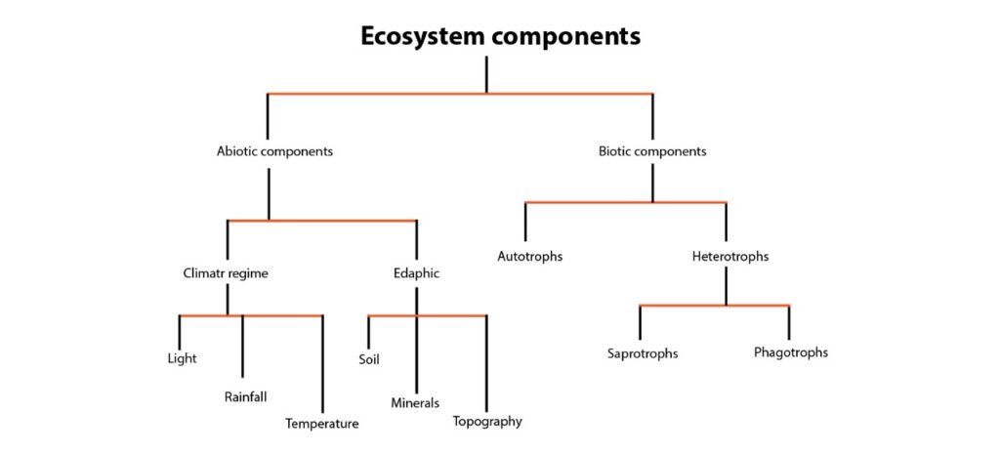

## Global change factors impact how ecosystems work

**Change impacts biotic and abiotic ecosystem components**

 

**Ecosystem structure: abundance & distribution of species & resources**

 

**Ecosystem function: physical, chemical, & biological processes**

 

**Ecosystem services: processes & products that benefit humans**

 

**Ecosystem services are maximized by properly functioning ecosystems**

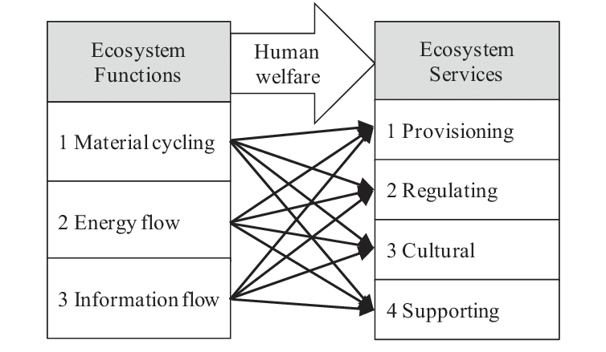

## Key ecosystem functions of Appalachian mountains

 

* **Biodiversity support & refugia**
    + ~160 tree species and huge diversity of salamanders, invertebrates, and understory plants 
    + complex topography and microclimates make the region a long-term refugium for many species can co-exist

 

<!-- 
 -->

* **Carbon storage & climate regulation**
    + Appalachian forests are carbon-dense
    + mixed hardwood and spruce-fir forests store large amounts of carbon for decades/centuries
    + buffers local climates (cooler, moister forest interiors)
    
 

https://www.nasa.gov/wp-content/uploads/2021/02/forests-global-net-carbon-flux-wri.png

<!-- 
 -->

<!--  -->

<!-- ## -->

<!--  -->

## Key ecosystem functions of Appalachian mountains

 

* **Water regulation, headwater protection & water quality**
    + Forested slopes, wetlands, and riparian zones slow runoff, stabilize soils, and filter sediments and nutrients before they reach streams
    
 

* **Nutrient cycling & soil formation**
    + thick forest floors drive decomposition and nutrient recycling (C, N, P), feeding the next generation of plants (food web)

 

* **Habitat connectivity & wildlife movement**
    + long, continuous Appalachian corridor functions as a north–south migration route and climate-change “escape ramp” for species
    + large intact habitats support wide-ranging species like black bear and forest birds

## Ecosystem services in the Appalachian mountains

Know the types of services, with examples
 
 

* **Provisioning services: Raw materials**
    + Timber, non-timber forest products
    + Freshwater; game, fish, and wild foods

 

* **Regulating services: Benefits from natural process**
    + carbon storage in forests and deep soils
    + flood control and water filtration
    + erosion control on steep mountain sides

 

* **Supporting services: fundamental processes**
    + High biodiversity that underpins food webs and nutrient cycling

 

* **Cultural services: non-material benefits**
    + Sense of place, recreation, and ecotourism
    + Spiritual, artistic, and cultural identity
 

## Humans as dominant ecosystem engineers in Appalachia

 

* **Re-engineering landscapes to capture services**
    + logging & plantation forestry → simplified forests, altered age structures
    + coal mining , shale gas, and pipelines to extract energy
    + dams and reservoirs, and channelization to generate hydropower and secure drinking water

 

* **Trade-offs & unintended consequences**
    + reduced biodiversity, disrupted habitat connectivity
    + increased sediment, metals, and acid mine drainage in streams
    + valley fills and road building altering hydrology

 

* **Cultural and economic shifts: dependence on extractive industries vs. emerging ecotourism and conservation economies**
    + Humans amplify some services while degrading others 

## Feedbacks: when a process/system is modified by its own effects

 
 

**Positive feedback loops= where response increases  stimulus** 

 
 

**Common and lead to amplification of climate change and biodiversity loss**

 
 

**Effects can be on structure and/or function**

 
 

**Despite the name, this is NOT a good thing**

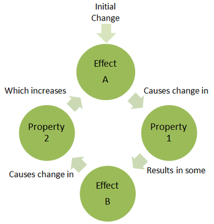 

<!-- ## Feedbacks: when a process/system is modified by its own effects -->
<!-- 
 -->
<!--   -->
<!--   -->
<!--   -->
<!--   -->

<!-- 
 -->

<!-- **Positive feedback loops= where response increases  stimulus**  -->

<!--   -->
<!--   -->

<!-- **Common and lead to amplification of climate change and biodiversity loss** -->

<!-- 
 -->

<!-- 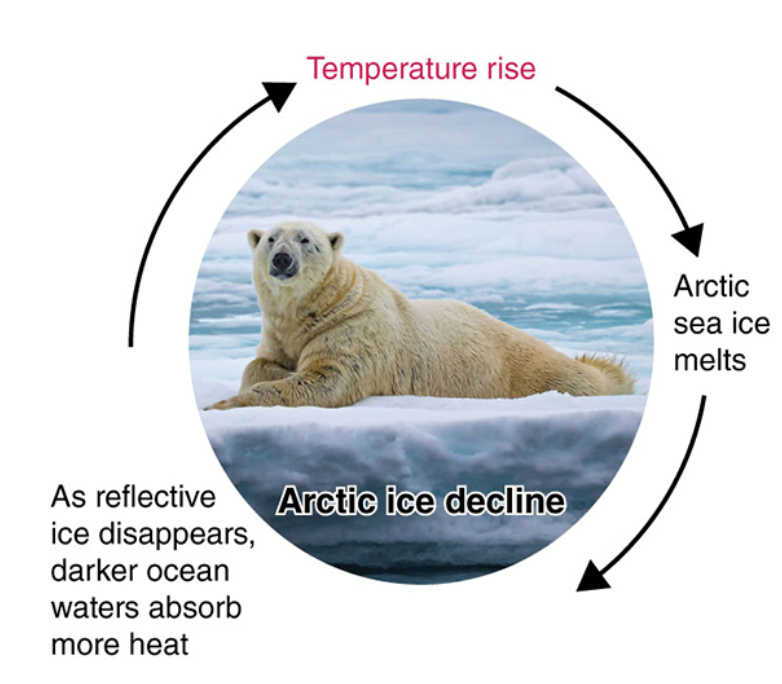  -->

## Feedbacks: when a process/system is modified by its own effects

 

**Positive feedback loops: Abiotic and biotic feedbacks from deforestation**

 

**Ecoystem functioning can then be hijacked by positive feedbacks from global change factors**

 

## Feedbacks: when a process/system is modified by its own effects

**Positive feedback loops= where response increases  stimulus** 

 

**Southern Appalachia peat bogs keep dead material from decomposing (storing C)**

 

**Warming increase evaporation, dryies out peat, exposes it to oxygen and microbes break it down, releasing CO~2~** 

 

**Releasing CO~2~ increases warming, further drying out bogs and off we go. **

 

**Takes 1000s of year to make a peat bog, so that carbon in no longer kept out of the atmosphere as a greenhouse gas** 

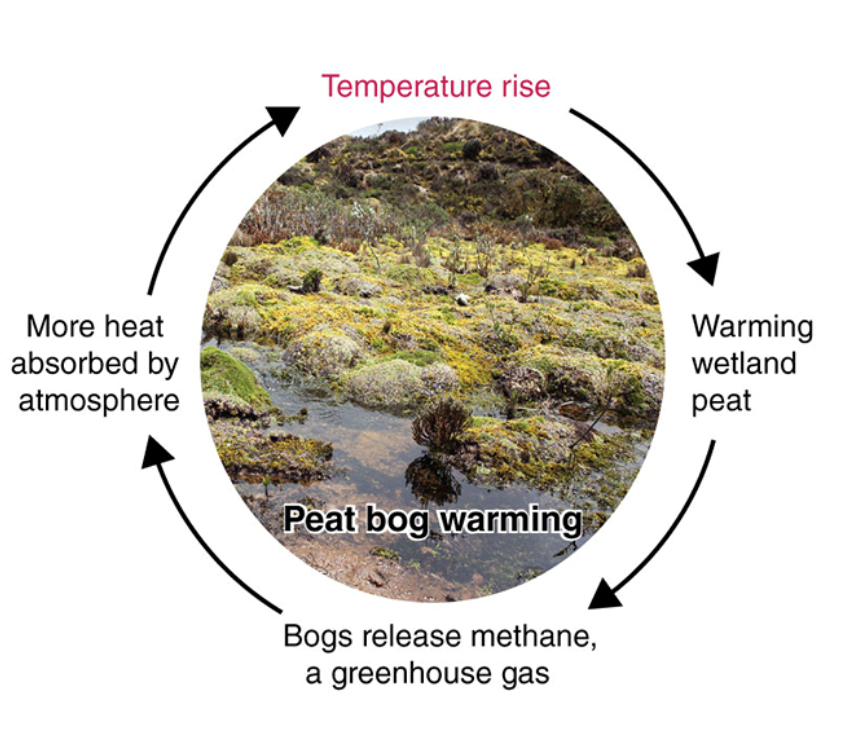 

## Feedbacks: when a process/system is modified by its own effects

**Positive feedback loops: Abiotic and biotic feedbacks from deforestation** 

**Loss of forests from logging, mountain top mining and urbanization release large amounts of stored carbon**

 

**This carbon is now a greenhouse gas (CO~2~), making the climate warmer**

 

**Warming climates increase the risk of droughts, wildfires, pest outbreaks and disease, driving the loss of even more trees and the release of more carbon, and on we go.**

 

**Risk of fire is lower than in the West but feedbacks from deforestation contribute to global responses**

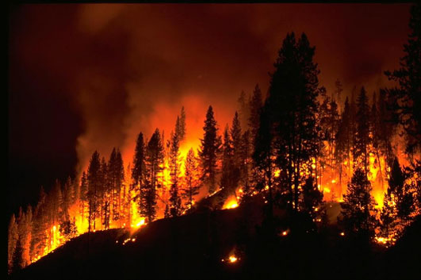 

## Feedbacks: when a process/system is modified by its own effects

**Positive feedback loops: Abiotic and biotic feedbacks from deforestation** 

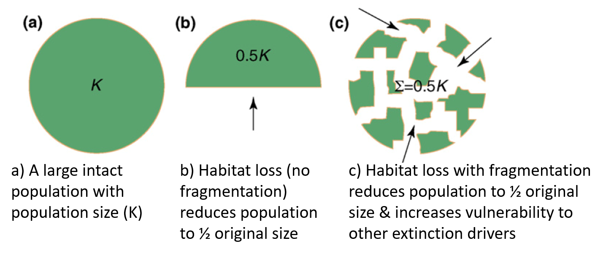

## Feedbacks: when a process/system is modified by its own effects

**Positive feedback loops: Abiotic and biotic feedbacks from deforestation** 

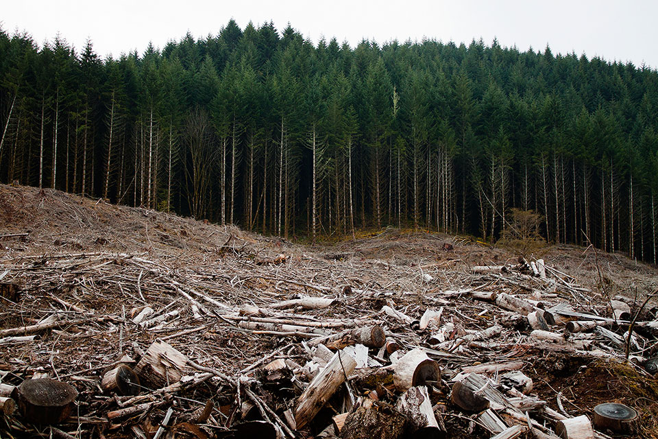 

 

**Habitat loss from deforestation has direct *negative* effects like removing organisms but also has *cascading* effects by facilitating invasions and disrupting ecosystem structure/function.**

 

**Invasive plants (Japanese stilt grass) quickly colonize dsitrubed areas**

 

**Creates more space for edge-loving species (deer) to browse native vegetation**

 

**Soil eroision/loss impacts nutrient cycling**

 

**These consequences redice the capacity of forests to regenerate**

## 

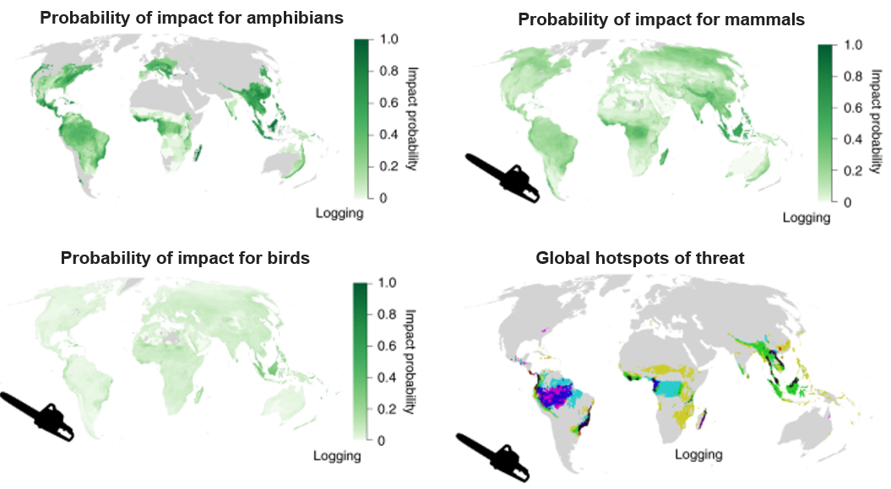

<!-- ## Feedbacks: when a process/system is modified by its own effects -->
<!-- 
 -->

<!-- **Negative feedback loops: works to reduce initial stimulus and return system to normal** -->
<!--   -->

<!-- **Exist naturally in biological systems, but not a big component of global change** -->

<!-- 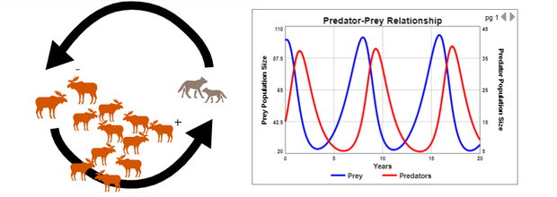 -->

## Threshold effects

**Positive feedbacks and cascading effects can lead to tipping points and ecosystem collapse**

 
**Which can be reversible, partially reversible, or irreversible**

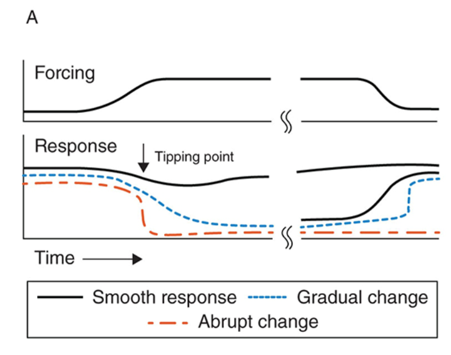

## Threshold effects

**Threshold effects can occur at many levels from…**

 
 
 
 
 
 
 
 
 
 
 
 
 
 
 
 

**Mountain systems do not rank as high is certain places like coral reefs or tropical forests for potential risk of tipping points. However, they still are vulnerable.**

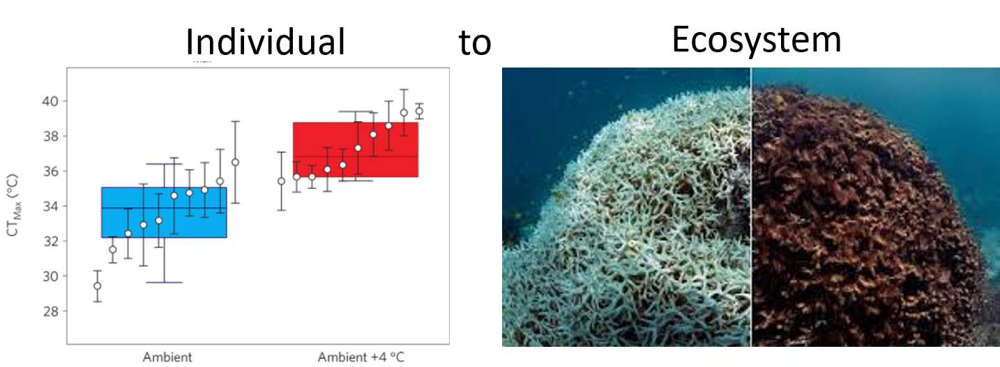

## Tipping points are generally unknown, making restoration hard

 
 

**At what points does the loss of hemlocks irreversibly change freshwater streams by removing shade?**

 

**At what point does deforestation + deer overpopulation + invasive plants create a 'new forest state"?**

 

**At what point does stream pollution from mining simplify streams to only pollution tolerant species?**

 

**At what point do Spruce-fir sky islands become too warm to exist?**

## Tipping points are generally unknown, making restoration hard

 

**Restoration always involves addressing the prior threats...what will this mean for future Appalachian ecosystems? **

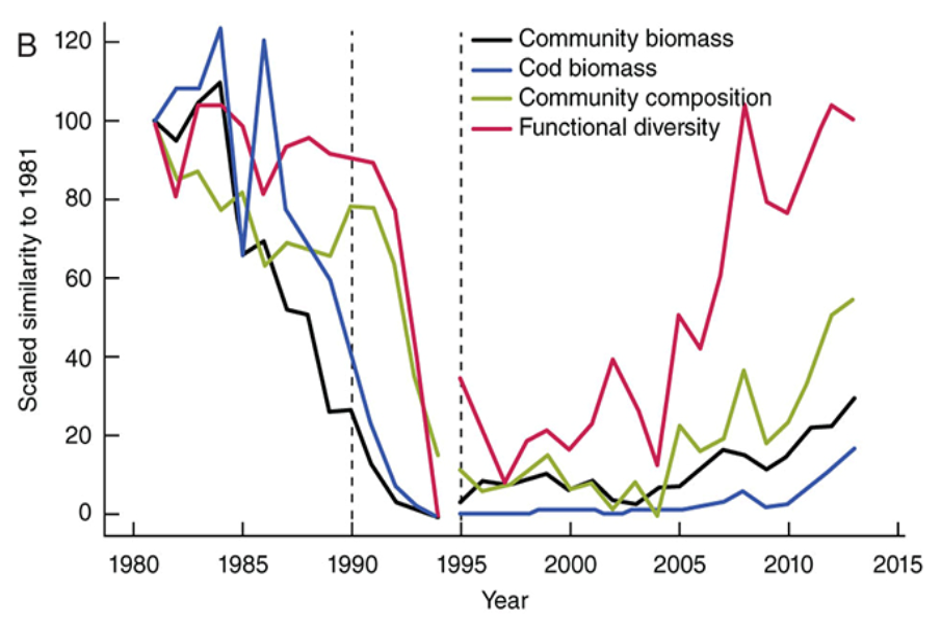

## Resilience and restoration of ecosystems

**Many factors contribute to resilience and potential for restoration (hammer and nail analogy)**

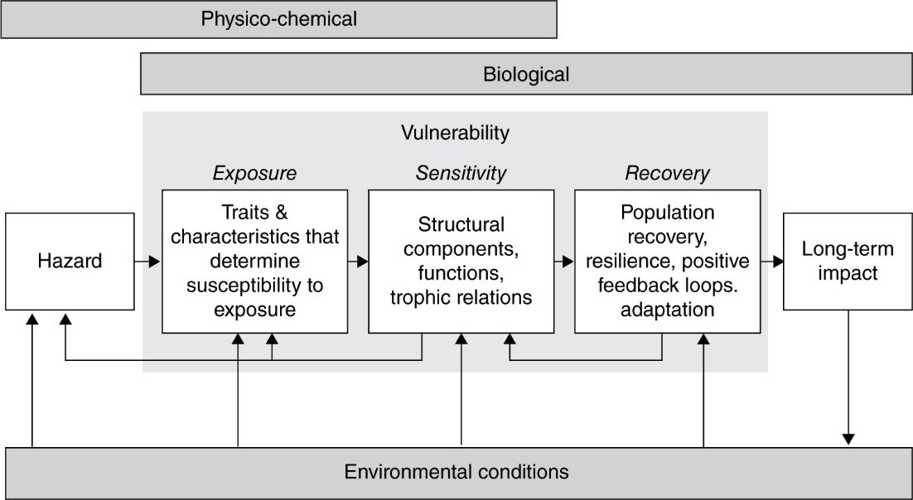

<!-- ## Resilience and restoration -->
<!-- 
 -->

<!-- **Many factors contribute to resilience and potential for restoration (use Taking a Closer Look & Chap 4 “Vulnerability” section as a study guide)** -->

<!-- 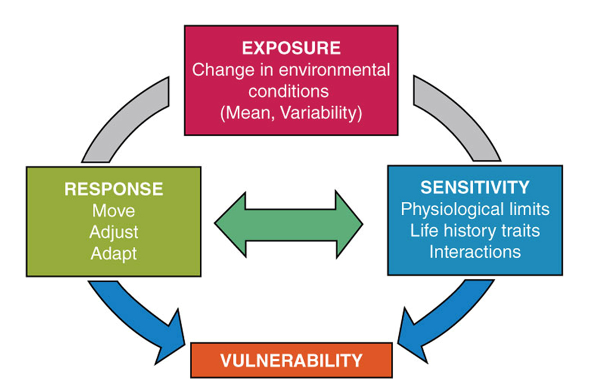 -->

## Resilience and restoration of Appalachian ecosystems

**Different elements of vulnerability: The degree to which a species or system is susceptible to adverse effects of global change is a function of:**

 

* **Exposure: Likelihood system will experience a given stressor**
    + how big & quickly is the change occurring in Appalachia?
    + are mountains systems more exposed or buffered?

 

* **Sensitivity: Degree the system will be impacted by a given stressor**
    + is the system fragile or robust?
    + are important are Appalachian endemics to ecosystem structure/function

 

* **Response: Ability of a system to respond to a given stressor**
    + Which core responses do species exhibit?
    + Can communities reorganize or not?
    + Do Appalachian ecosystems shift into a new stable state?

## Appalachian ecosystems are nested...and vulnerable

 
 

- **Our systems are out of balance**
    + different Earth systems at different scales
    + our own body systems
    + many of our socio-political-cultural systems

 
 
 
 

**Premise that all systems are out of balance in shared ways**

 

**We extract and deplete without giving time and energy to the process of recharge and restoration**

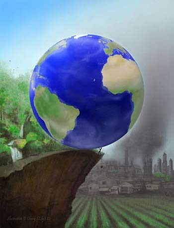
