## Coupled human-natural systems

 

**Ecological and social domains are truly one integrated system with complex interactions and feedbacks**

 

**Human survival depends on thriving ecosystems and ecosystem health now depends on the choice humans make**

 

**In Appalachia, clean headwater streams, intact forests, and stable mountain slopes literally protect towns from floods, landslides, and drinking-water crises**

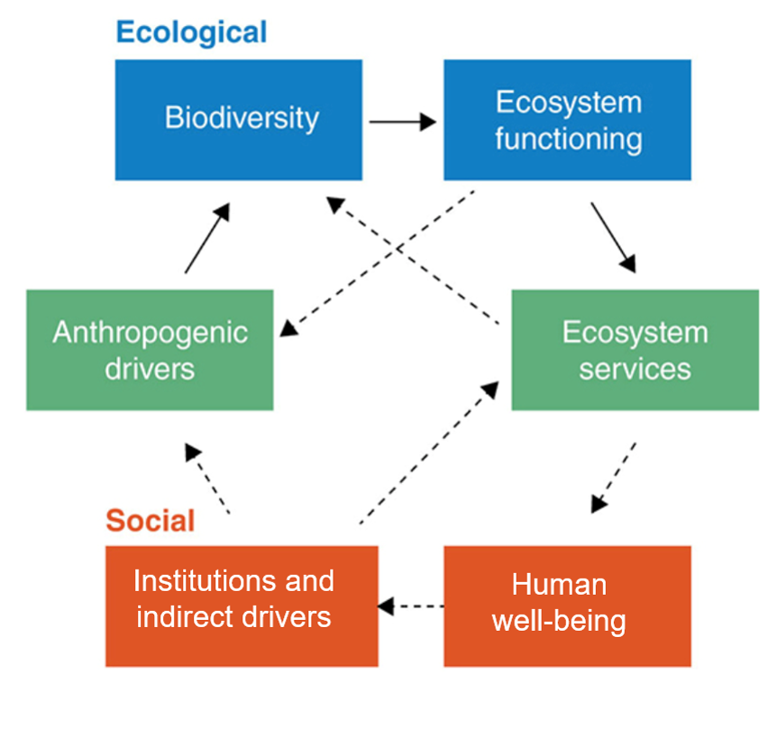

## Coupled human-natural systems

 

**Ecological and social domains are truly one integrated system with complex interactions and feedbacks**

 

**Successful biodiversity conservation will require addressing needs and inequities in human societies**

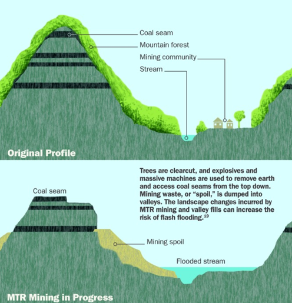

## Coupled human-natural systems

 

**Ecological and social domains are truly one integrated system with complex interactions and feedbacks**

 

**Successful biodiversity conservation will require addressing needs and inequities in human societies**

 

**Successful social reform and sustainable futures for humans will require biodiversity conservation**

 

**Example: Mountaintop-removal mining in Central Appalachia – high global demand for coal, local loss of forest, headwater streams, and community health**

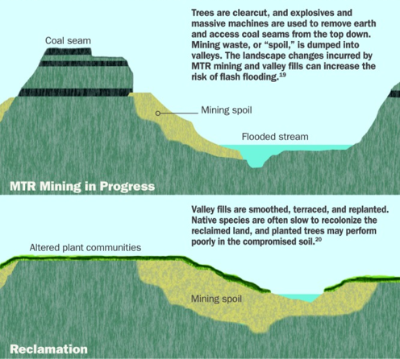

## Coupled human-natural systems

 

**Case Study: Are creative solutions possible with mountaintop removal?**

 

**“The fact that coal companies can blast away the tops of 500 of the oldest and most biodiverse mountains on the continent shows an utter disrespect for the communities that have to live with the destruction of their land, air and water,” said Matt Wasson, with Appalachian Voices.**

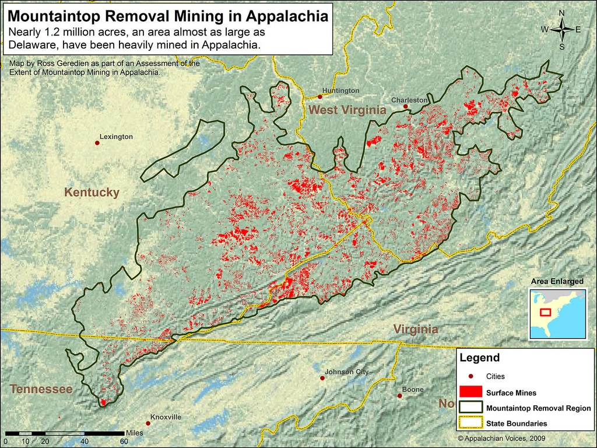

## Coupled human-natural systems

 

**Case Study: Are creative solutions possible with mountaintop removal?**

 

**In Appalachia, creative solutions might mean: red spruce restoration, mine-land solar, trail-based economies, floodplain buyouts, and stream restoration instead of more extraction**

## Coupled human-natural systems

 

**Creative solutions are possible but they commitment and agreement across individuals – communities – law makers**

 

**The mining industry exploits a federal provision that exempts them from restoring the land to its “approximate original contour” if there is a plan to develop the land for “equal or better economic use” (e.g., industrial, residential or public use)**

 

**However, only ~4% of mountains in Kentucky and West Virginia, where 80 percent of the mining is occurring, have any post-mining economic activity**

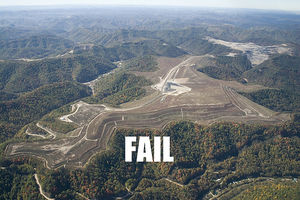

## How can people support biodiversity conservation?

 

* **Individuals, as:**
    + consumers
    + funders
    + practitioners
    + activists
    + frequency holders

 

* **Policy actors, through:**
    + fisheries governance
    + endangered species legislation
    + international climate treaties
    + international debt-for-nature swaps

* **Collectives, through:**
    + ecotourism
    + sustainable food production
    + community solar projects

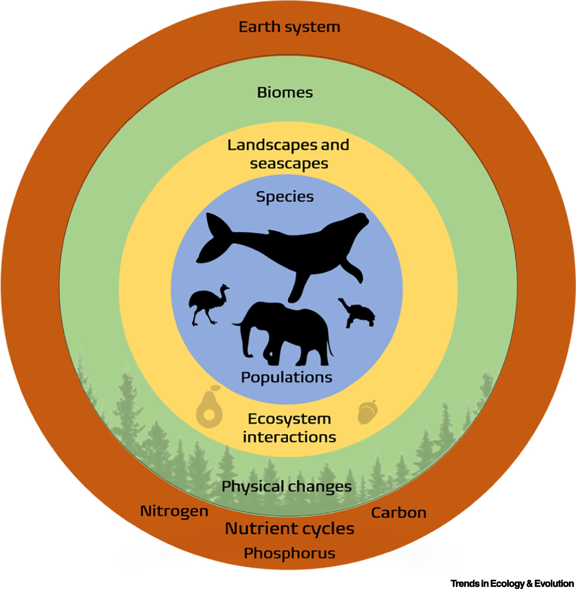

##

**In Appalachia, ‘frequency-holders’ hold a steady note of care for land and community—through art, activism, teaching, parenting, and everyday acts of showing up**
 
 
 
 
 
 
 
 
 
 
 
 
 
 
 
 
 
 
 
 
 

**Think of ‘frequency-holders’ in Appalachia as the quiet backbone: people who keep tending to mountains, rivers, and relationships, even when no one is watching**

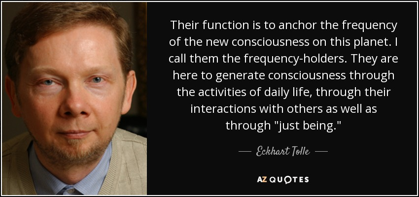

## How can individuals support biodiversity conservation?

 

**Through …**
 

**the things we do (behaviors that align best with nature)**
 

**and**
 

**the ways we be (aligning our belief systems and decision making)**

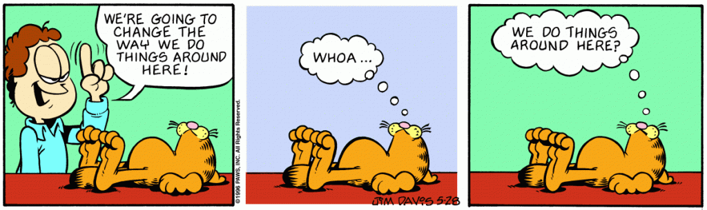

<!-- ## Flash-back to extinction class sessions -->
<!-- 
 -->
<!-- 
 -->
<!--   -->

<!-- * **What are some of the root causes of extinction?** -->
<!--     + Exploitation -->
<!--     + Capitalism -->
<!--     + Economic inequality -->

<!-- 
 -->

<!--   -->

<!-- 
 -->

<!-- * **What are the root causes of these behaviors and social structures?** -->
<!--     + Keep going until can’t go any further… -->

<!-- 
 -->

<!--  -->

## Root causes: nature's decline

 

* **What are some of the root causes of biodiversity decline?**
    + Exploitation
    + Capitalism
    + Economic inequality

 

 
* **What are the root causes of these behaviors and social structures?**
    + Greed
    + Fear
    + Complacency
    + Feeling of separation

 

* **What are the root causes in Appalachia?**
    + coal, gas, timber, and now data-centers
    + ‘resource curse’ economies
    + opioid crisis and health disparities

## Root causes: nature's decline

 
 
 
 
 

**What other effects do these root causes have?**

 

**Symptoms of these root causes are tangible and often have positive feedbacks to other planetary Earth systems, such as climate** 

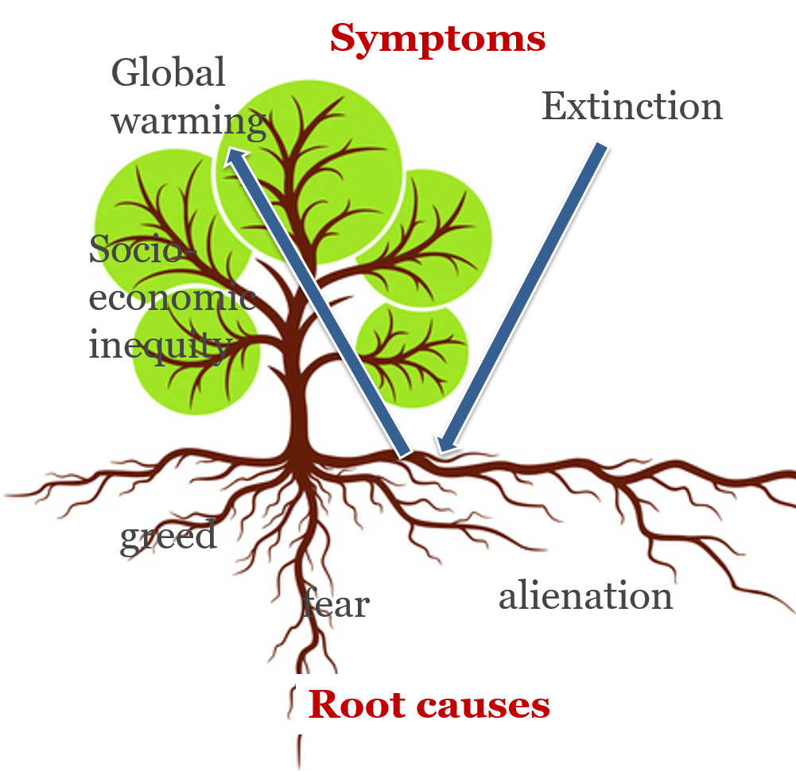

## Root causes affect everything

**The same extract and deplete mentality is impacting our planet, biosphere, social, emotional, and educational systems…**

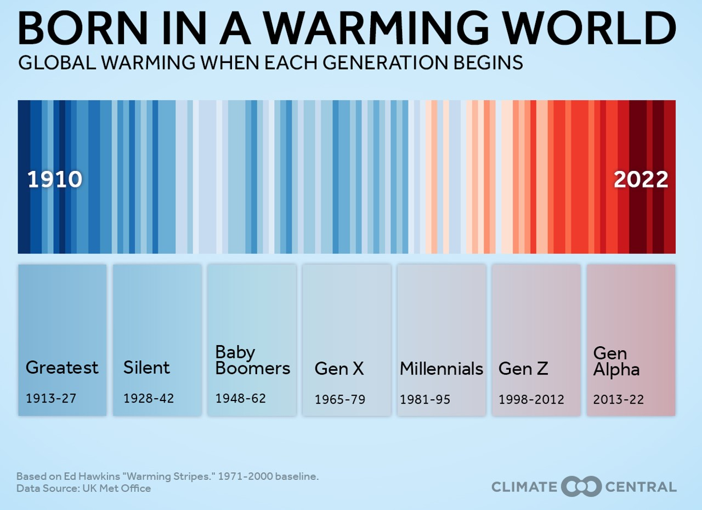

## 

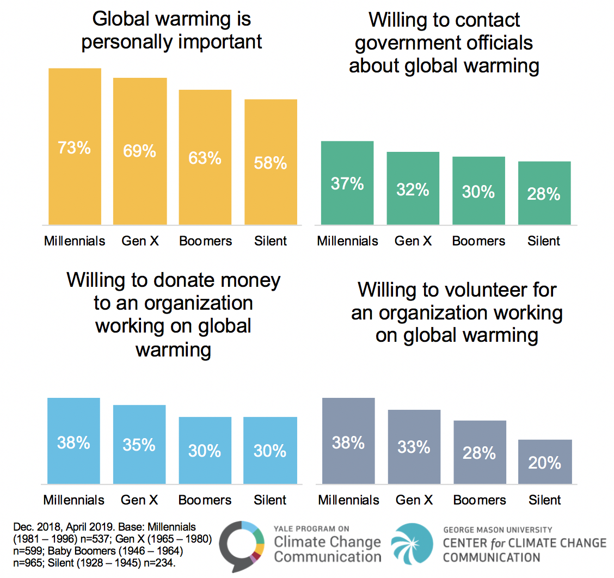

## Root causes affect everything

 

**The same extract and deplete mentality is impacting our planet, biosphere, social, emotional, and educational systems…**

 

**Planet/thermometer: Record-breaking rain events and heat in WV/KY**

 

**Extinction: “Hemlock woolly adelgid, chestnut blight, red spruce decline, brook trout habitat shrink**

 

**Hunger/poverty: “Food deserts and energy poverty in rural counties**

 

**Classroom: Under-funded rural schools; brain drain as students leave**

 

**This is painful....every one of us has likely a direct personal relationship to at least one of these issues**

<!--  -->

## The world feels like it’s ablaze

 

**Like it’s been in the oven too long and the edges are all burnt and taste like charcoal**

 
 
 

**How do we manage our mental fire?**
 

**How do manage aspects of our society that are to hot to touch?**
 

**How do prevent nature from turning into ash?**

 
 
 
 

**Is 'Too hot to touch’ in Appalachian: back-to-back 100-year floods, unemployment after mines close, FEMA assistance gaps for hurricane Helene, and political fights over energy transition**

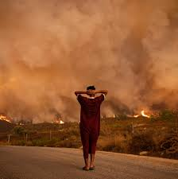

## Root causes affect everything

 
 

**So what is the medicine?**

 

**Is what is needed in Appalachia fundamentally different than other areas?**

 
 

**THOUGHTS?**

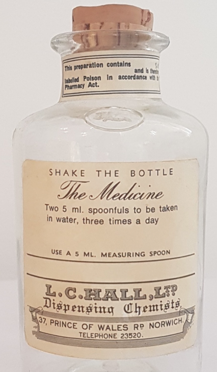

## Connect to the pain/problems/issues

 
 
 

**Don’t bypass/avoid the uncomfortable**

 

**It doesn’t need to be avoided or indulged but it needs to be acknowledged**

 

**Even in college classes**

 

**By acknowledging it we can learn how to deal with it and how to make appropriate actions in the future to alter the root cause**

## The underlying deep caring

 
 

**Reinforce the truth: that things wouldn’t be depressing if we didn’t care deeply**

 

**Our caring is about the mountains and rivers we’d like future generations to inherit**

 

**Connecting to deep caring is totally different than a false “finding the silver lining”**

 

**For example, this object in this picture could be reversed**

## The action that wants to emerge from the caring

 
 

**Support actions that come organically from caring rather than guilt**

 

**We agreed that we have an ethical and moral role to do something. However, we need to be careful on where the motivation comes from**

 

**We now have constant real-time opportunities to practice this paradigm**

 
 

 
 

**In WV, people may have been led to believe the only choices were more extraction or no jobs. What if our caring points to different actions – like restoration jobs, heritage tourism, small-scale farming, community solar?**

## Root causes affect everything but can be addressed anywhere

 
 
 

**We can explore personal or collective action anywhere   **

 

**At whatever scale, we can realign our interests for any source of stress**

 

**This is an opportunity to embrace new ideas**

 

**Global change is global but can be tackled by any one or any group at any time**

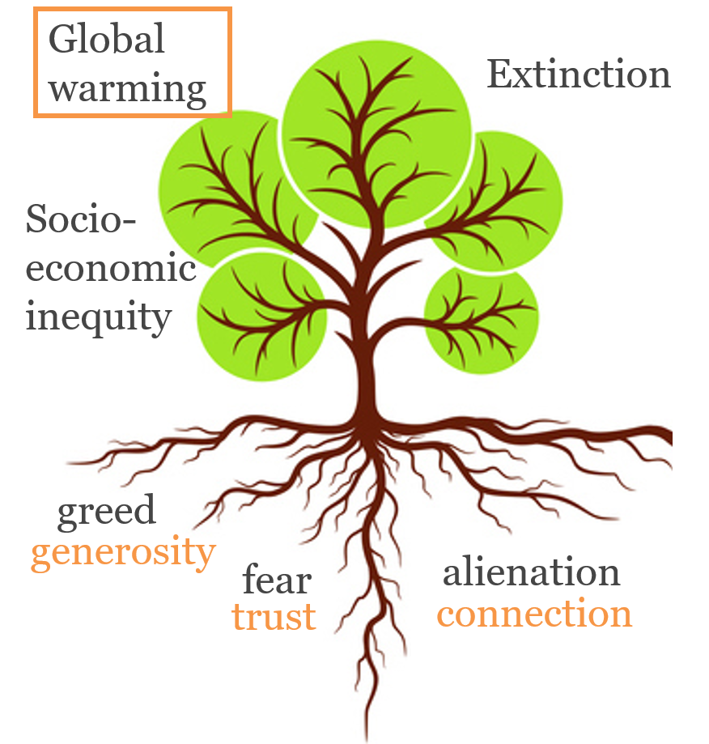

## Linking internal and external solutions

**And we can address root causes in small daily ways:**

<!--   -->

<!-- **Let's list some....** -->

<!--  -->

<!-- ## -->

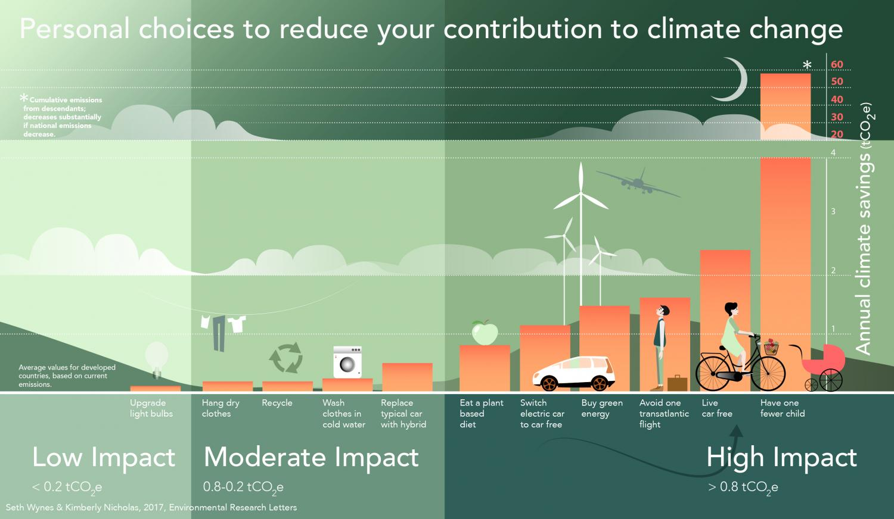

## Linking internal and external solutions

 

**And we can address root causes in small daily ways:**

 

**What could we ask Shepherd University to do better everyday?**

 

**How can Shepherd act as a model Appalachian campus?”**

<!-- ## Linking internal and external solutions -->
<!-- 
 -->
<!--   -->

<!-- **And we can address root causes in small daily ways:** -->

<!--   -->

<!-- **We can take problems that seem huge, complex, and “out there” and makes them something we can work with together, through connection, “in here”.** -->

<!--   -->

<!-- **An empowering way of taking responsibility** -->

<!--  -->

<!-- ## Root causes affect everything but can be addressed anywhere -->
<!-- 
 -->
<!--   -->

<!-- 
 -->

<!-- **On a particular branch?** -->

<!--   -->

<!-- **On a particular level?** -->
<!--   -->
<!-- **individual** -->
<!--   -->
<!-- **collective** -->
<!--   -->
<!-- **policy actor** -->

<!--   -->

<!-- **In a particular way?** -->
<!--   -->
<!-- **internal** -->
<!--   -->
<!-- **external** -->

<!--   -->

<!-- **On a particular root?** -->

<!-- 
 -->

<!-- 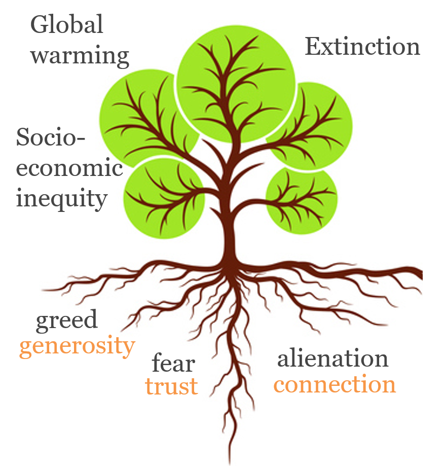 -->

## Where do you feel drawn to contribute?

 

**Is individual action pointless in the face of climate change? Let's not beat around the bush...**

 
 
 
 
 
 
 
 
 
 
 
 
 
 

**"I think this is one of the great moral challenges of the 21st Century, perhaps the greatest moral challenge", he says. "If we are not acting, we are endangering everyone who is alive now and also future generations." Peter Singer of Princeton University**

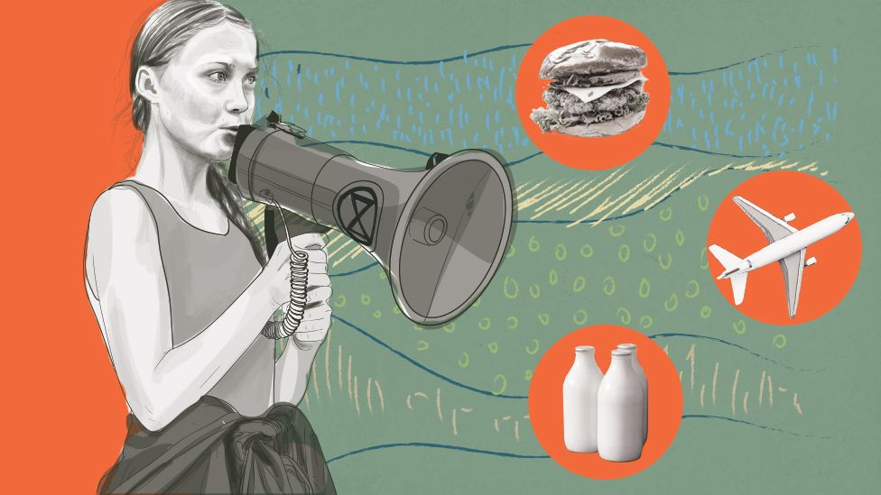

