## Review: What is wrong with this representation?

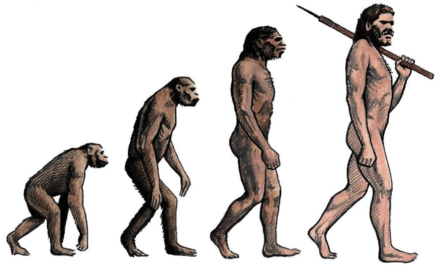

- **The “March of Progress” is one of the most iconic — and most misleading — images in science communication.**

 

- **Reality: Evolution is not a straight line; it's a branching tree**

 

- **Reality: Evolution has no goal or direction**
    + evolution is not creating modern humans as an 'end goal'

 

- **Reality: There were many species of hominins with varied adaptations**

 

- **It reinforces misleading (racists/ablesit) hierarchies from primitive to advanced humans**

## The complexity of being human

 

- **In addition to other harmful fallacies this cartoon propagates, it makes “being human” seem very separate, and very independent**
    + As we evaluate the role of humans in global change, are any of these things true?

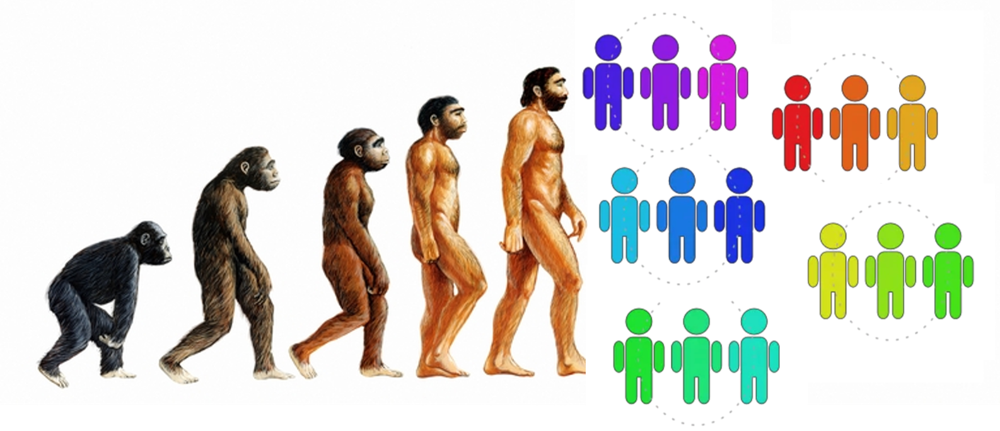

## Human Independence Revisited

 

***Homo sapiens* wouldn’t exist without our complex evolutionary, ecological, and societal associations**

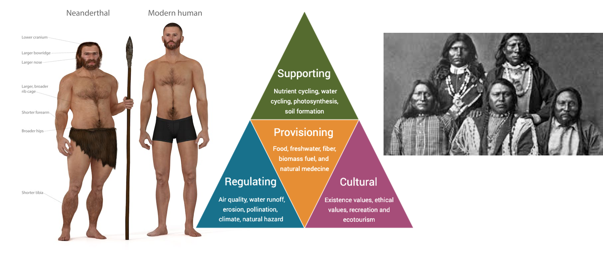

## Is independence just another human fallacy?

- **This isn’t only “external” but also internal**

 

- **Example 1: your microbiome**
    + >10,000 species occupy human body
    + 80-100 genera

 

- **39 trillion microbial cells including bacteria, viruses and fungi live on-in us**
    + 'cell-wise' the human body is 43% human
    
 

- **Human microbiome has 500x more genes than human**
    

## How independent are we?

 

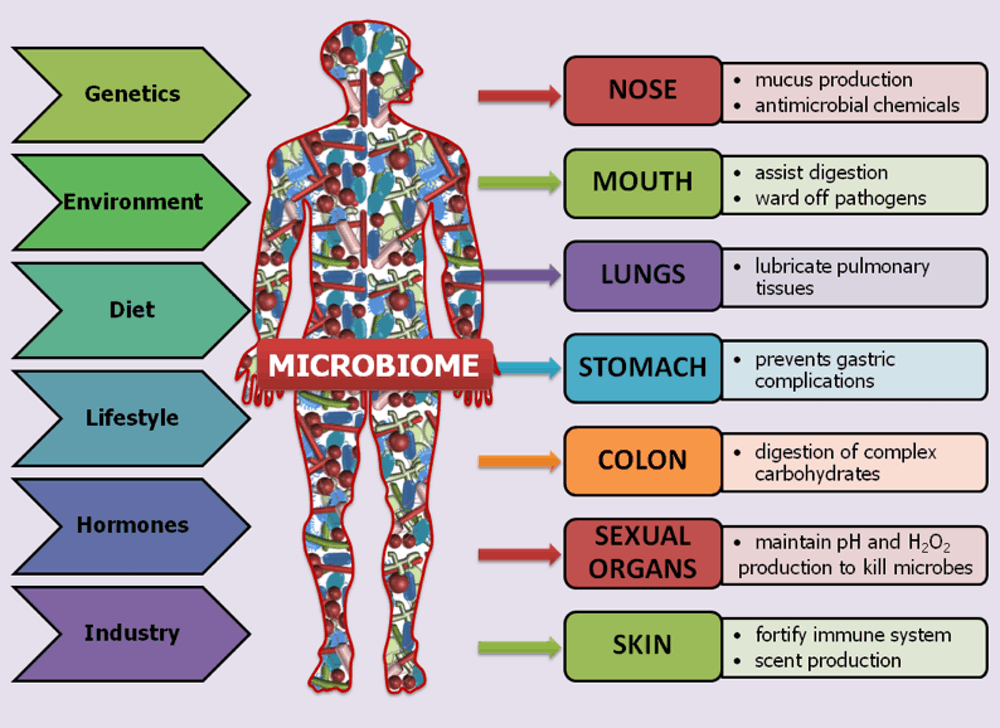

## What does it mean to be *Homo sapiens*?

 
 

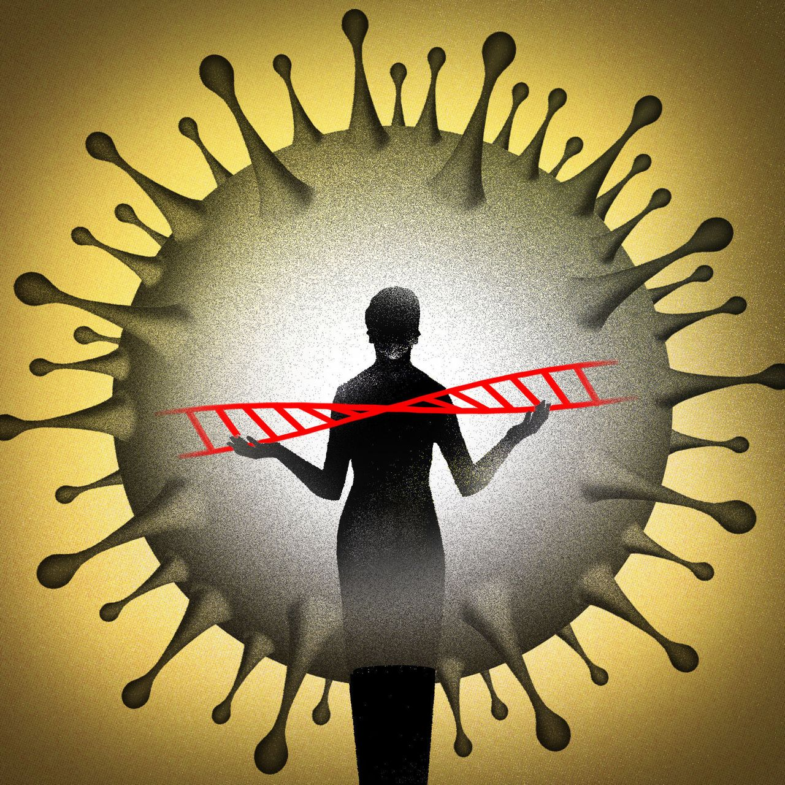

- **Example 2: (barely) hidden in your DNA**

 

- **~8% of human genome is viral DNA**

 

- **~40% human genome is repetitive DNA which also likely has a viral origin**

 

- **100,000 pieces of ancient viral DNA live among our genes**
    + function, if any, has long been unclear
    

    
## What does it mean to be *Homo sapiens*?

 
 

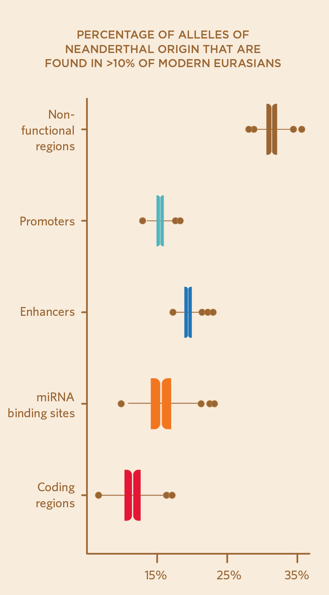

- **Example 2: (barely) hidden in your DNA**

 

- **Most humans have 2% Neanderthal DNA**
    + remember - both species co-existed and sometimes mated 

 

- **Neanderthal allele variants range in diverse expression of skin and hair color to immune function and neuropsychiatric disease**
    + may have left us prone to allergies!
    + may have caused some to have higher risks from Covid!
    + possible genetic links to depression and addiction

## What does it mean to be *Homo sapiens*?

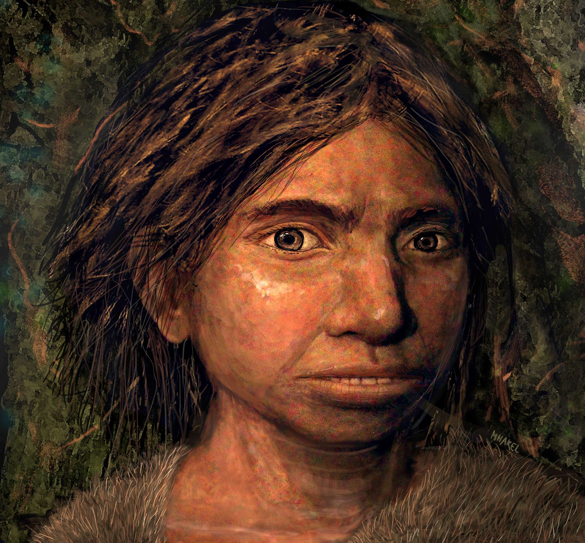

- **Example 2: (barely) hidden in your DNA**

 

- **Denisovans left genetic traces in oceanic and Asian regions**
    + genomes of Australian aborigines, New Guineans and Pacific Islanders ~5% Denisovan
    + East and South Asians up to .5%

 

- **Denisovan gene variants range in diverse expression of immunity, metabolism and neurology**
    + variants in Tibetans regulate hemoglobin levels to allow survival at high altitudes
    + may allow better pathogen recognition and defense in Asian populations
    + variant in zinc transporter gene associated with predisposition to depression
 
 

 
## Review: We are not 'independent' because we persisted

 
 
 
 

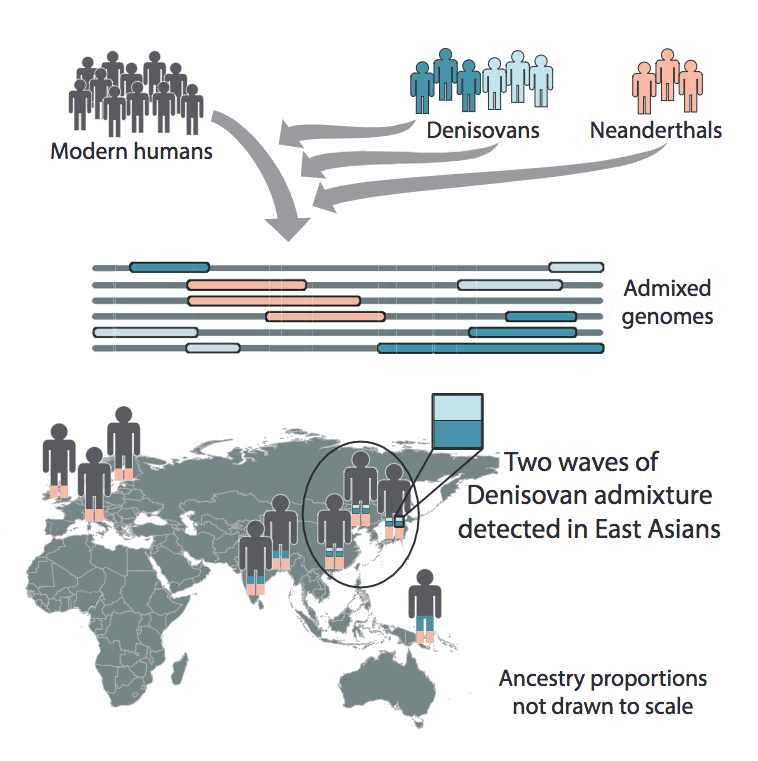

- **How separate or independent our we?**
    + perhaps.....just enough.....
    + 87 specific genes in modern humans are different from related genes in Neanderthals and Denisovans
    + Potential clues for our survival?

## Why did humans win the survival race?

- **Was it key 'human' traits?**
    + many of these were shared (bi-pedalism, tools)

 

- **Was it evolution of larger brains?**
    + Neanderthals were slightly larger!

 

- **Was it fire?**
    + H.erectus may have used fire before we evolved

 

- **Was is related to social aspects**
    + survival of the friendliest

 

- **Was it related to our adaptability**?
    + climate was unpredictable
    
 

- **Was it something non-human?**
    + superior microbiome

 

 

 
- **Was it luck?**
    + were we 'independent' enough?
    
 
   
 
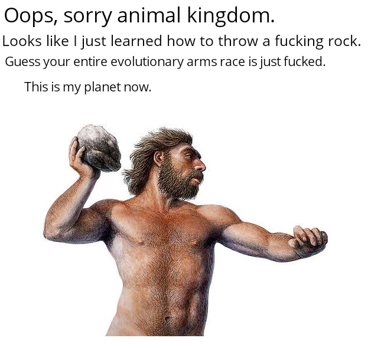

## Independent or not, *Homo sapiens" have left our mark...

 

- **Human evolution → migration → agriculture → industrialization → Anthropocene**

 

- **What are the key milestones in human impact on Earth**
    + how far back do you think we need to go?

 

- **When did humans start impacting Appalachian ecosystems?**    
    + early indigenous agriculture, coal mining era, ecological restoration efforts

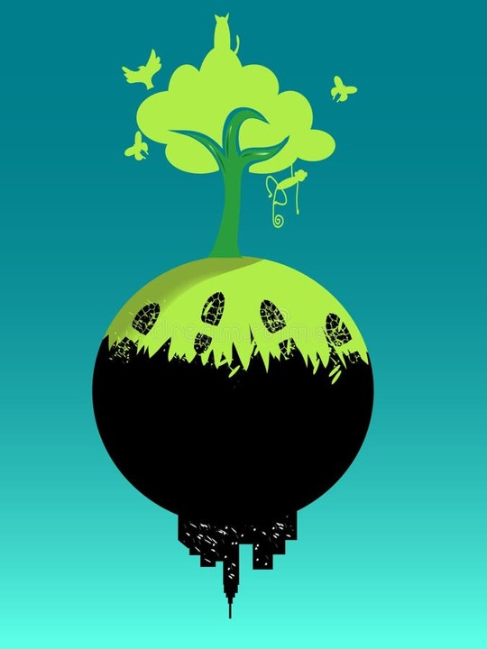

## Human impacts: The beginning (review)

 

- **Genus Homo: ~2.5 million years ago**

 

- **Homo sapiens: ~300,000 years ago**

 

- **Coexistence with Neanderthals, Denisovans**
    + Homo sapiens 'alone' 40,000 ya

 
 

- **Appalachia: Indigenous presence ~12,000 years ago**

 
 

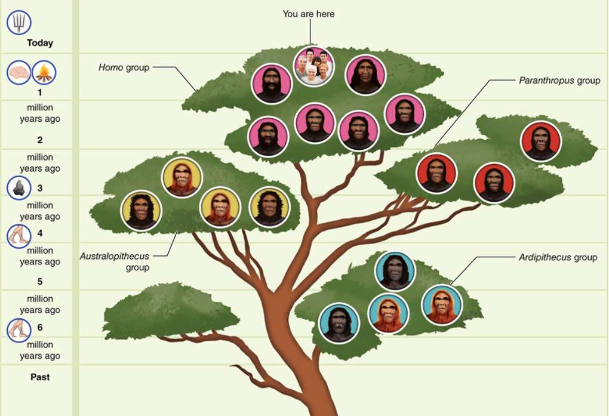

## Humans on the move

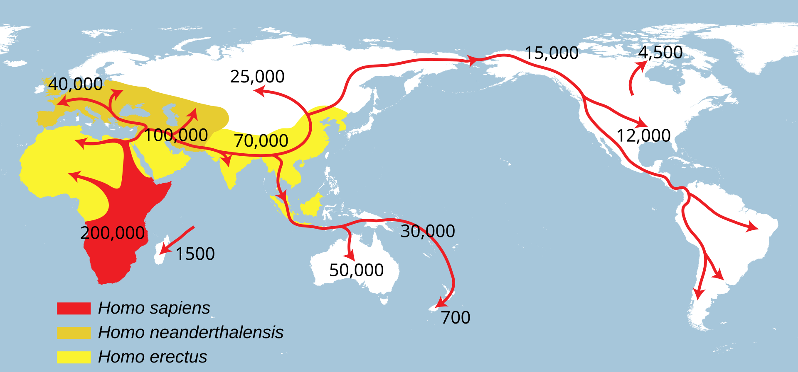

## Human migration and megafauna impact

 

- **Human expansion linked to extinction of large mammals**
    + During migration, >150 megafauna went extinct
    + sheep to mammoth sized
    + America's and Australia most notable

 

- **Evidence in Eastern USA suggests hunting of megafauna**
    + clovis points (stone tools) found alongside megafauna remains
    + direct evidence in Appalachia is lacking

 

- **Climate change combined with overhunting may have accelerated extinctions**

 
 
 
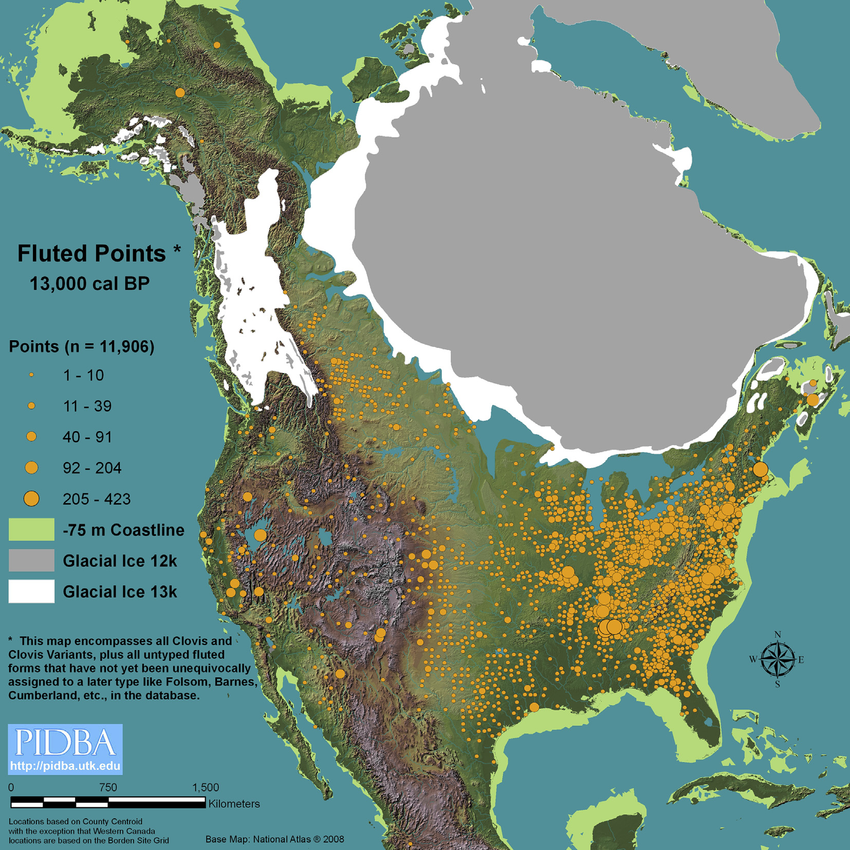

##

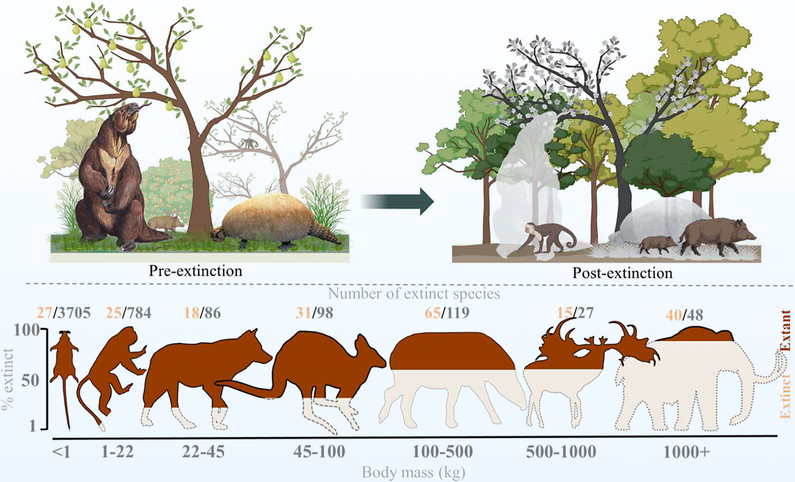

## The agricultural revolution was a game changer..

 

- **The end of the last Ice Age brought about warmer and more stable climates**
    + ~10,000 BCE at places like the 'Fertile Crescent'
    + favorable conditions supported experimentation with plant cultivation

 

- **Humans domesticated plants and animals**     
    + more predictable food supplies and the ability to store surplus
    + transition from nomadic hunting and gathering to settled farming communities.

 

- **Impact: Laid the foundation for the rise of permanent civilizations**

 
 
 
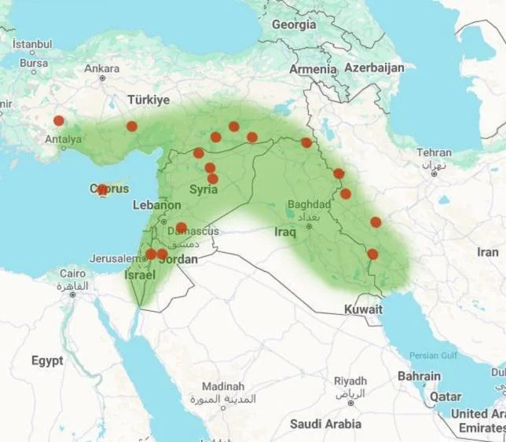

## Agricultural revolution key for population growth

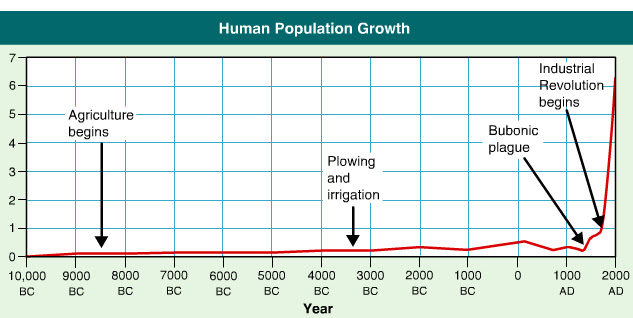

## Impacts of agricultural revolution

 

- **Increased impact on landscapes and biodiversity**
    + deforestation, soil quality, habitat loss

 

- **Start of land ownership and class divisions**
    + land ownership/inheritance as wealth
    + social stratification and inequality
    + new political structures

 

- **Enabled the emergence of trade networks and markets**
    + Case study: Hopewell culture in Ohio River Valley

 
 
 
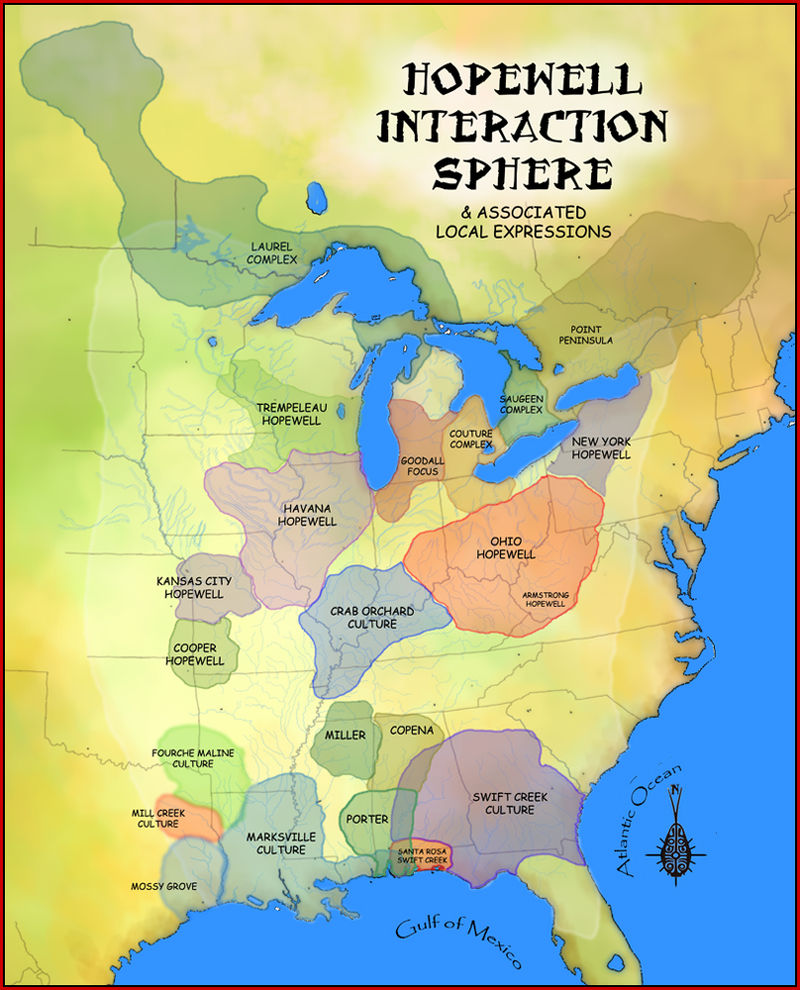

## Migration and Agriculture in context: Wildlife

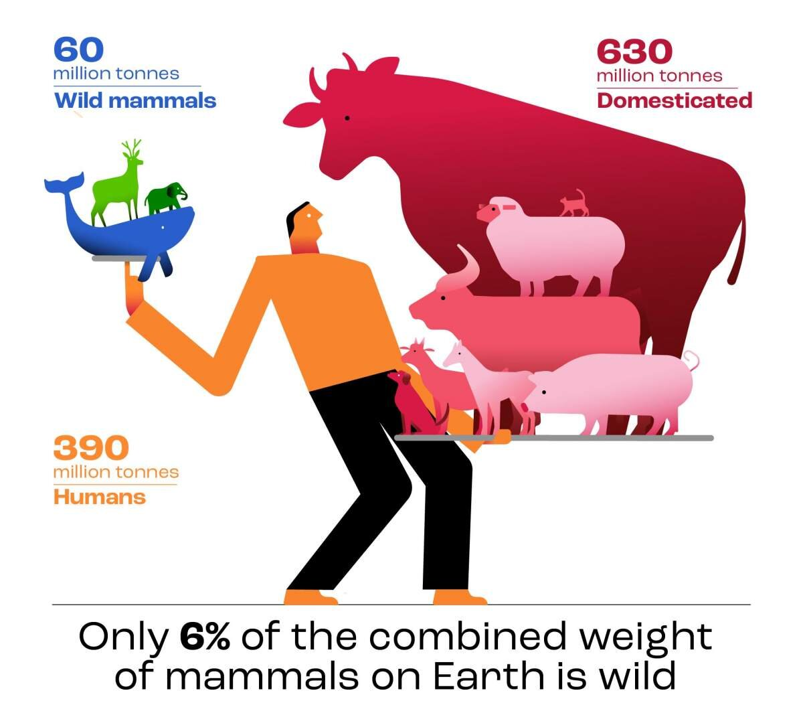

## Industrialization and the Human Footprint

 

- **Industrial Revolution began in the late 1700s in Britain, driven by coal, steam engines, and mechanized textile production**

 

- **Spread to Europe and North America in the 1800s, transforming economies and landscapes**
    + shift to fossil fules (coal)
    + Led to urbanization, exponential growth in energy use, and mass production

 

- **Industrialization in USA 'fueled' by Appalachia**
    + rise of coal towns, railroad expansion, and deforestation

 
 
 
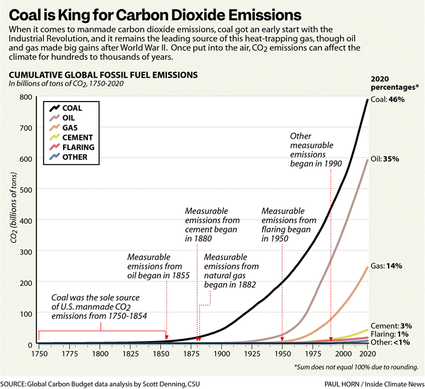

## Industrialization and the Human Footprint

**While driving economic and technological advancements, it has had a detrimental impact on the environment**

 

- **Environmental degradation: air and water pollution, mining scars, habitat destruction**

 

- **Societal consequences: rise of factory labor and child labor, income inequality, labor movements and strikes, migration to urban centers, and weakening of traditional rural communities**

 
 
 
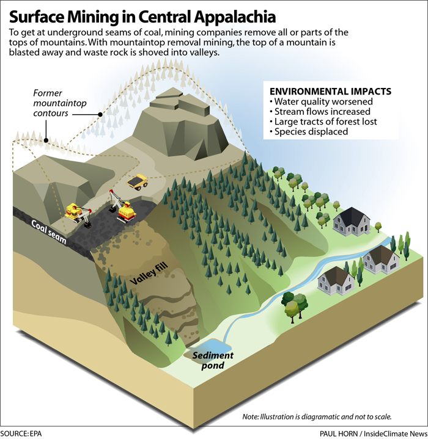

## Industrialization beyond coal...

- **Water systems altered by dams, canals, and diversions**
    + disrupt aquatic life and natural flows.

 

- **Soil degradation from deforestation, erosion, and chemical farming**
    + reduce fertility and biodiversity.

 

- **Mining and factories polluted rivers with heavy metals and toxins**
    + Appalachia: Acid mine drainage turned streams orange, harmed fish and communities

 

- **Floods in Appalachia now made worse by compromised soils and hardened watersheds from past industrial activity**

 

 
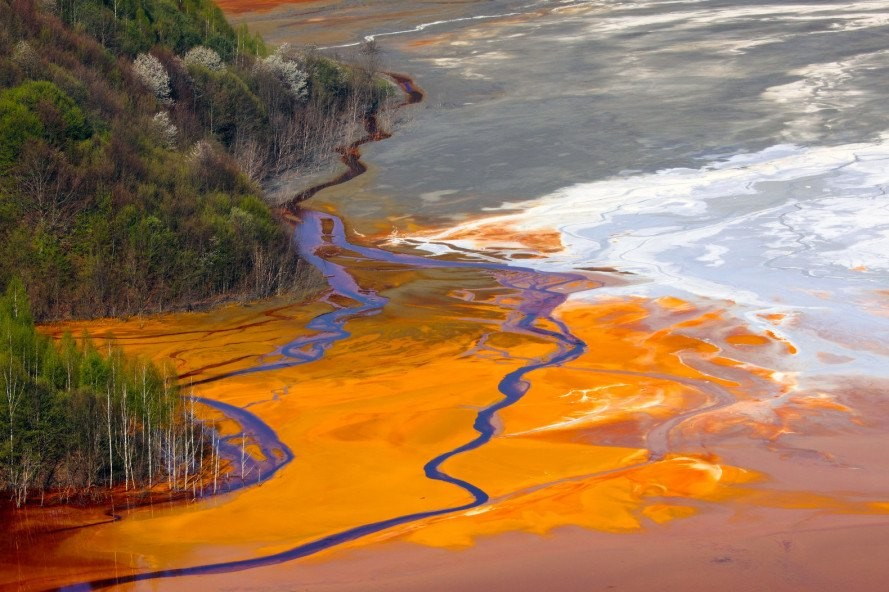

## Industrialization in context: Trees and humans

- **Tree-to-human ratio today is ~443:1 (~3 trillion trees globally & 8 billion people)**

 

- **Before agriculture, ratio possibly in the hundreds of thousands to one**
    + by the Roman Empire (~2,000 years ago), major forests in Europe and the Mediterranean were already cleared.

 

- **Industrialization (18th–20th centuries) marked a sharp drop in tree cover, especially in Europe and North America, including Appalachia**
    + Appalachia: Experienced major deforestation during the 19th-century timber boom

 

 
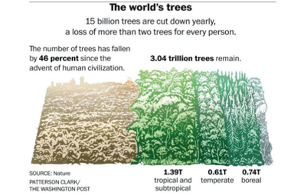

## NOW: The Great Acceleration

- **Period of rapid socio-economic and environmental following World War II (>1950)**
    + Coincided with the Atomic Age and the Cold War tech race
    + non-official start of the Anthropocene

 

- **Key drivers: Population boom, industrial expansion, globalization, rise of consumer economies**
    + global population has tripled in just 75 years
    
 

- **Introduction of synthetic chemicals, plastics, fertilizers, and global supply chains**

 

- **Technological growth: Cars, highways, electronics, suburban sprawl**

 

- **Appalachian context: Infrastructure expansion, coal demand spikes, and federal investments (e.g., TVA projects)**
    + mechanization reduced jobs but increased extraction.

## The Great Acceleration – Environmental and Societal Impacts

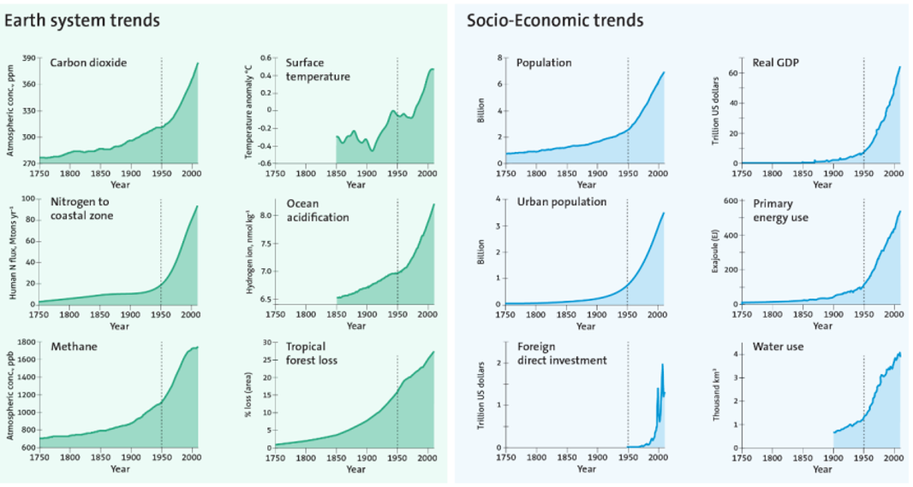

## Why does this matter for global change?

 

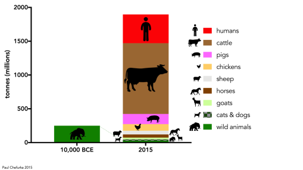

- **Over human history...**
    + **Biomass of terrestrial vegetation has halved**
        + 443 trees per human
    + **More than 20% reduction in biodiversity**
        + terrestrial and aquatic
    + **At least one million species threatened with extinction**
        + new discussions of an emerging mass extinction event
    + **More than 70% of the Earths land surface has been altered by humans**
        + only 5% is left as 'pristine'
    + **Total global biomass of wild animals today is < 25% of what it was during the Late Pleistocene**
    <!-- + **Terrestrial vertebrates biomass today is represented by livestock (59%) and living human beings (36%)**. -->

