## The Geologic Time Scale

- **Humans subdivide time into useable units, such as our calendar year, months, weeks, and days** 

 

- **Geologists also subdivide time- breaking it into useable, understandable segments**
    + based on major geologic events
    + based on appearance (and disappearance) of significant life-forms
    + starts with formation of Earth’s crust followed by the appearance of ever-changing forms of life

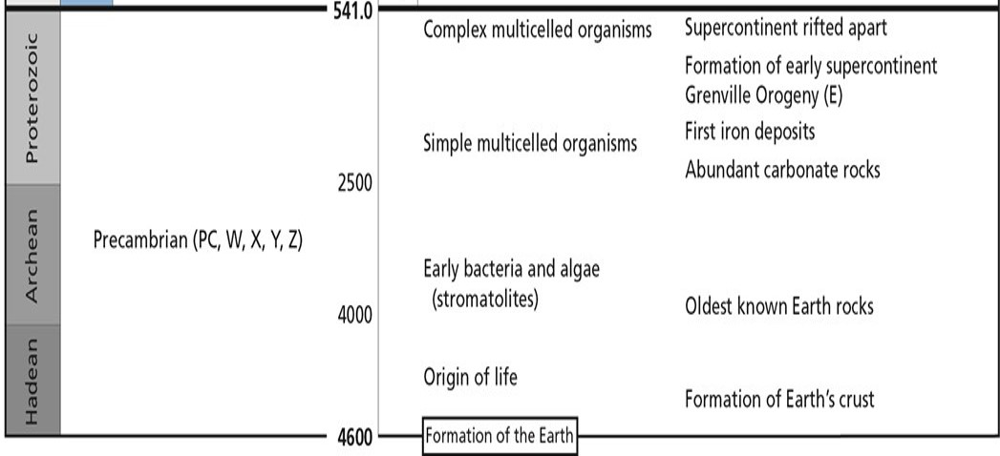

##

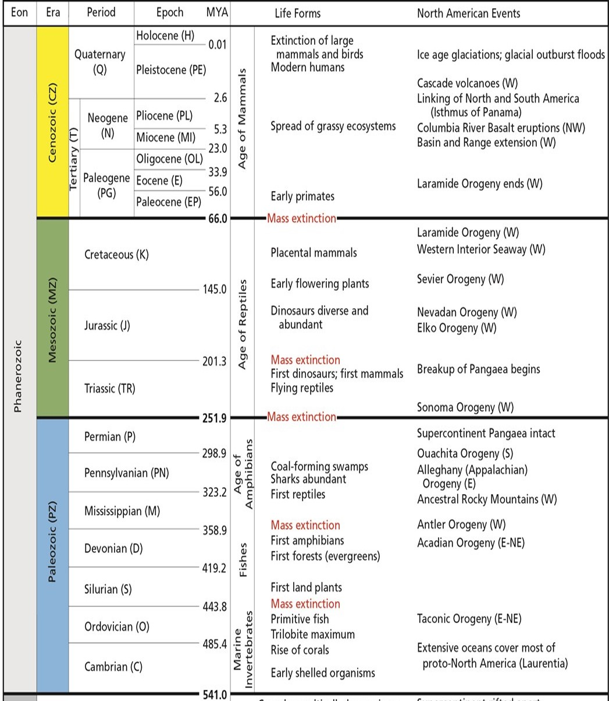

## Key Periods of Human History

 

- **We know that humans influence the biosphere - just by being humans**
    + local vs regional vs global

 

- **On geologic times scales humans have existed in the Cenozoic era**
    + our evolutionary trajectory takes us through the Pleistocene and Holocene
    + and at some point a new epoch: *Anthropocene*

 

- **Understanding the pace of human impacts requires knowledge geologic time scales**
    

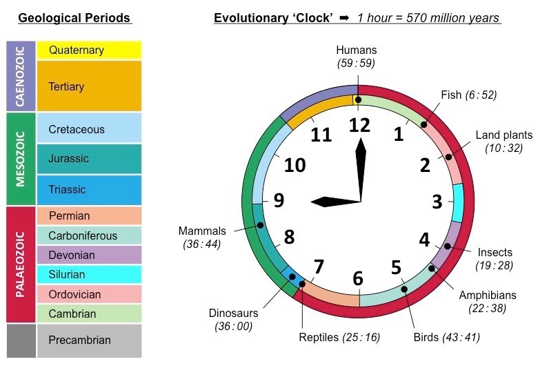

## Pleistocene Ice Age (1.8-0.1 mya)

- **Glaciers repeatedly advance from the Arctic over Europe and North America**
    + ice up to a mile thick
    + temperatures ahead of the flow drop significantly.
    
 

- **Animal life evolved (or not) to handle temperature change**
    + new species, range shifts, population declines
    
 

- **Hominid line continues to evolve during the Pleistocene**
    + anatomically modern humans first appear during late stages

 

- **More than 200 genera of very large herbivores go extinct**
    + 95% in North America
    + humans and climate

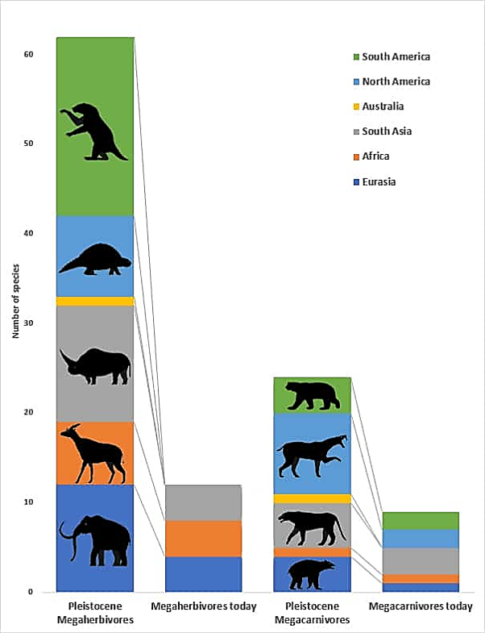

## Appalachian Mountains During the Pleistocene 

- **Laurentide Ice Sheet covered much of North America but did not extend into the southern Appalachians**

 

- **Mountains were a major climatic refuge for species displaced by glaciers**
    + preserved ancient lineages of *temperature* plants and animals
    + endemic specie of Appalachia survived this period

 

- **Large mammals (mastodons, mammoths) migrated through Appalachian valleys**

 

- **Post-glacial meltwater created river valleys (e.g., Tennessee and New River basins)**

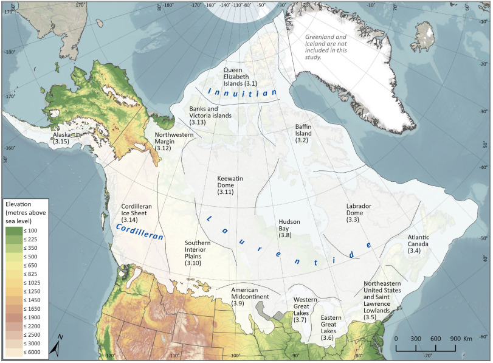

## Holocene (12,000 -)

 

- **H. sapien the only member of our genus to enter this period**

 

- **Begins after last glacial period, including glacial retreat**
    + Earth experienced a warming trend
    + Perhaps why biodiversity is comparably high
    
 

- **Climate change and megafauna extinction drive massive change in human behaviors**
    
 

- **Rapid proliferation, growth and impacts of the human species worldwide**

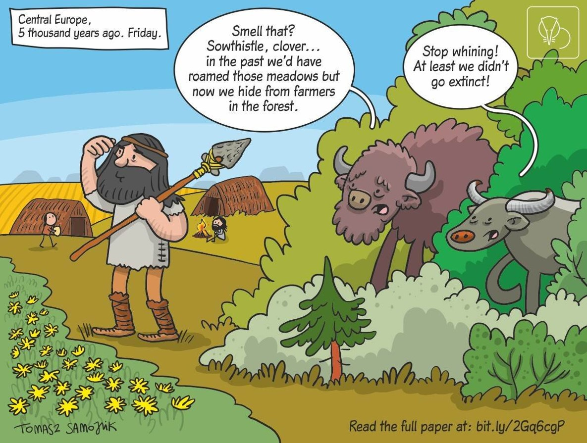

## Holocene: Stable/warm climate benefited humans

- **Significant advancements in technology and 'urbanization'**
    + resultant increases in human impacts (>local?)
    

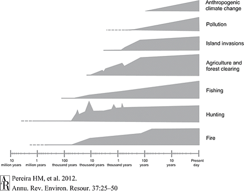

## Holocene: Were humans lucky?

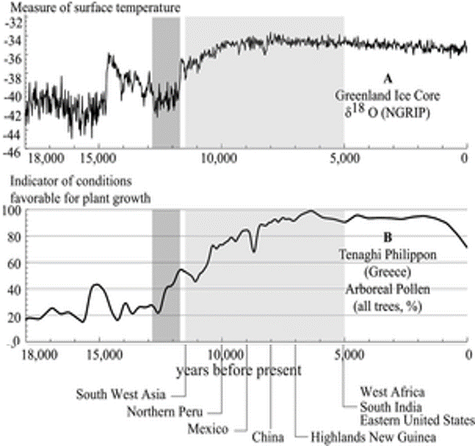

## Neolithic period (12,000-6,000ya)

 

- **Set of developments that appeared in several places independently!**

 

- **Development of agricultural crucial human landmark**
    + plant cultivation and animal domestication
    + irrigation in areas with insufficient rainfall
    + spread from several centers of origin
    
 

- **Origin of agriculture... necessity or opportunity?**

 

- **Whether from migrating farmers or indigenous development, most continents were transformed**

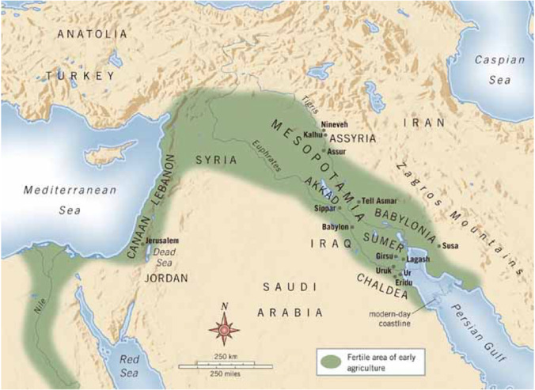

## Neolithic period: Urbanization and Population growth 

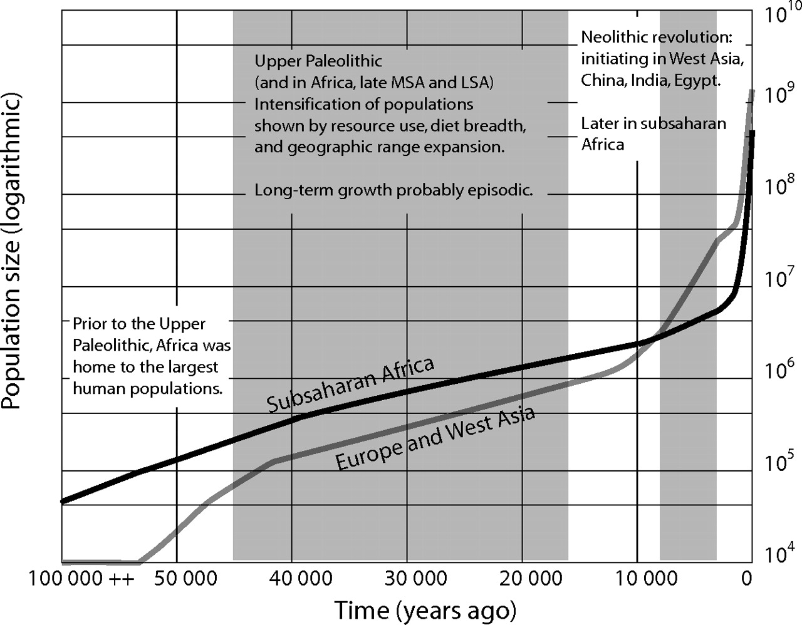

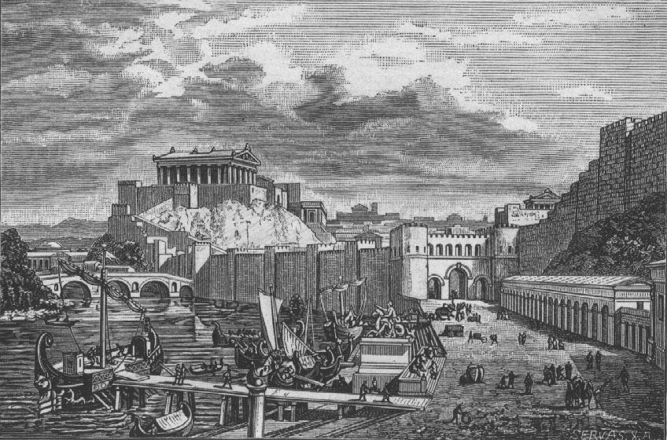

## Health consequences of agriculture...

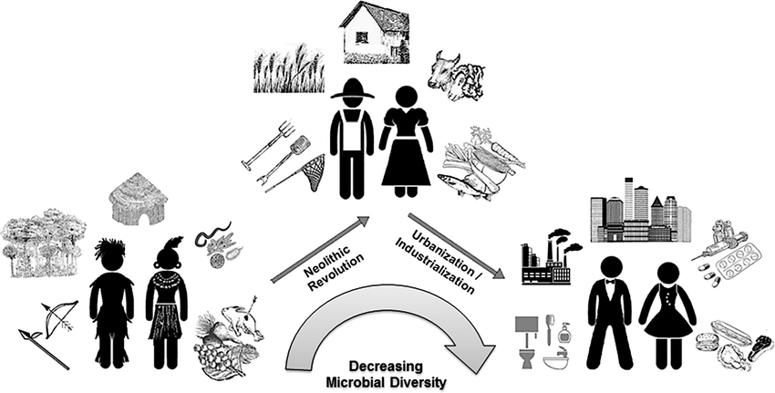

## Appalachian Mountains During the Holocene/Neolithic 

- **Earliest indigenous peoples arrived as hunter/gathers**
    + relied on foraging, hunting, and fishing
    + shifted to cultivating native crops

 

- **Eastern Agricultural Complex: woodlands of eastern North America was 1 of 10 independent centers of plant domestication**
    + sunflower, goosefoot, squash, and maygrass
    + disappeared after maize was introduced

 

- **Increased sedentism and larger semi-permanent villages along rivers and fertile valleys**
    + regional-scale transition to landscape manipulation and resource intensification.

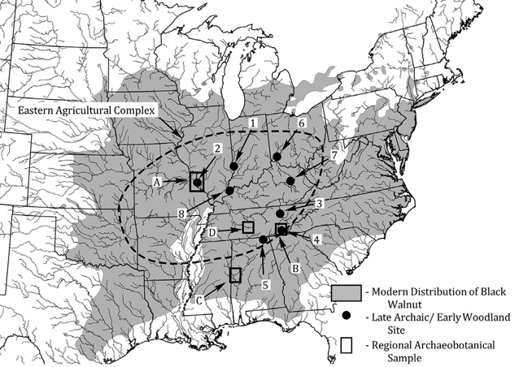

<!-- ## Neolithic period: Humans transitioned to permanent settlements -->
<!-- 
 -->

<!-- 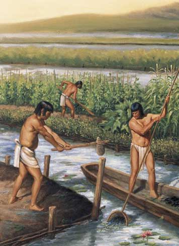 -->

<!-- 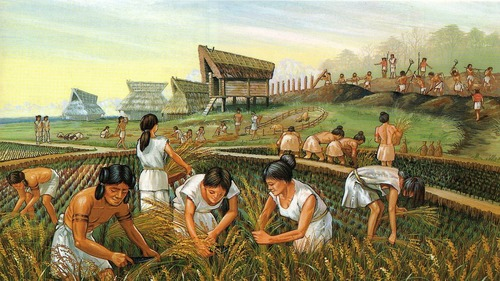 -->

<!-- ## Neolithic period: Consequences of Urbanization -->
<!-- 
 -->

<!-- 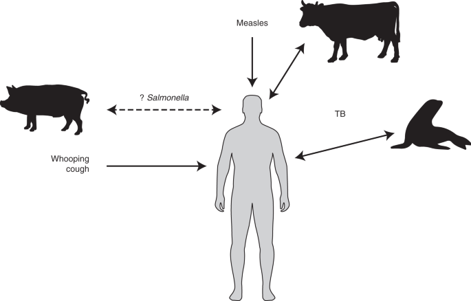 -->

<!-- 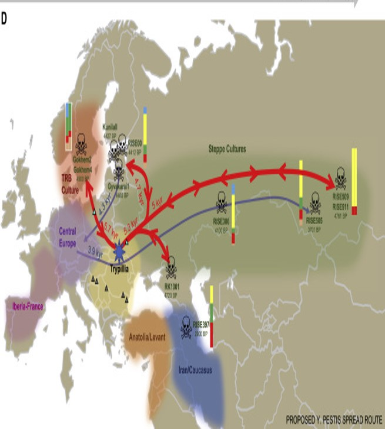 -->

## Late Holocene: Review - Industrial Age (1760 -)

 
 

- **Economic and social organization that began around 1760 in Great Britain** 
    + factory's of production (trade, farming, natural resources) allowed it to happen
    
 

- **Replacement of hand tools with power-driven machines**
    + power loom, steam engine, iron making

 

- **Appalachian Context: The region became a center for coal mining, fueling industrial growth at the cost of environmental health.**
 
 

 
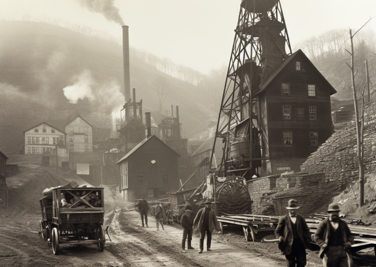

## Late Holocene: Review - Industrial Age (1760 -)

 
 

- **Every aspect of daily life was influenced in some way**

 

- **Average income and population began to exhibit unprecedented sustained growth**
    + creation of middle class
    
 

- **Represents the starting point for serious atmospheric change**
    + based on fossil fuel emissions
    + https://www.youtube.com/watch?v=kCmwKbVFbWg (bar chart race)
    
 

 
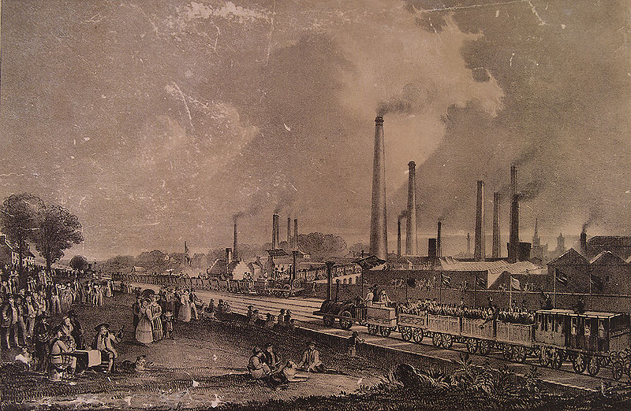

## NOW: The Great Acceleration

- **Period of rapid socio-economic and environmental following World War II (>1950)**
    + Coincided with the Atomic Age and the Cold War tech race
    + non-official start of the Anthropocene

 

- **Key drivers: Population boom, industrial expansion, globalization, rise of consumer economies**
    + global population has tripled in just 75 years
    
 

- **Introduction of synthetic chemicals, plastics, fertilizers, and global supply chains**

 

- **Technological growth: Cars, highways, electronics, suburban sprawl**

 

- **Appalachian context: Infrastructure expansion, coal demand spikes, and federal investments for energy**

## Key Periods of Human History: The Anthropocene Epoch

- **New geologic era?**
    + proposal submitted
    + would mark end of the Holocene
    
 

- **Many geologist criticize the idea**
    + hard to define a period when you are in it
    

- **Interval of time where humans dominate key processes on Earth**
    + anthropo, for “man,” and cene, for “new”

 

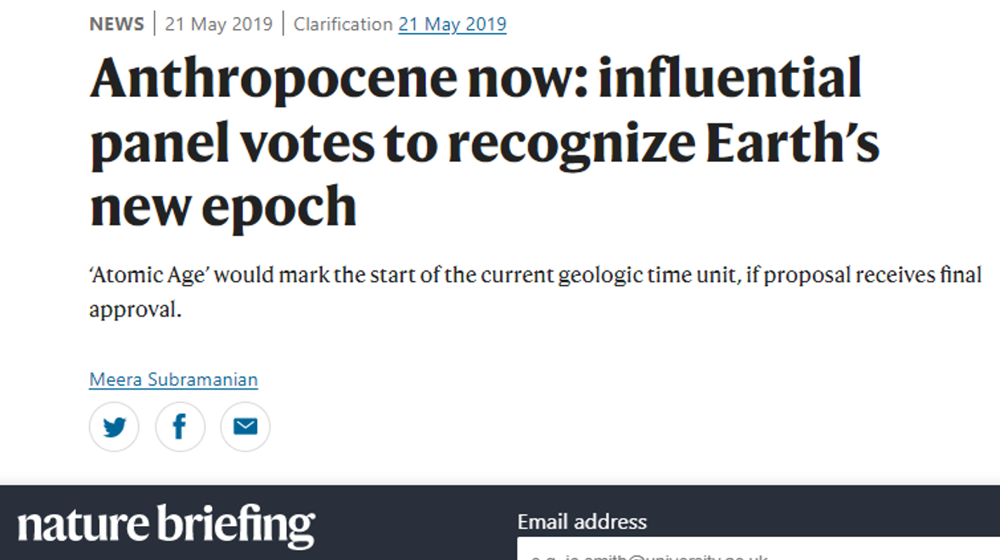

## Does the Anthropocene begin in the Industrial Age?

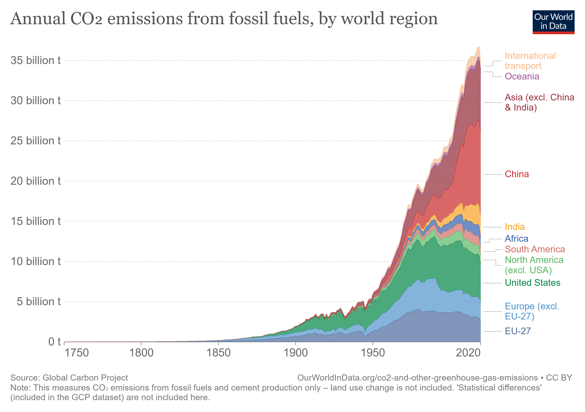

## Does the Anthropocene begin in the Industrial Age?

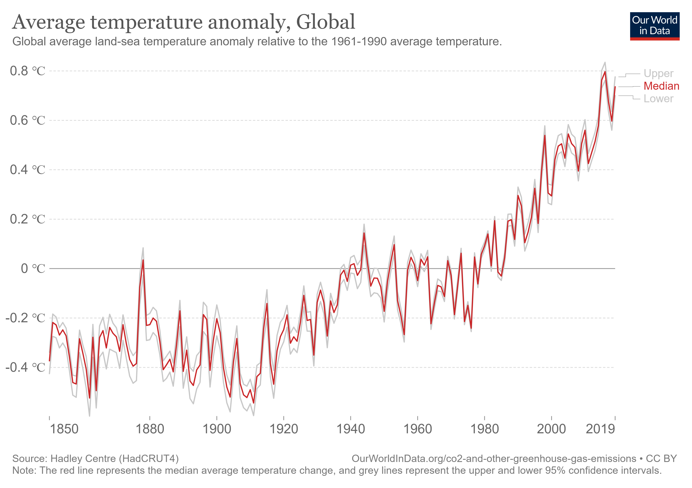

## Does the Anthropocene begin in the Industrial Age?

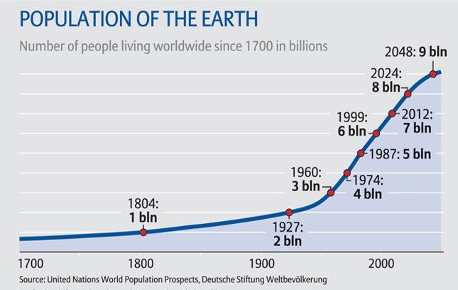

## The Great Acceleration: Post 1950

 

- **Dramatic, continuous surge in growth rate across a large range of measures of human activity**

 

- **Socioeconomic parameters:  population, economics, water usage, food production, transportation, technology**

 

- **Earth system parameters: green house gases, surface temperature, and natural resource usage**

 

- **Post-war revival age**
    + fossil energy and new technology flooding the markets

 

 
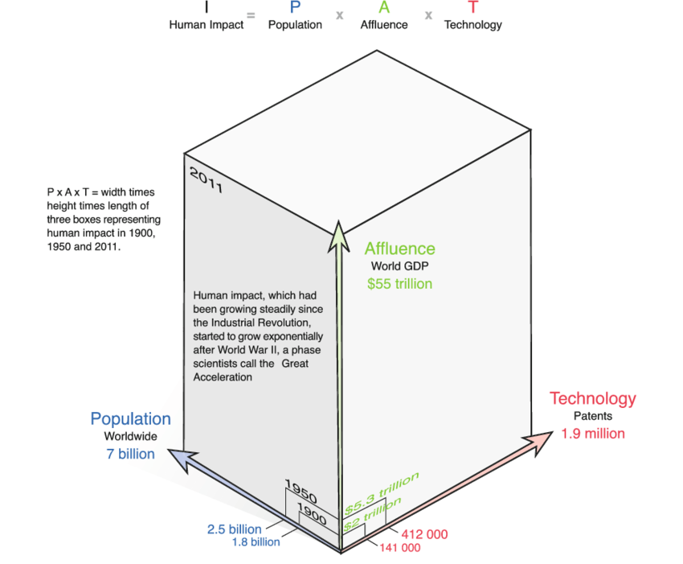

## What happended? Haber Bosch happened!

 

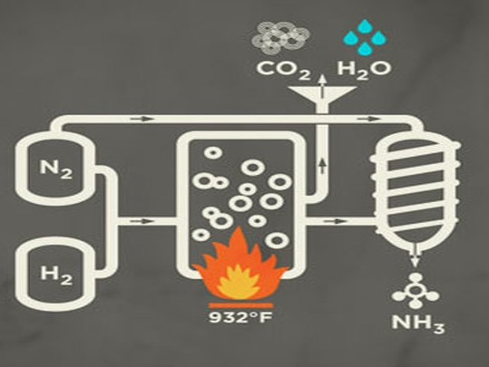

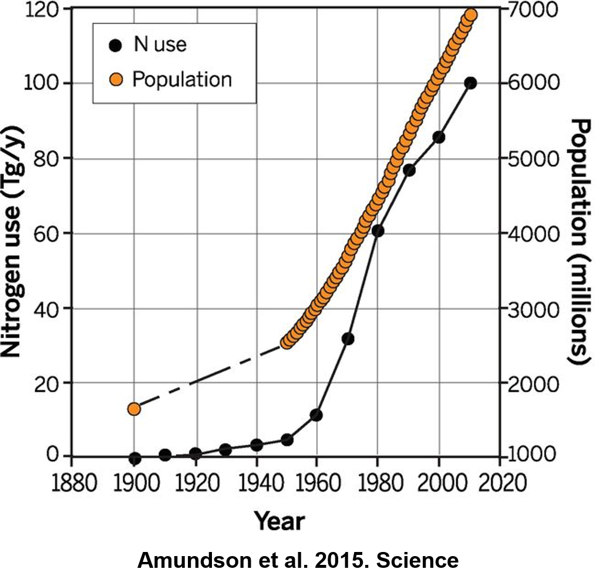
    
## Exponential human growth puts pressures on Earth's systems

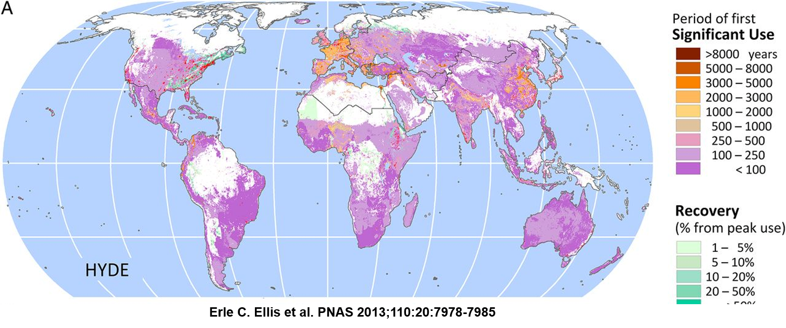

## 

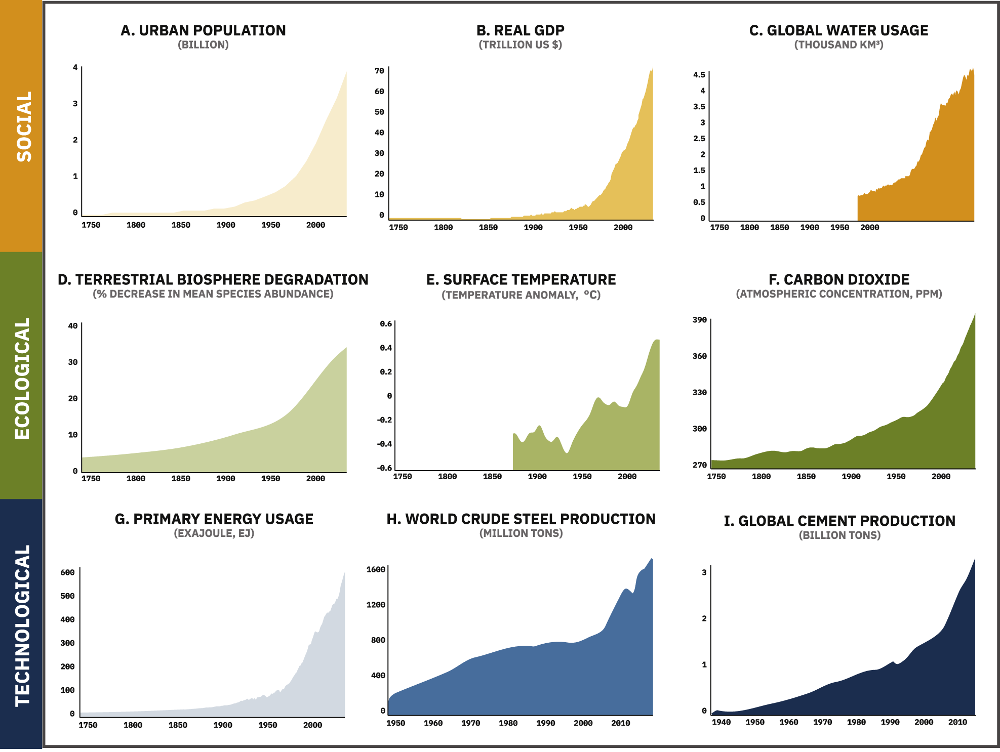

## Appalachia in the Anthropocene: Enviromental

 

- **Remains a major U.S. coal producer**
    + mountaintop removal flattened 500+ peaks
    + now includes fracking (oil/natural gas) in Marcellus shale

 

- **Continued land transformation**
    + clear-cutting removed old-growth forests
    + erosion, stream pollution from mining/logging

 

- **Climate Trends include warmer winters, heavier spring rainfall**

 

    
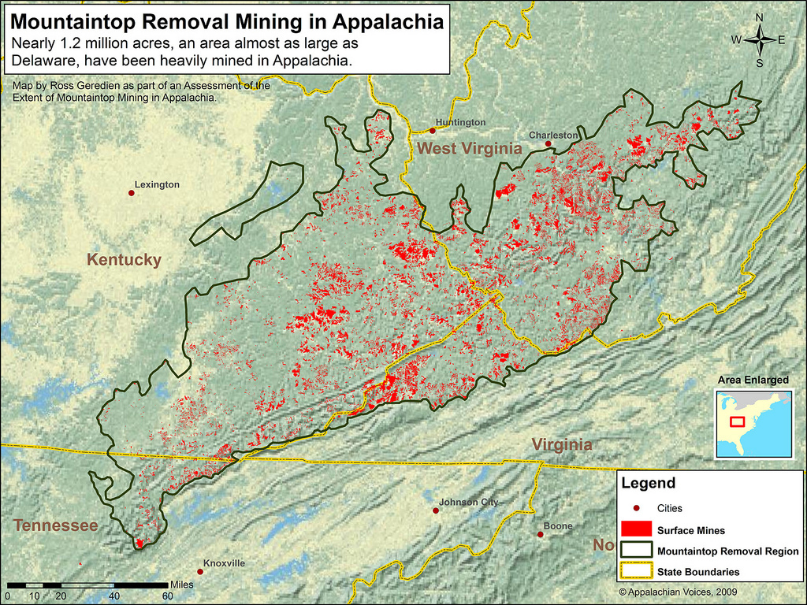

## Appalachia in the Anthropocene: Soceital

 

- **Boom-Bust Economy: Jobs rose with coal, fell with automation/global shift**
    + Persistent poverty, youth outmigration

 

- **Health & Justice: Higher rates of cancer, respiratory illness near mining sites**
    + Poor & rural communities hit hardest

 

- **Resistance Movements: Groups like Appalachian Voices fight for justice**

 

- **Cultural Resilience:Local stewardship rooted in lived experience**
    + Strong land ties, storytelling, music traditions
    
 

    
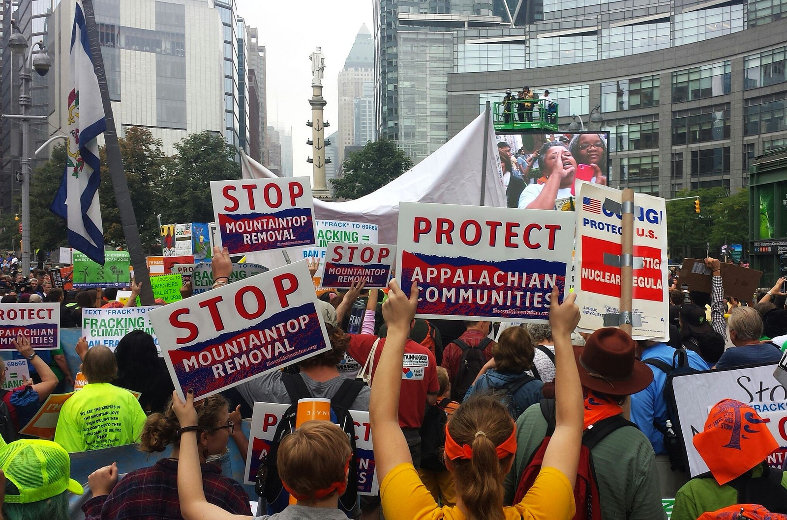
    