## Why are we here? The Big Bang to the Blue Ridge

- **Appalachian Mountains: Formed over billion years ago**
    + among Earth's oldest mountain ranges
    + formation from the collision of ancient landmasses
    + major uplift/folding occurred during Pangea (335mya)
    
 

- **Once as tall as the Alps, eroded to plains, then uplifted again in the Cenozoic**
    + Continues to be shaped by erosion, weathering, and geological forces
    

## Central Pangean mountains

## Why are we here? Human presence in the mountains

- **Native peoples arrived in the Appalachian region during  the Paleoindian Period (10,000-14,000 ya)**
    + This initial settlement  occurred at the end of the last Ice Age
    + Settlers were highly mobile bands of foragers, hunters, and fishers

 

- **Foraging, hunting, and fishing remained the subsistence for the Native peoples of Appalachia throughout the Archaic Period (3,000 to 10,000 ya)**

## Why are we here? Modern indengious peoples in the mountains

 

- **The Cherokee people are the original Appalachians, with evidence indicating a human presence in the current Cherokee territory in North Carolina for almost 12,000 years**

 

- **The Appalachian Trail runs through 22 Native Nations’ traditional territories and holds an abundant amount of Indigenous American history**

 

- **The Appalachian Region includes 3 federally recognized and 5 state recognized Native American Tribal Communities**

## Why are we here? Indian Removal Act (1830)

 

- **U.S. law that forced relocation of Native American tribes west of the Mississippi River**
    + tribes in the Appalachian region included the Cherokee, Creek, Chickasaw, and others
    + lands coveted by white settlers for use as cotton plantations and gold mining

 

- **Trail of Tears: Thousands of Cherokee were forcibly marched west in 1838; thousands died from disease, exposure, and starvation**

 

- **Cultural Disruption: Removal led to the breakdown of traditional social structures, languages, and spiritual practices**

## Why are we here? Early European settlement of the mountains

- **17th–18th Century Settlement: English, Scotch-Irish, and German pioneers arrived seeking land and opportunity**
    + In the late 1700's most of the population in the United States was found east of the Appalachian Mountains

 

- **Early pioneers and settlers traveled along the historic Wilderness Road west into the wilderness of Kentucky through Cumberland Gap**

 

- **Economic Focus: Primarily farming and livestock in valleys and hillsides**

 

- **Major Challenges: Faced rugged terrain, limited transport, and conflict with Native populations**

 

- **Cultural Legacy: Introduced traditions in music, crafts, and customs that shaped Appalachian culture**

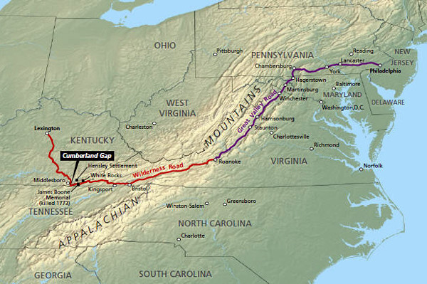

## Why are we here? Modern Appalachian cultural history

 

- **Industrial Revolution: Coal, timber, and iron extraction transformed the economy and population**

 

- **American Revolution: Served as a key defensive region; notable battle at Kings Mountain**

 

- **Federal Preservation: Creation of parks like Shenandoah, New River Gorge and Great Smoky Mountains signaled increased federal land management**

 

- **Modern Appalachia: Region remains culturally rich, facing ongoing economic and environmental challenges**

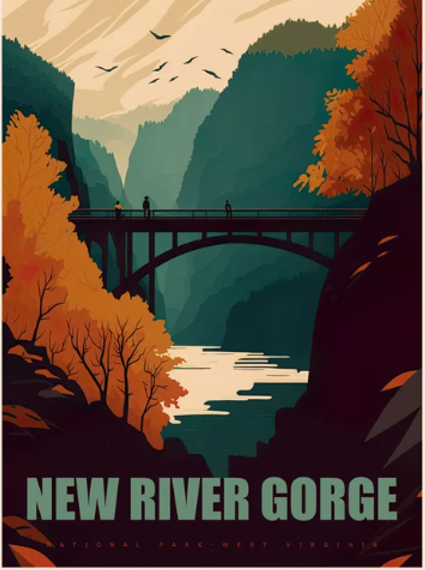

## Why are we here? Cultural identity in Appalachia

 

- **Early Adaptation: Indigenous peoples developed seasonal hunting, gathering, and farming techniques suited to mountainous terrain**

 

- **Pioneer Ingenuity: Settlers built log cabins, terraced hillsides for farming, and used local materials for survival**

 

- **Resource Use: Communities adapted to isolation by relying on coal, timber, and small-scale farming**

 

- **Cultural Resilience: Music, storytelling, and crafts reflect and preserve Appalachian identity**

 

- **Modern Shifts: Residents face economic shifts, environmental change, and rural depopulation**

## Why are we here? Impact of those cultural choices

 
 

- **Strip mining, mountaintop removal, and their environmental consequences**

 

- **Economic dependency on single industries led to cycles of boom and bust**

 

- **Cultural impacts: Displacement, community fragmentation, and revival efforts**

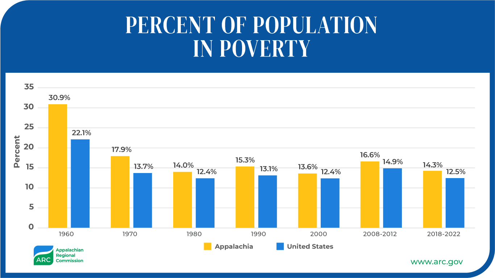

## Why are we here? Limiting stories in Appalachia

 

- **Stereotypes: Poverty, ignorance, isolation**

 

- **Counter-narratives: Rich traditions in music, storytelling, community solidarity, and activism**

 
 
 
 
 
 
 
 
 
 
 
 

- **Question: How do these stories limit or empower regional identity and future policy?**

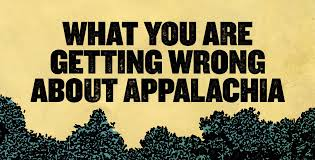

## Why are we here? The urgency for a new Appalachian story

 
 
 

- **Climate vulnerability: Floods, erosion, and economic uncertainty**

 

- **Importance of cultural and ecological resilience**

 

- **Embracing renewable energy, agroecology, ecotourism, and localism**
    + reinvention of the economy

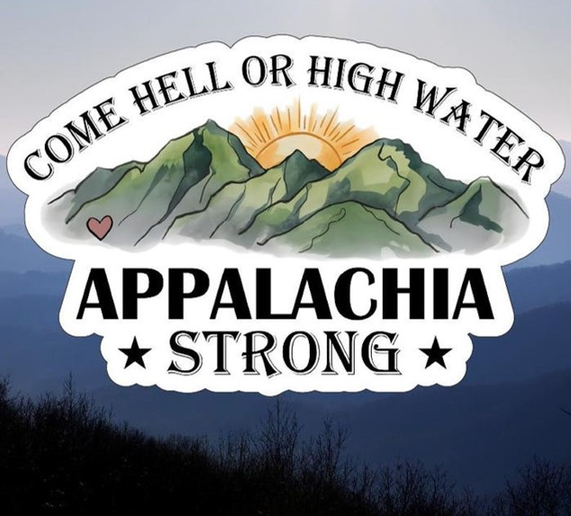

##  Why are we here? Approaching ecological thresholds

- **Ecological tipping points in central Appalachia: Deforestation, water pollution, biodiversity loss**
    + Appalachian mountains are a vital migratory route and climate refuge

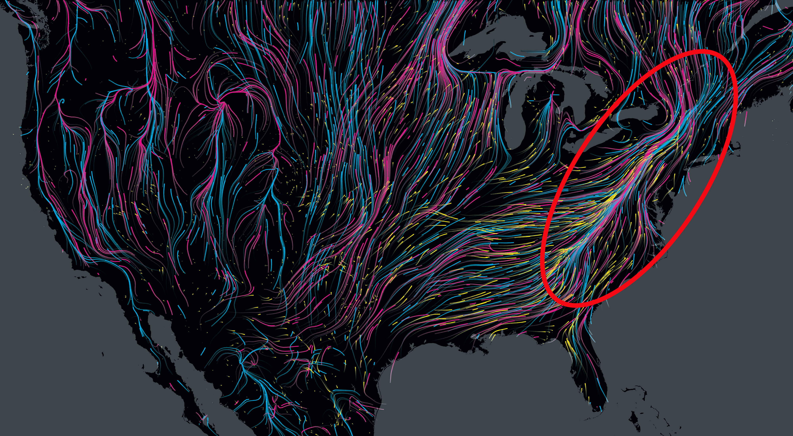

##  Why are we here? Approaching societial thresholds

 
 
 
 
 

- **Socioeconomic thresholds: Outmigration, health crises (e.g., opiod epidemic), education gaps.**
    + In 2023, nearly 41,000 people left West Virginia
    + What happens if we don’t act?

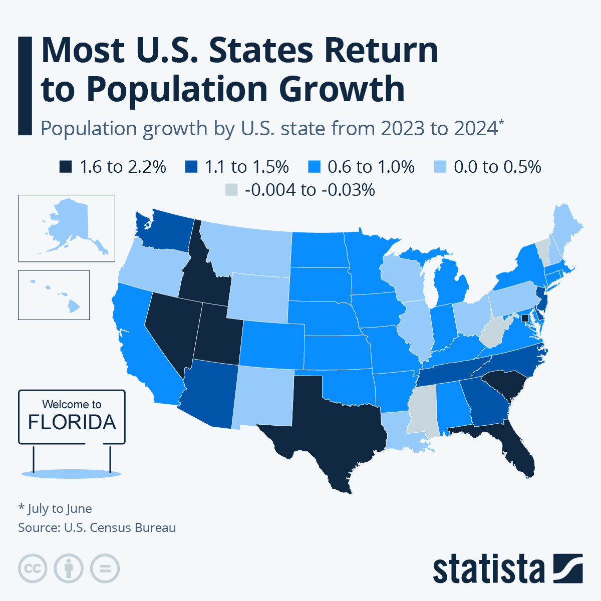

##  Why are we here? Shifting baselines in Appalachia

 

- **Shift from dense forest and clean rivers to industrial scars and reclaimed lands**
    + What is your firefly story?
    
 

- **Loss of traditional knowledge and oral history**

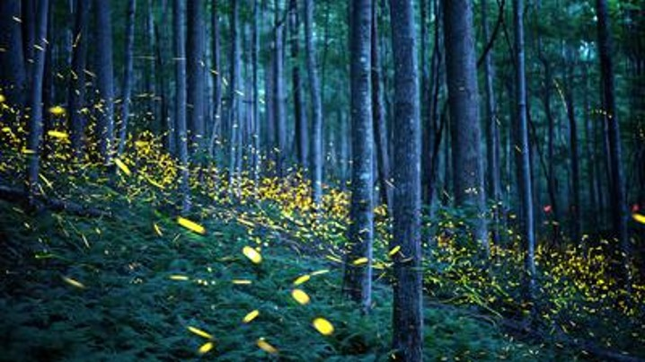

##  Why are we here? Telling a new hero'sstory

 

- **Appalachia as a place of strength, creativity, and resilience**
    + Reflect: What do *you* bring to this place?

 

- **Artists, scientists, and citizens reshaping the narrative**
    + Act: How can *you* be a steward of Appalachian landscapes and cultures?

 

- **How do we rewriting Appalachia's story moving forward?**
    + Connect: How do *we* broaden the knowledge base of Appalachian past, present and future?

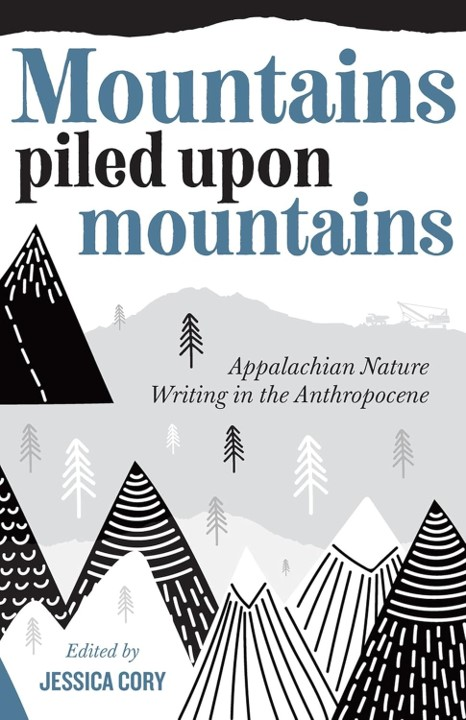

## Science communication in Appalachia

- **Barriers: Educational disparities, mistrust of institutions, digital divides**

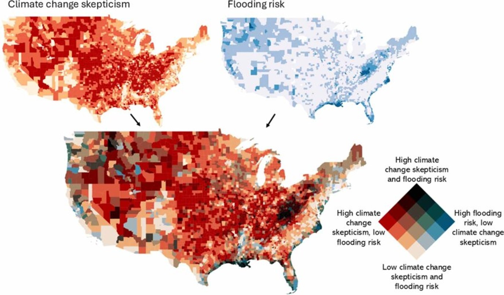

 
 
 
 
 
 
 
 
 
 
 
 
 
 
 
 
 

- **Opportunities: Place-based science education, citizen science, ecotourism**

## Rebuilding trust in science in this region...

 
 
 

- **Community-led research and partnerships with local universities**

 

- **Grounding climate science in lived experience (e.g., flood damage, farming shifts)**

 

- **Bridging tradition with innovation**

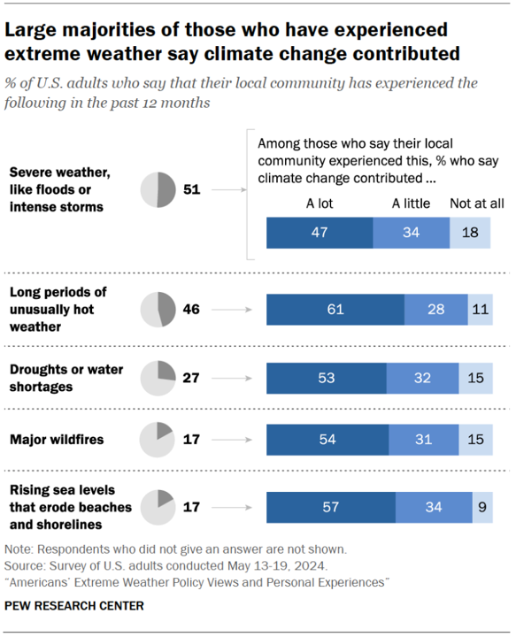

## Social Fragmentation: How can we mend the social fabric?

- **Political polarization, economic decline, and outside exploitation.**

 
 
 
 
 
 
 
 
 
 
 
 
 
 
 
 
 

- **Yet also: inter-generational households, neighborly networks, and spiritual communities**

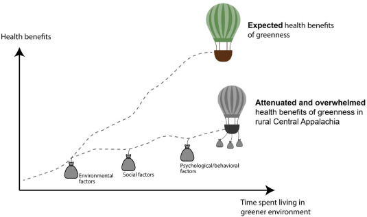

## Course Purpose in Context of 'Why are we here?'

- **This course is not just about learning facts—it’s about place-based awareness and civic responsibility.**

 

- **I will do my best to teach global change in an accessible manner. Our discussions, however, will be driven by the uniqueness of ideas, motivations, and concerns of you**
    + You’re part of a living history. What chapter will you write?

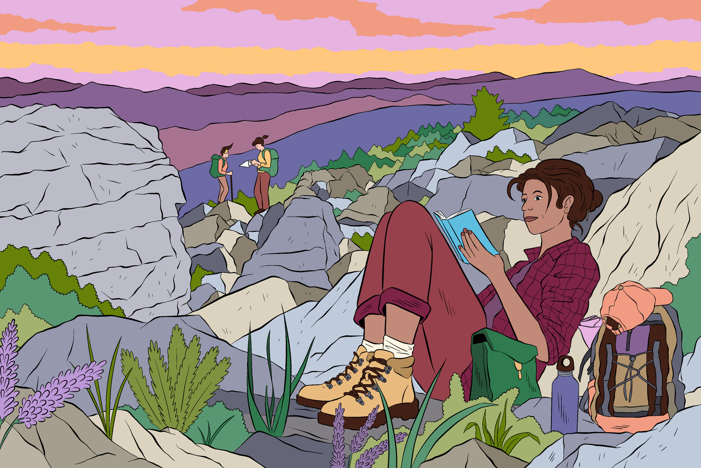

## Lab Today: Build your Appalachian caricature

 
 
 
 

- **Why are you here—in this class, on this campus, in this region?**

 

- **What do you hope to give and receive during your time in Appalachia?**

 

- **Try to use AI to build a caricature of your Appalachian self**

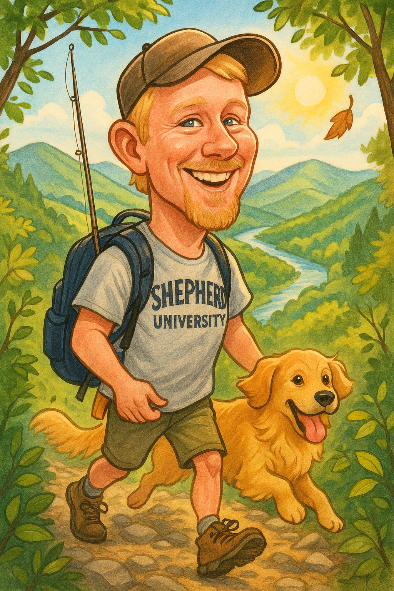

## Friday Discussion Assignment (posted on Brightspace)

 
 
 

- **Reflect on what you've learned/know about Appalachia’s past and future AND your perceived knowledge of global change**

 

- **Check your group assignment (by last name) for Friday's group discussion**
    + Submit short answers to the questions (min 1/2 page, max 1 page)
    + Submit a link/pdf to at least one article that relates to your group questions

