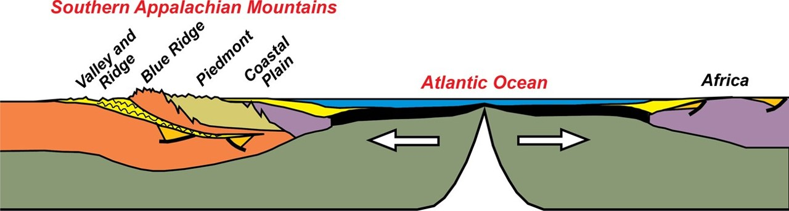
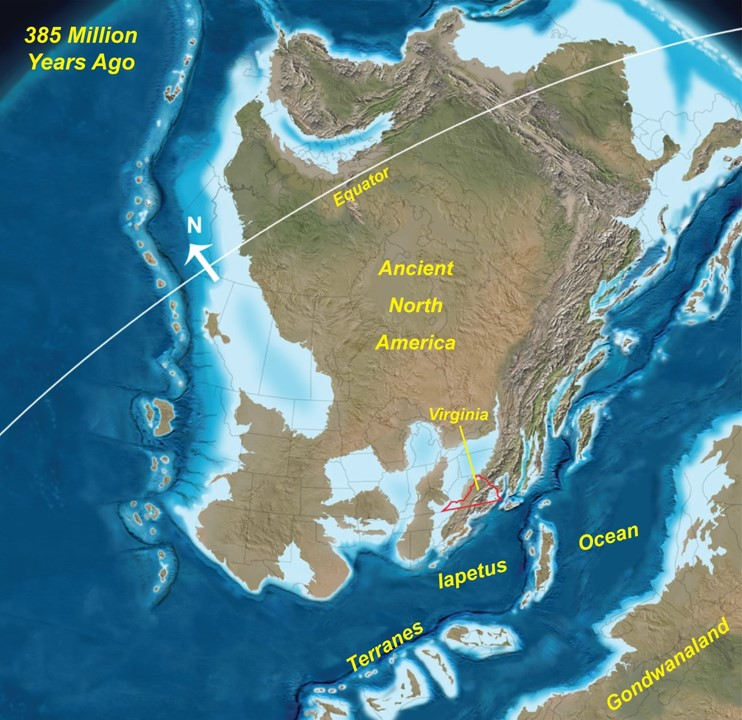
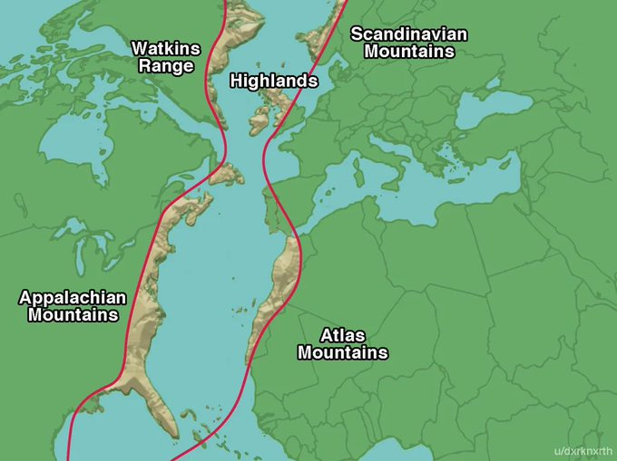
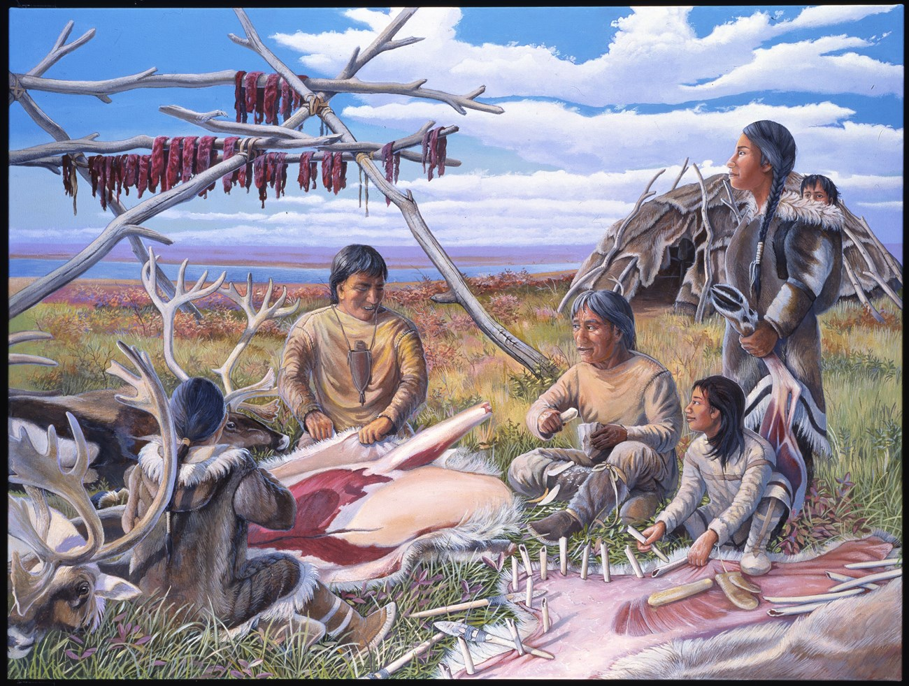
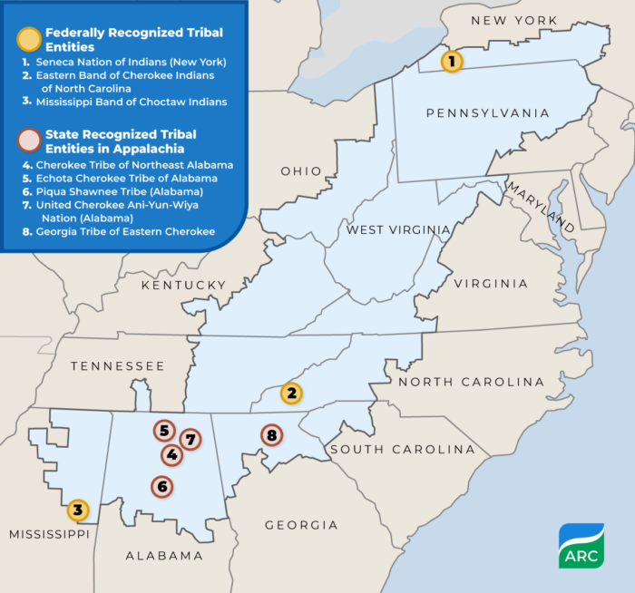
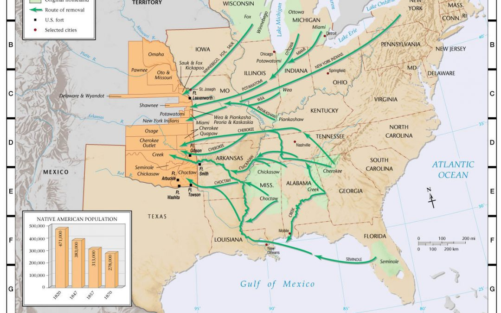

## The Big Bang to the Blue Ridge

- The universe began 13.8 billion years ago.

- Appalchian Mtns: Formed over billion years ago
    + among Earth's oldest mountain ranges
    + formation from the collision of ancient landmasses
    + major uplift/folding occurred during Pangea (335mya)

- Erosion & Rejuvenation: Once as tall as the Alps, eroded to plains, then uplifted again in the Cenozoic
    + Continues to be shaped by erosion, weathering, and geological forces
    

---

## Central Pangean Mountains

---

## Human presence in the mountains

- Native peoples arrived in the Appalachian region during  the Paleoindian Period (10,000 to 14,000 years ago])
    + This initial settlement  occurred at the end of the last Ice Age
    + Settlers were highly mobile bands of foragers, hunters, and fishers
    
- Foraging, hunting, and fishing remained the subsistence for the Native peoples of Appalachia throughout the Archaic Period (3,000 to 10,000 years ago])

---
## Modern indengious peoples in the mountains

- The Cherokee people are the original Appalachians, with evidence indicating a human presence in the current Cherokee territory in North Carolina for almost 12,000 years

- The Appalachian Trail runs through 22 Native Nations’ traditional territories and holds an abundant amount of Indigenous American history.

- The Appalachian Region includes 3 federally recognized and 5 state recognized Native American Tribal Communities

---

## Indian Removal Act (1830)

- U.S. law that forced relocation of Native American tribes to lands west of the Mississippi River
    + tribes in the Appalachian region included the Cherokee, Creek, Chickasaw, and others
    + tribes were displaced from homelands they had inhabited for centuries
    + coveted by white settlers for use as cotton plantations and gold mining

- Trail of Tears: Thousands of Cherokee were forcibly marched west in 1838; thousands died from disease, exposure, and starvation

- Cultural Disruption: Removal led to the breakdown of traditional social structures, languages, and spiritual practices

---

## Early European settlement of the mountains

-17th–18th Century Settlement: English, Scotch-Irish, and German pioneers arrived seeking land and opportunity

-Migration Routes: Came from regions like Virginia, Pennsylvania, and the North Carolina Piedmont

-Economic Focus: Primarily farming and livestock in valleys and hillsides

-Major Challenges: Faced rugged terrain, limited transport, and conflict with Native populations

-Cultural Legacy: Introduced traditions in music, crafts, and customs that shaped Appalachian culture

---

## Modern Appalchian cultural history

-Industrial Revolution: Coal, timber, and iron extraction transformed the Appalachian economy and population

-American Revolution: Served as a key defensive region; notable battle at Kings Mountain

-Federal Preservation: Creation of parks like Shenandoah and Great Smoky Mountains signaled increased federal land management

-Modern Appalachia: Region remains culturally rich, facing ongoing economic and environmental challenges

## Cultural identity in Appalachia

-Early Adaptation: Indigenous peoples developed seasonal hunting, gathering, and farming techniques suited to mountainous terrain

-Pioneer Ingenuity: Settlers built log cabins, terraced hillsides for farming, and used local materials for survival

-Resource Use: Communities adapted to isolation by relying on coal, timber, and small-scale farming

-Cultural Resilience: Music, storytelling, and crafts evolved to reflect and preserve Appalachian identity

-Modern Shifts: Residents continue adapting to economic shifts, environmental change, and rural depopulation

---