## Death is an inevitable part of life

 

**Die: loss of individuals, populations (*extirpation*), or species (*extinction*)**

 

**Is extinction actually an adjacent possible response?**

 

**The die 'response' is more a a failure to move, adjust or adapt**

 

**But patterns of extinction are so important (Since Industraial Revolution)that we need to treat it as a core category**

 

**Appalachia as a biodiversity 'hot spot' and climate refuge is a key area of concern**

## Shaping the tree of life

 
 
 

**Modern day biodiversity reflects billions of years of speciation**

 

**For example: Formation of mountain ranges (Appalachia) over geologic time are significant drivers of speciation due to their ability to isolate populations and create unique environmental pressures (elevation and climate gradients, diverse habitats)**

 

**The fossil record shows us that the creation of species (via evolution) occurs at different rates through time**

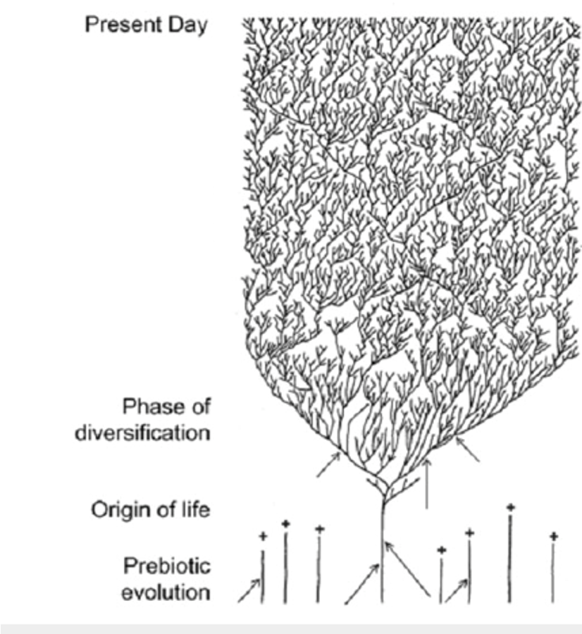

## Is the tree of life being pruned?

 
 
 

**Modern day biodiversity reflects billions of years of speciation**

 

**Balanced by billions of years of extinction**

 

**Speciation and extinction should not be considered a equally balanced yin and yang**

 

**What is different about today?**

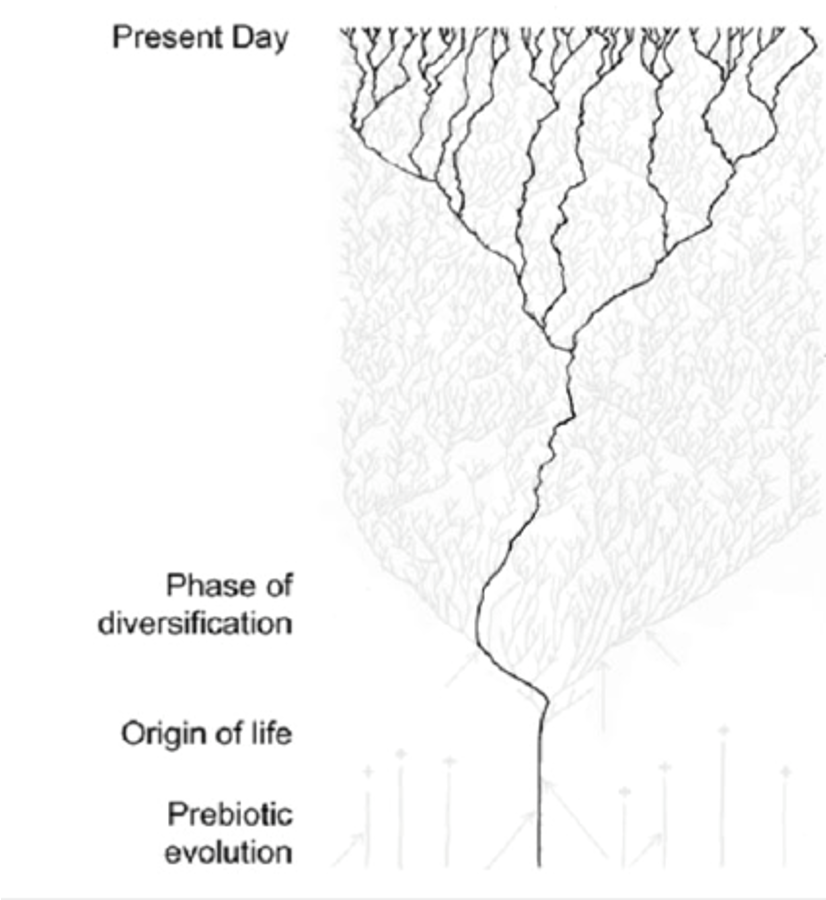

## Mass extinction history

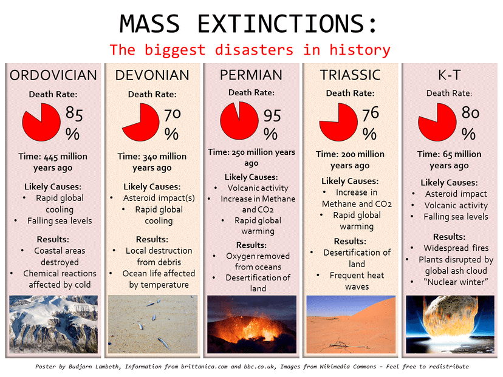

## Extinction during our time

 
 
 
 
 
 
 
 
 
 
 
 
 
 
 

**2011, cited ~6000 times**

 
**Never before has a large extinction event been caused by a single species at such high velocity**
 
**This "event" is evident in Appalachian forests and waterways, where unique species are threatened by human activities**

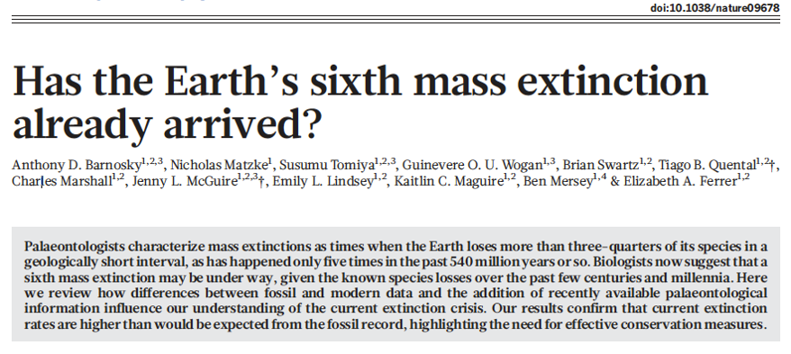

## Extinction during our time

 
 
 
 
 
 
 
 
 
 
 

**“The analysis we present here avoids using assumptions … which can suggest very high extinction rates, and which have raised the possibility that scientists are “alarmists” seeking to exaggerate the impact of humans on the biosphere”.**

 

**Ceballos and colleagues objectively compared current extinction rates to the background rate derived from the fossil record, providing insight into contemporary extinction trends versus the past**

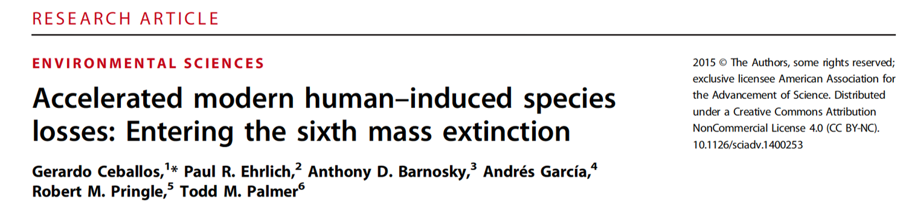

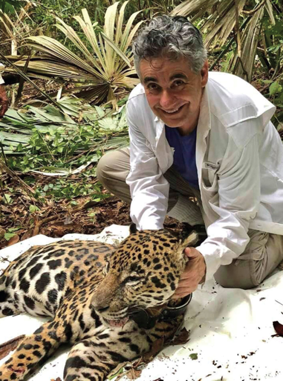

## Extinction during our time

 
 
 
 
 
 
 
 
 
 
 
 
 
 
 
 
 
 
 

**Cumulative percentage of extinct species for vertebrates. Dashed line is number of extinctions expected under a background extinction rate of 2 E/MSY**

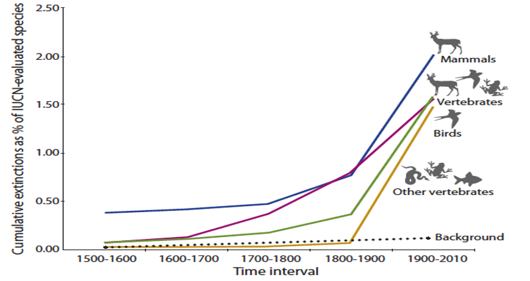

## Extinction during our time

 
 
 
 
 
 
 
 
 
 
 
 
 
 
 
 
 
 
 

**Number of years it would take for the vertebrate extinctions since 1900 to occur under the background extinction rate of 2 E/MSY**

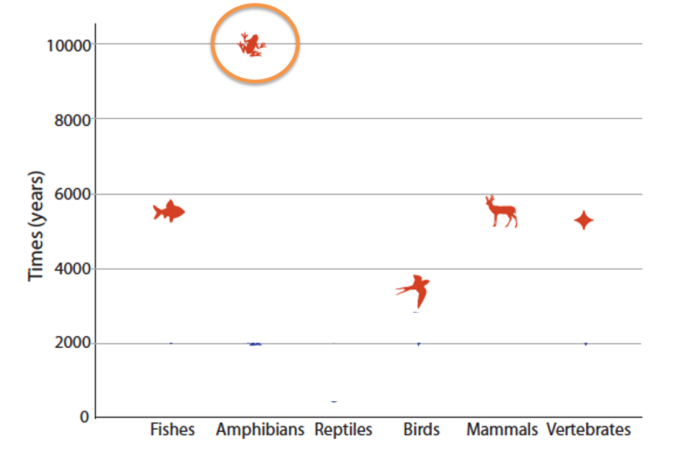

## Imperiled amphibians

**Current amphibian extinction rates are 100 times higher than historical background rates**

 

* **Caused by: **
    + Climate change
    + Habitat alteration
    + Overexploitation
    + Introduced predators and competitors 
    + Contaminants
    + Emerging infectious disease

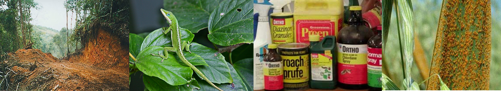

## Imperiled amphibians

**Current amphibian extinction rates are 100 times higher than historical background rates**

 

* **Caused by: **
    + Climate change
    + Habitat alteration
    + Overexploitation
    + Introduced predators and competitors 
    + Contaminants
    + Emerging infectious disease
    
 

- **What makes an emerging disease emerging?**
    + recently discovered
    + recently expanded in geography or host range
    + recently evolved in virulence

## Emerging Infectious Diseases in Appalachia

 

**White-Nose Syndrome in bats is caused by a fungus**
 

**Appeared in New York in 2006 and has spread rapidly through Appalachian species**
 

**Population declines of >90% have been observed in Appalachian bat colonies**

**Sudden ash death is caused by the invasive emerald ash borer**
 

**Appeared in Michigan in 2002 and has spread rapidly through Appalachia**
 

**In areas with severe infestations, most ash trees are killed**

<!--  -->

<!-- 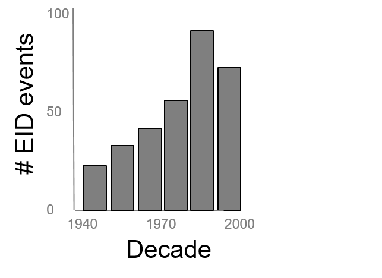 -->

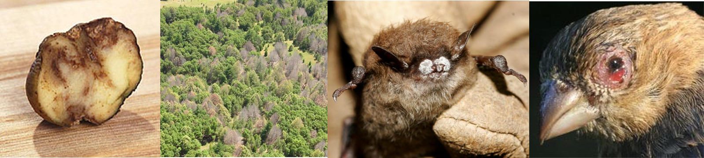

## Frog Apocalypse via *Batrachochytrium dendrobatidis*

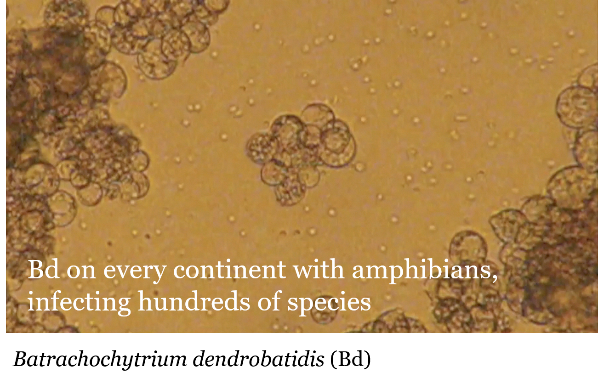

## Frog Apocalypse via *Batrachochytrium dendrobatidis*

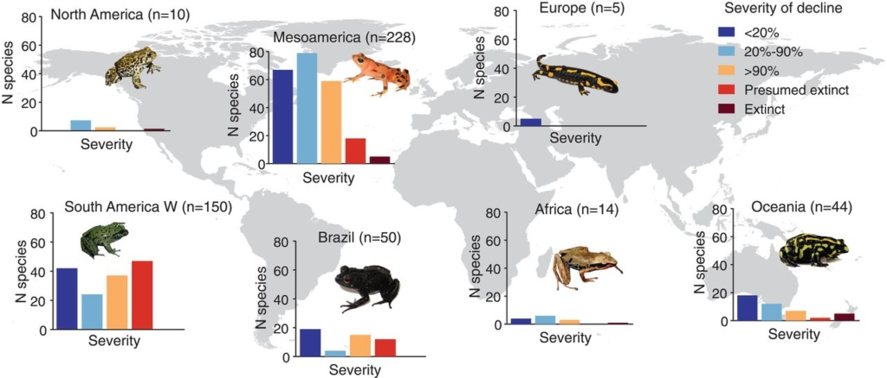

## Imperiled amphibians

 

**Emerging infectious disease**

 

**Where did the chytrid fungus come from?**

 

**How has it spread?**

 

**How does it kill frogs?**

 

**Are all chytrid strains equally deadly?**

 

**Why are some frog species more susceptible than others?**

 

**What can we do to protect amphibian biodiversity?**

 

**And on…**

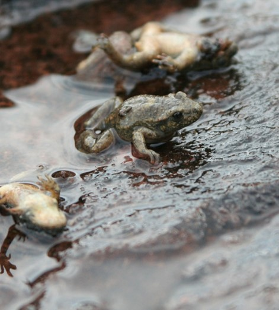

## Ways of studying population declines

 

**Emerging infectious disease**

 

**Where did the chytrid fungus come from?**

 

**How has it spread?**

 

**How does it kill frogs?**

 

**Are all chytrid strains equally deadly?**

 

**Why are some frog species more susceptible than others?**

 

**What can we do to protect amphibian biodiversity?**

 

**And on…**

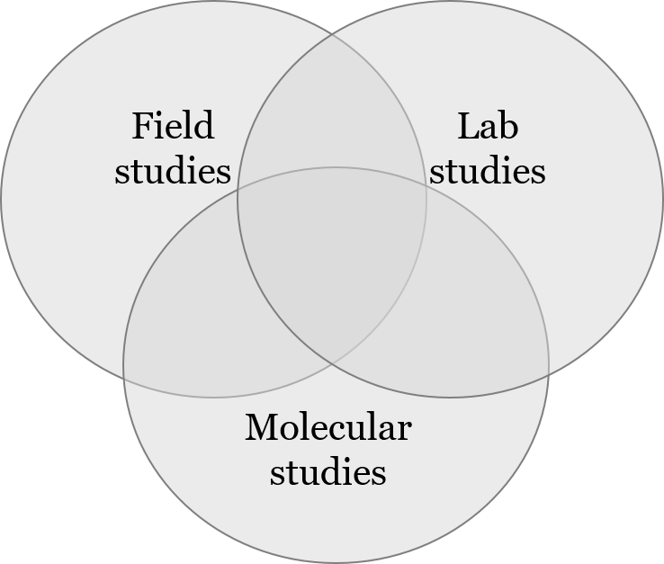

## Chytrid story

 

**How does *Bd* kills frogs**
 
 
 
 
 
 
 
 
 
 
 
 

**Amphibians are infected with Bd by contact with other animals or by spores floating in the water** 
 

**Eats away at their skin and triggers fatal heart attacks**
 

**Before it dies, a frog may manage to move to a new stream or pond, spreading the fungus further.**

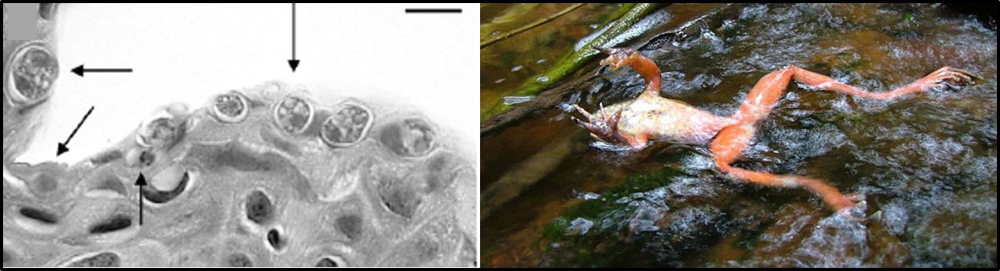

## 
 

**Where did *Bd* come from?**

 

**How much genetic diversity does it contain?**

 
 

**Museum specimens point to the oldest known instance from South Africa in the 1930’s.**

 

**?Spread around the world in African clawed frogs used for human pregnancy tests?**

 

**Appalachian connection: How might human activity in Appalachia contributed to the spread of white nose syndrome in bats?**

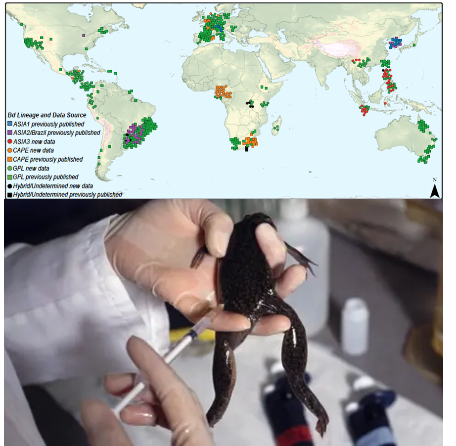

<!-- ##  -->
<!--   -->
<!--   -->
<!--   -->
<!--   -->
<!--   -->
<!--   -->
<!--   -->
<!--   -->

<!-- 
 -->

<!-- **When did *Bd* invade different places around the world?** -->

<!-- 
 -->

<!-- 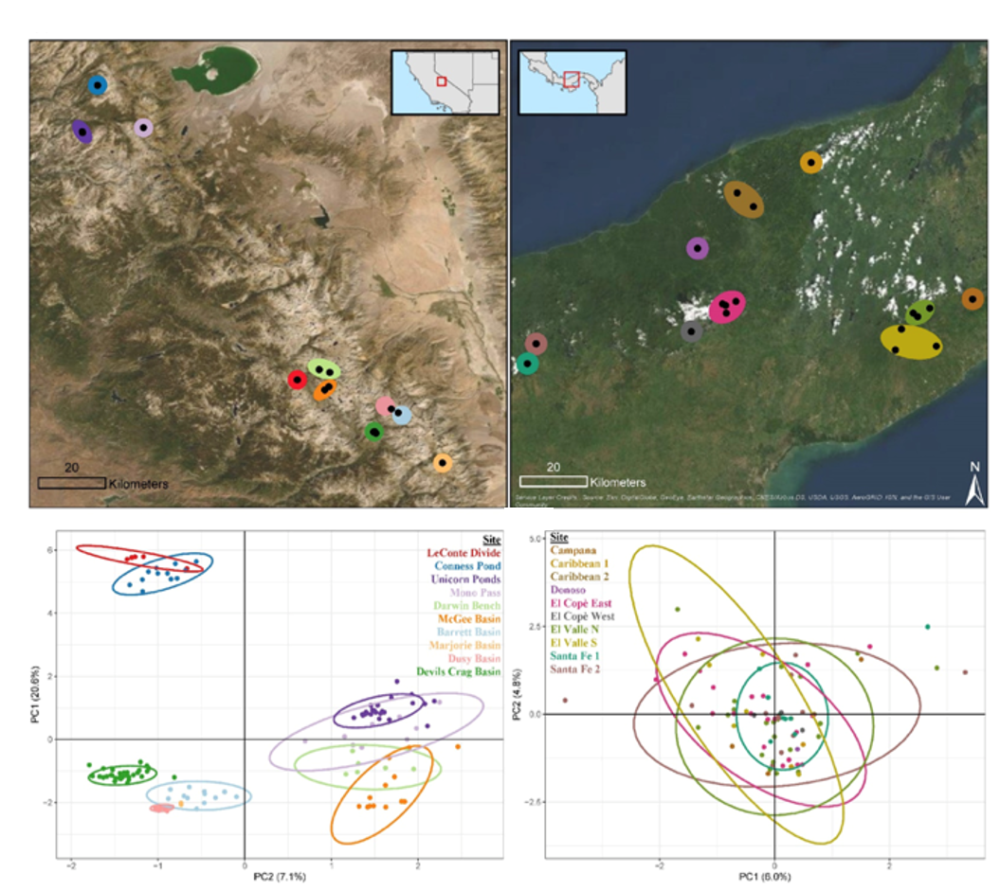 -->

## What makes Bd so deadly?

 
 
 
 
 
 
 
 
 
 
 

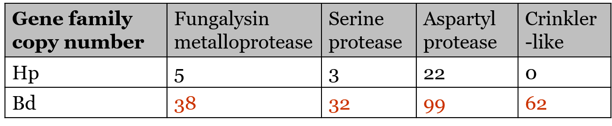

**Genetic evidence of virulence: these gene families serve as virulence factors in other fungi that infect vertebrate skin**

 

**Appalachian connection: Research on white nose syndrome has identified genes in the fungus that contribute to its cold-tolerance and ability to thrive on bats in hibernation, making Appalachian caves ideal environments for its spread**

## Differences between the winner and the losers

**Why do some frogs NOT die from Bd infection?**
 
 
 
 
 
 
 
 
 
 
 
 
 
 
 
 
 
 
 

**Resistant frogs mount a more robust immune response (via phenotypic plasticity)**

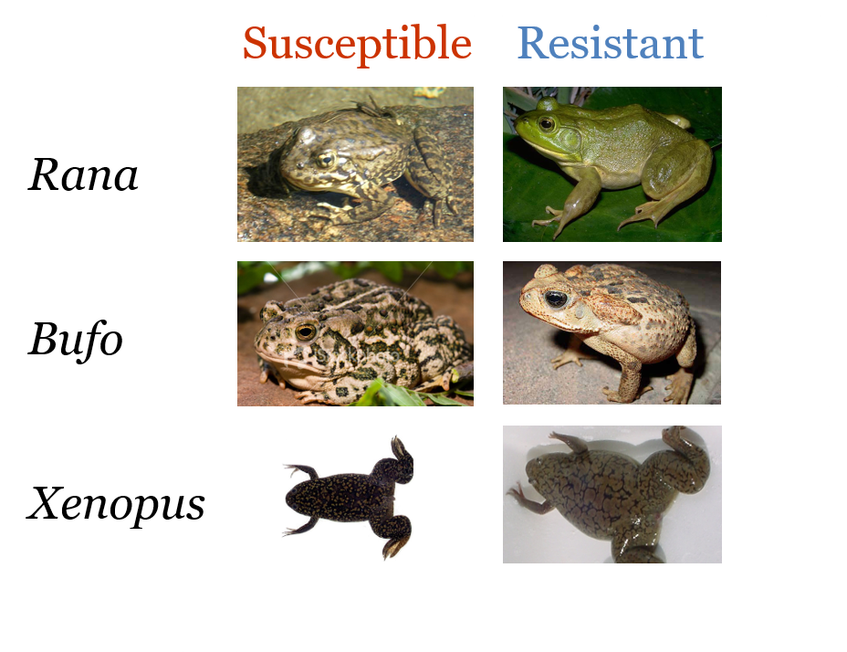

## Field studies reveal the heartbreaks?

**>500 species of amphibians have declined significantly because of the outbreak — including at least 90 species presumed to have gone extinct (2019)**

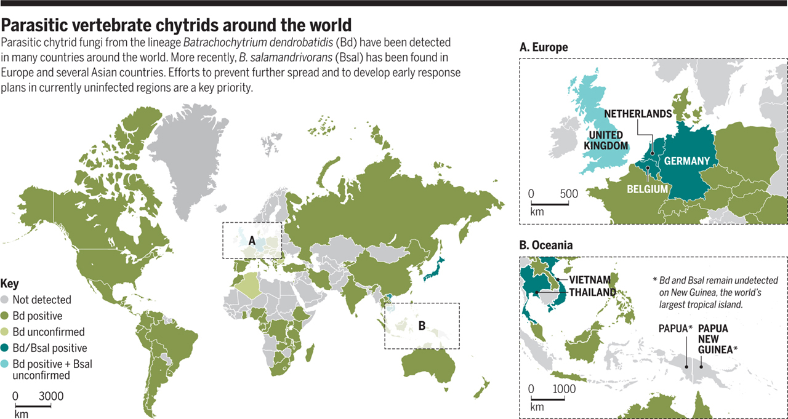

## Appalachian amphibians: Chytrid Impacts

 

**Spotted Salamander: Bd detected in Southern Appalachians, with one study showing 10% positive**

 

**Green Salamander: Identified with Bd infection in Southern Appalachia, though at lower prevalence (around 7.7%)**

 

**Lungless Salamanders: show low historical Bd prevalence, but experiments indicate susceptibility and death from infection in lab settings.**

 

**Field surveys have detected Bd on frogs and toads in the southern Appalachians but not a lot of mortality**

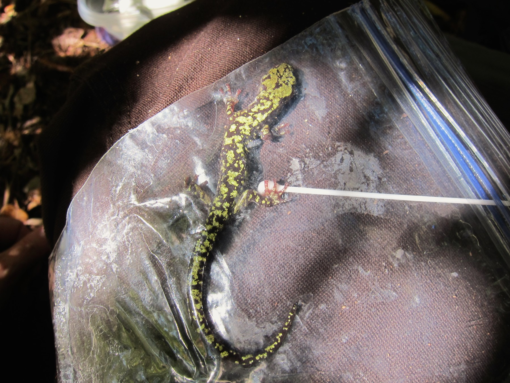

<!-- ## What are the glimmers of hope? -->
<!-- 
 -->
<!-- **Examples of contemporary extinctions…** -->

<!-- 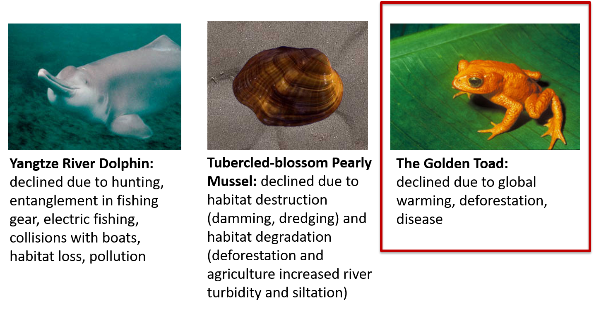 -->

## What are the glimmers of hope?

**Tracking population recoveries through the adjust response (immune plasticity) and the adapt response (new antibacterial skin secretions in bullfrogs) **

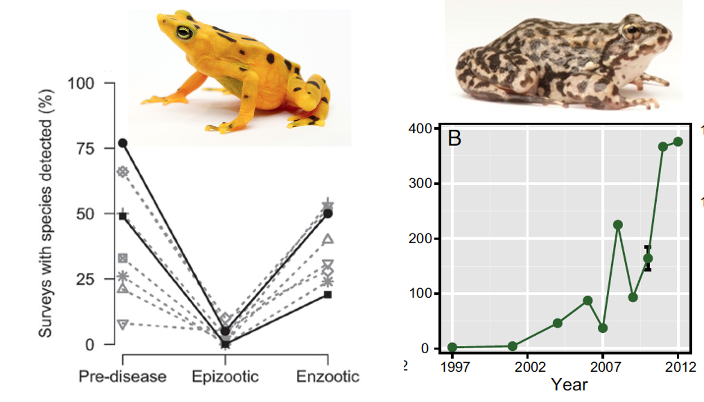

## What are the glimmers of hope?

**Direct support to mangers working on-the-ground for amphibian conservation **

 

**Pinnacles biologists conducted a study of Bd at Pinnacles National Park from 2006-2007**

 

**Tested animals for Bd by swabbing their skin and sending the swabs to a lab for DNA analysis**

 

**All three frog and toad species we tested at Pinnacles are infected with Bd**

 

**Rarely find dead frogs, and frog populations appear to remain stable**

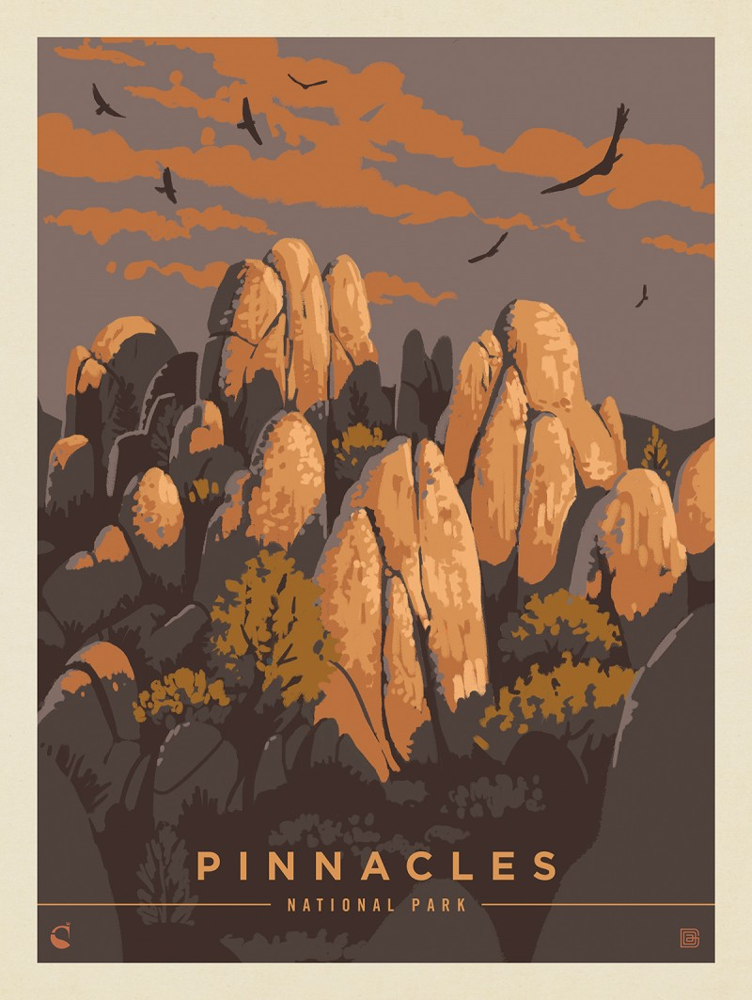

## What are the glimmers of hope? Targeted conservation

**Contributions to conservation more broadly. Knowledge gained from studies aids in preparedness for the next emergent disease. Bsal is another chytrid fungi in Europe. Studies indicates great invasion risk in the Appalachians**

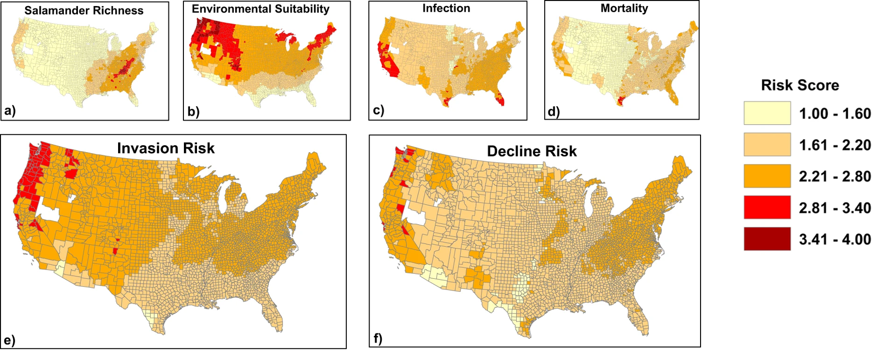

## What are the complexities?

**Intentional extinction of pathogens & parasites?**
 

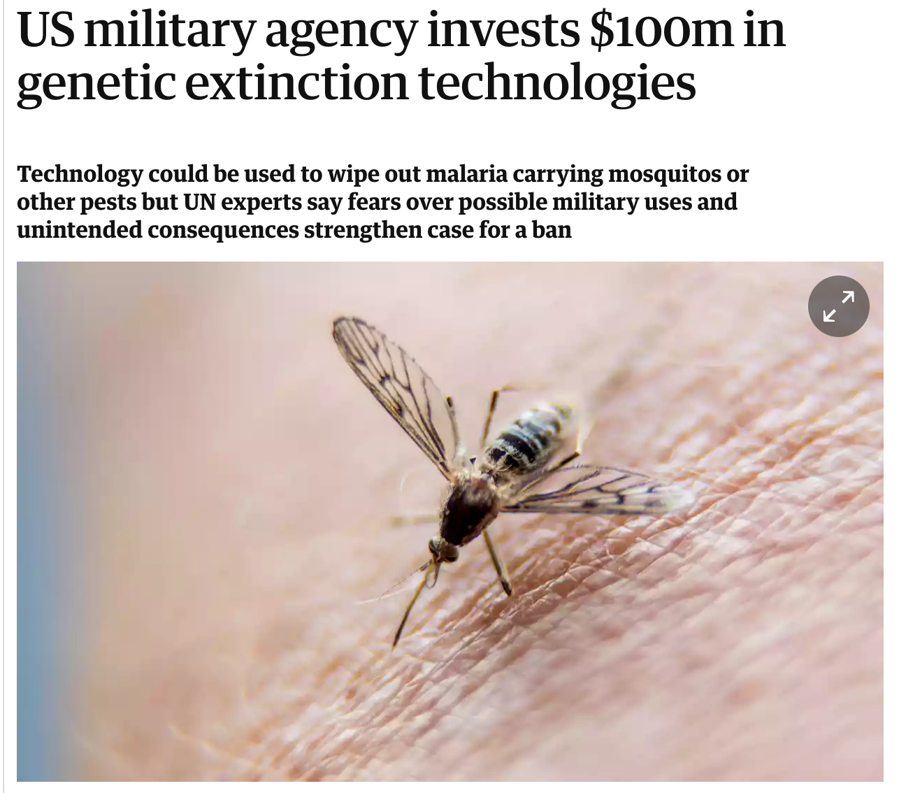

**British biotech firm has the  green light from U.S. regulators to release over 2 million genetically modified mosquitoes in Florida and California**

 

**Effort to combat transmission of diseases like Zika, dengue fever and canine heartworm**

 

**Genetically modified male (non-biting) mosquitoes mate with invasive female Aedes aegypti mosquitoes, mediating a reduction of the target population as the female offspring of these encounters cannot survive**

 

**Effects on humans may be clear but what about the broader community?**

## Sixth mass extinction in Appalachia...

 

**Mammals & Birds: Many large mammals (Bison, Elk, Timber Wolf, Eastern Cougar) and iconic birds (Carolina Parakeet, Passenger Pigeon) extirpated or went extinct due to overhunting and habitat loss**

 

**Aquatic Species: Significant declines and extinctions of freshwater mussels and fish due to pollution (mining), deforestation, and damming**

 

**Overall Trend: While precise numbers are elusive, the Anthropocene has seen accelerated extinction rates in Appalachia, driven by human activities like habitat destruction, pollution, and climate change, impacting its rich biodiversity**

 

**Over 1,800 species are currently classified as endangered, threatened or rare in the Appalachian region**

## Next Time: Sixth Mass Extinction Open Discussion

 

* **FACT, FICTION or SPECULATION?**

 

* **Do some digging and pick a side**
    + provide evidence of your choice
    + be ready to argue your point/s

    

* **Create a list of the complexities that make any of the choices not straightforward**

 

* **Submit you findings on Brightspace**
    
