## Today: Moving from the individual to the collective

 
 
 
 
 
 

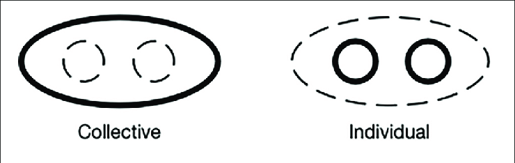

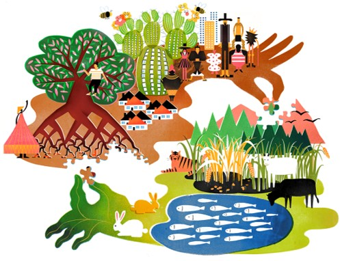

**Responses of individual species ripple through communities, ecosystems, and the biosphere.**

 

**Biotic interactions shape and constrain individual responses.**

 

**Puzzle analogy: individuals are pieces; only whole communities show the full picture**

## Evolution of communities

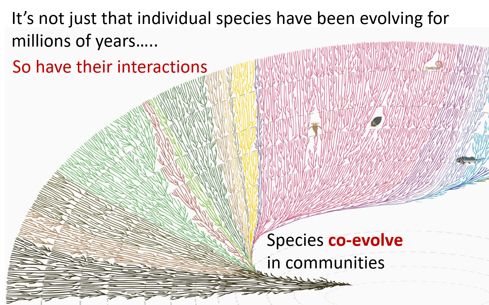

## Evolution of communities: Nothing exists in isolation

**Show me one single, isolated tree in a Appalachian forest...**

 

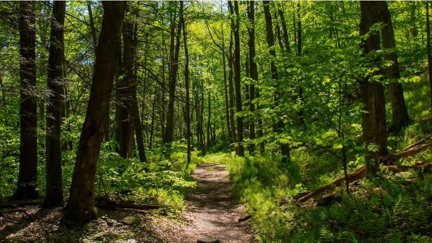

**Biological implications of change**
 

* **Each member in this Appalachian forest community is serving a role in this system**
    + impacts on that individual can impact its role and thus other species

 

* **Many species (including Appalachian) co-evolve**
    + obligate vs facultative
    + Trillium species ←→ Ants (Aphaenogaster genus)
    + Paw Paw tree ←→ carion (rotting flesh) feeding insects
    + Beech drop (parasitic plant) ←→ American Beech
    

##

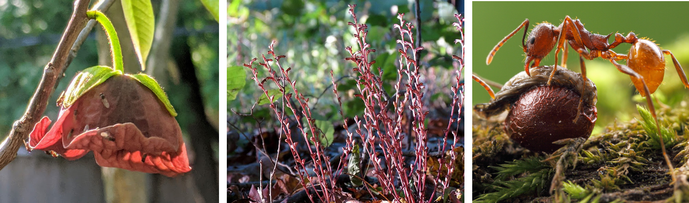

## Global change stresses affect biological interactions

**An invasive Rusty crayfish enters Appalachian streams w/ native frog tadpoles....**

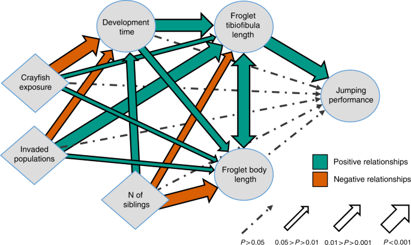

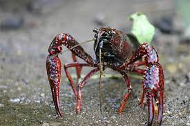

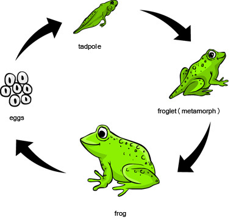

## Cascading effects across many species

 

**Every time community composition changes (by species gains, losses, or altered timing, strength, or type of interactions), shit happens**

 

**This is what we are doing on (and to) the planet**

 

**Individual species move, adjust, adapt, die and we care about that, but it’s the cascading effects that can unravel the biosphere as we know it**

## Cascading effects: complex chains

 

- **Changes can have impacts many trophic levels away**
    + trophic levels = feeding relationships

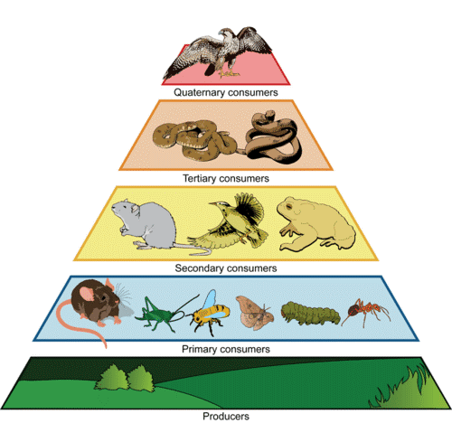

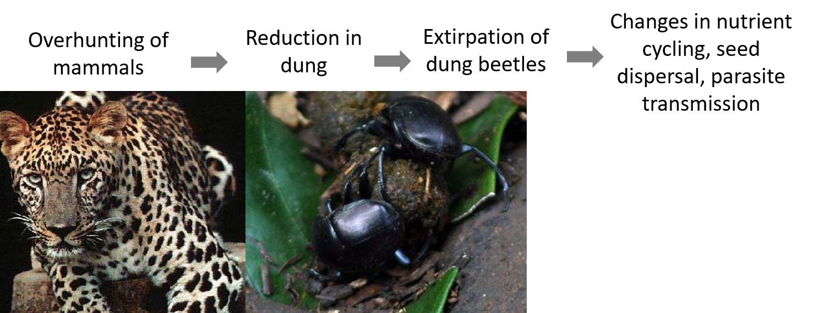

## Cascading effects: complex webs

**And these biotic interaction chains are actually embedded in complex biotic interaction webs**

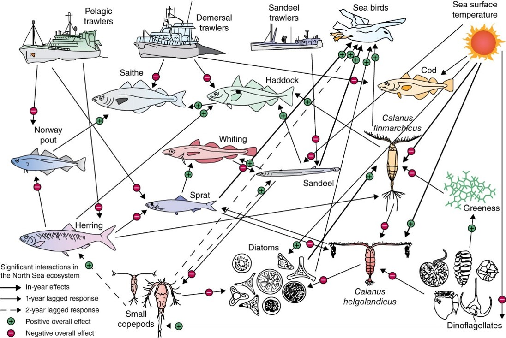

##

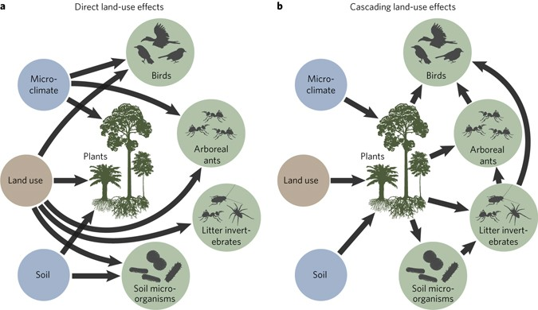

## Cascading effects: co-extinction

**Obvious examples like co-extinction where *direct* interaction partners influence each other**

 
 
 
 
 
 
 
 
 
 
 
 
 

**e.g., most vulnerable are obligate interaction partners (can be hosts/mutualists, predators/prey, plants/herbivores prey, hosts/parasites, etc.)**

 

**Appalachian region is primed for such events due to many critical dependencies of endemic species**

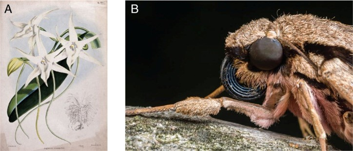

## Cascading effects: keystone predator

 

* **But species impact each other even if they don’t interact directly through biotic interaction chains**

   
 
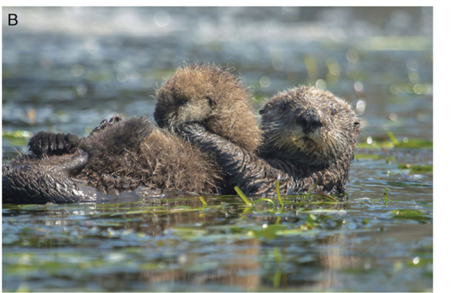

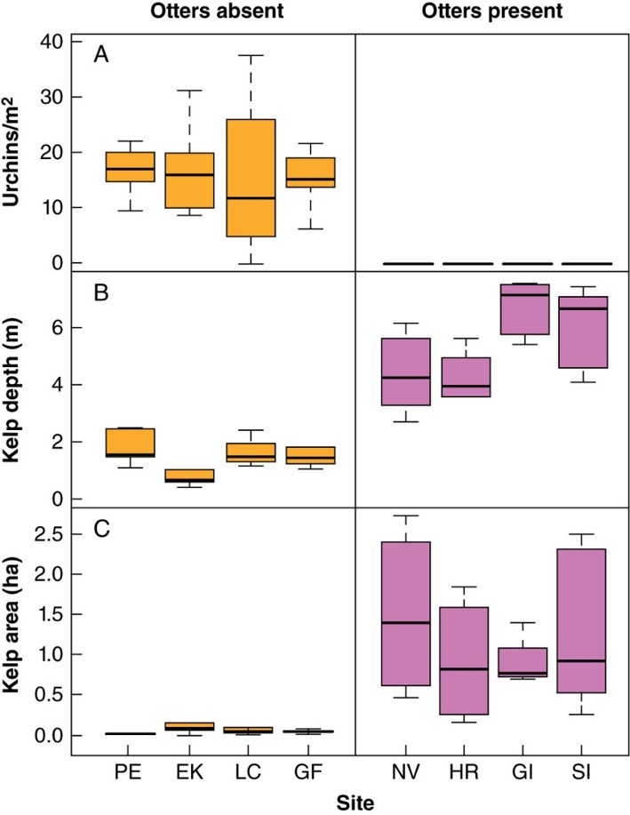

## Diagnosing the Appalachian deer problem...

**Removal of apex predators (wolves, mountain lions) and hunting regulations result in deer overabundance, leading to over-browsing of native plants, leading to shifts in deer resistance plants (oaks), impacting wildlife that depend on lost species**

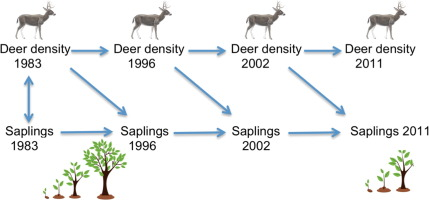

## Cascading effects: introduced species

 

**And this doesn’t need to be a top-down keystone predator; it can be a bottom-up effect**

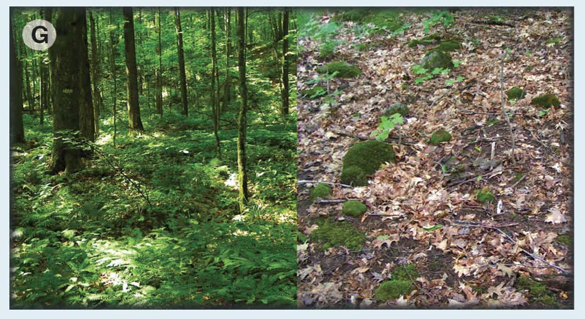

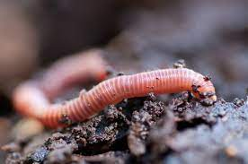

## Cascading effects: global worming

* **The last ice sheet killed off earthworms in the northern 1/3 of North American**
  + worms—with their limited powers of dispersal—weren’t able to recolonize on their own

 

**European settlers re-introduced earthworms. Humans now move worms, via ship ballast, horticultural plants, mulch and fishing bait.**

 

* **Post ice age, Appalachian hardwood forests developed thick blankets of slowly decomposing leaves that created homes for insects, amphibians, birds, and native flowers**
    + Now, worms breakdown this layer too quickly for plants to capture nutrients and insects to build homes.

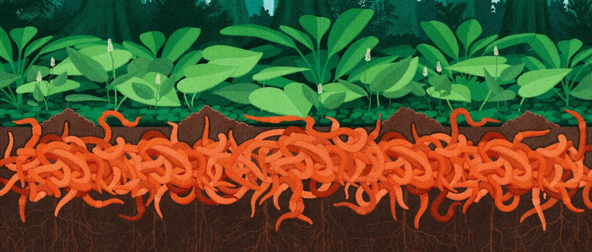

## Cascading effects: the big picture

**Community stability relies on many weak and strong links. Loss of one species can trigger multiple stressor interactions. Appalachian as an 'endemic' biodiversity hotspot makes them particularly vulnerable.**

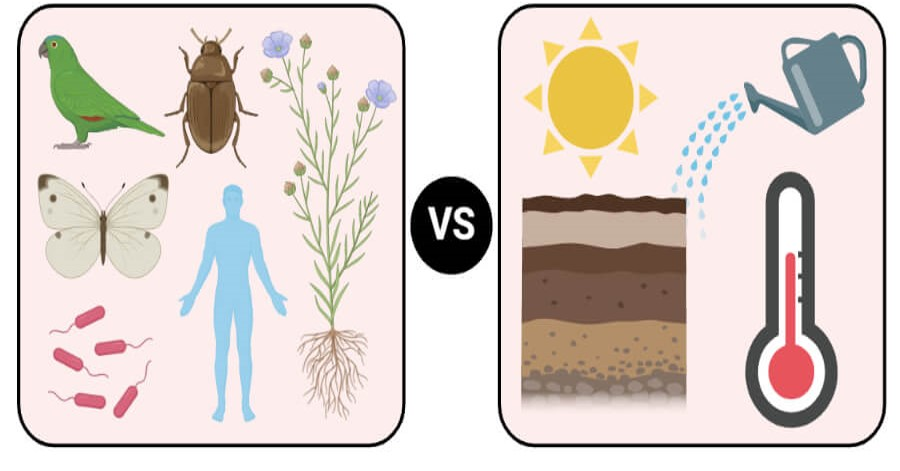

## Evolution of communities

**So we come back to… Nothing exists in isolation**

 
 

**Philosophical implications of change**

 

**Humans are dominant members of most biological community**

 

**Human agency in shaping community structure is a philosophical question**

 

**Are we just regular members of a community or are we responsible for managing communities because of our impacts?**

## The Myth of Disconnection

 

**Modern view often frames humans as separate from nature or above it (dominance without stewardship**

 

**This view gives us agency to degrade biological communities, even if we depend on them**

 

**Indigenous perspectives are quite the opposite**

 

**Connectedness with biological communities is represented in Indigenous cultures everywheer**

 

 

**Where does Appalachian culture sit in this connectedness spectrurm?**

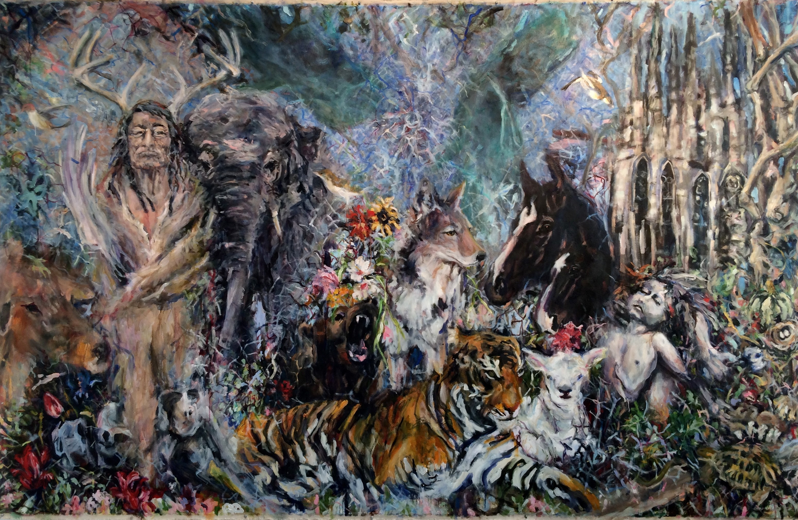

## Community Consequences of Human Disconnectedness

<!-- **Even in modern social media  culture, can you separate YOU from everything else?** -->

<!--  -->

<!-- ## True interconnectedness -->
<!-- 
 -->
<!--   -->

**The problem is that we feel isolated**

 

**Cultural shifts in the social media arena reduce our ecological literacy**

 
 
 

**We fail to realize that human-caused community changes feed back to affect human well-being**

<!--  -->

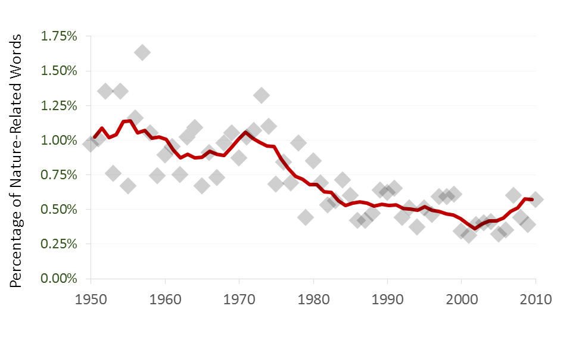

## Overcoming the Human - Nature Disconnect

**It is not only about the physical planet Earth, it is about OUR bodies, minds, spirits, and relationships that are being trashed and polluted**

 

**We are being told that we are isolated, not good enough, not important to the big picture**

 

**But it’s not true**

 

**We must recognize humans as part of communities.**

 

**We must shift from exploitation to stewardship**

 

**We must invest in restoration and reconnection**

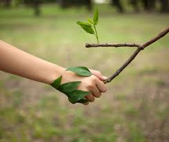

<!-- ## True interconnectedness: Friday open discussion -->
<!-- 
 -->
<!-- **What are the impediments to feeling connected?** -->

<!--   -->

<!--  -->

<!-- **In our societies?** -->

<!--   -->

<!-- **In our classrooms?** -->

<!--   -->

<!-- **In our psyches?** -->

<!--   -->

<!-- **Others?** -->

<!--   -->

<!-- **Choose a subject to write about or find an article to discuss** -->
<!--   -->
<!-- **Submit an short paragraph of your conclusions to Brightspace for participation** -->

<!-- ## Nested Responses: From Individual to Ecosystem -->
<!-- 
 -->
<!--   -->

<!-- 
 -->

<!-- * **Individuals influence populations → communities → ecosystems** -->
<!--     + red pruce decline → Owl habitats → small mammal populations → plant herbivory -->

<!--   -->

<!-- * **Responses rarely happen in isolation — multiple mechanisms may operate at once** -->

<!--     + invasion of Tree of Heaven → Invasion of Spotted Lantern Fly → native trees????   -->
<!--   -->

<!-- * **Appalachian forests: species interactions shape overall resilience** -->
<!--     + high biodiversity = high resilience -->

<!-- 
 -->

<!-- 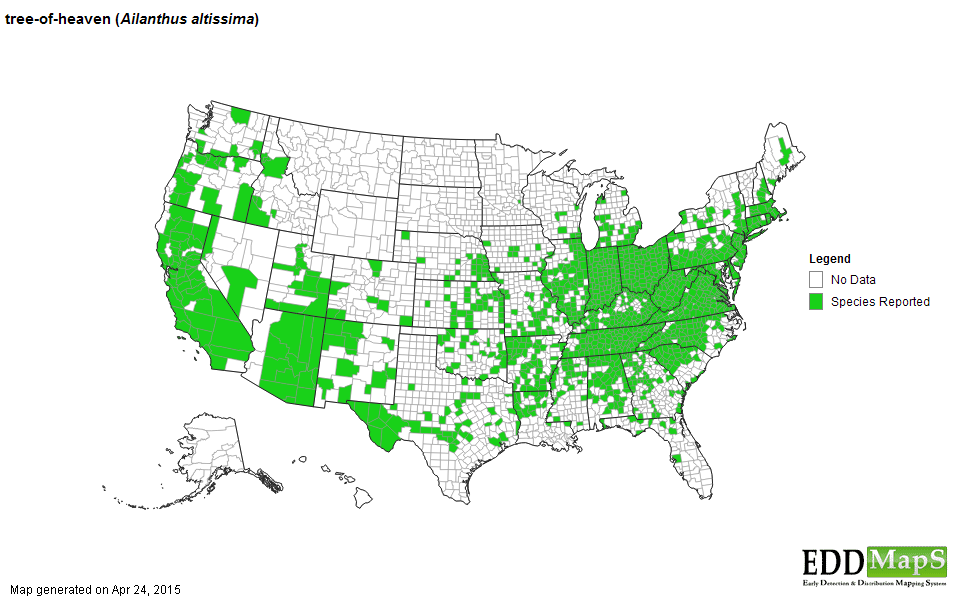 -->

<!-- ## Appalachian Resilience to Change, Why Biodiversty Matters -->
<!-- 
 -->

<!-- 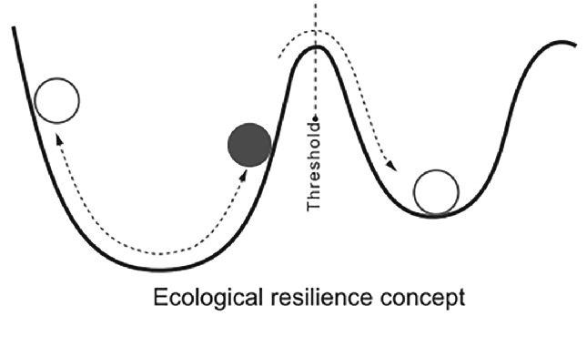 -->
