## Organismal responses in appalachia

 

* **Review: Appalachia as a biodiversity hotspot with high endemism and habitat specialization**

 

* **Global change factors in Appalachia: climate shifts, invasive species, land use change, pollution**
    + multiple stressors are likely co-occurring
    
 

* **Native organisms can Move, Adjust, Adapt, Die — but responses interact**
    + organisms are adapted to *ecoregions* withing the Appalachian region
    + *ecoregion = large geographic area with distinct features (climate, geology, soil)*
    + ecoregions may constrain the move, adjust, adapt response...

 

* **Appalachia’s biodiversity and varied microclimates make it an ideal case study for complex response interactions**

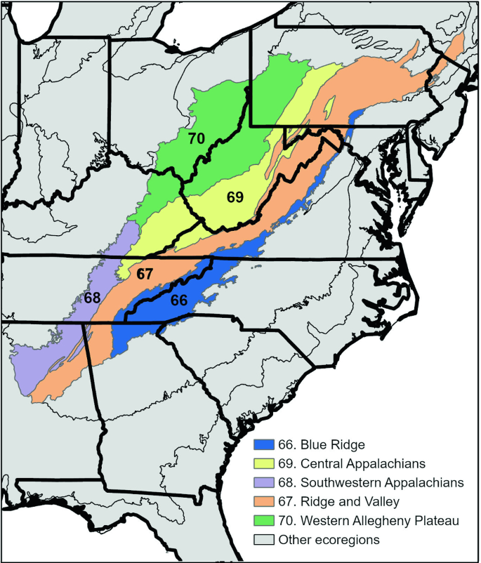

## Review: change factors in Appalachian ecosystems

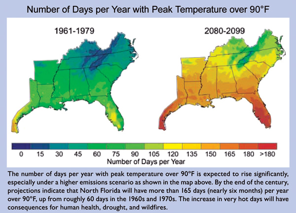

## Review: change factors in Appalachian ecosystems

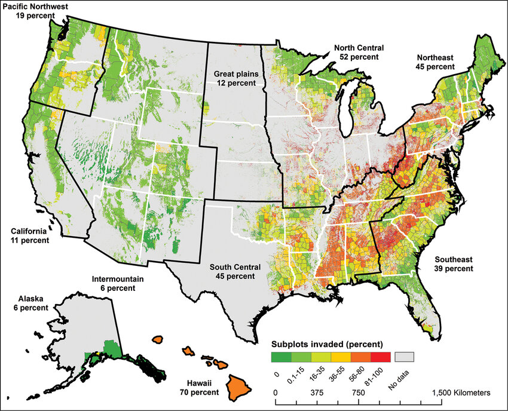

## Review: change factors in Appalachian ecosystems

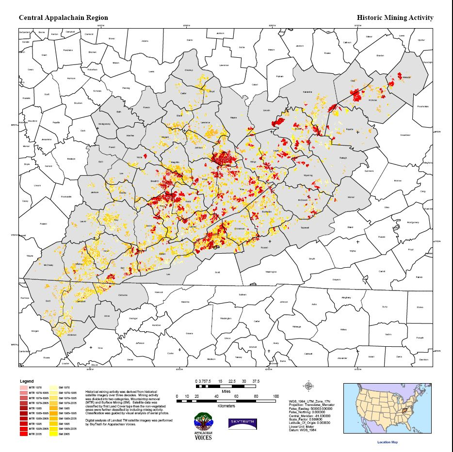

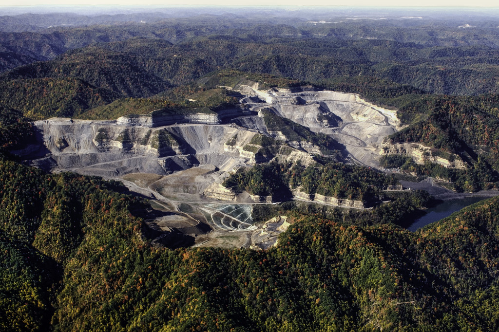

## Review: change factors in Appalachian ecosystems

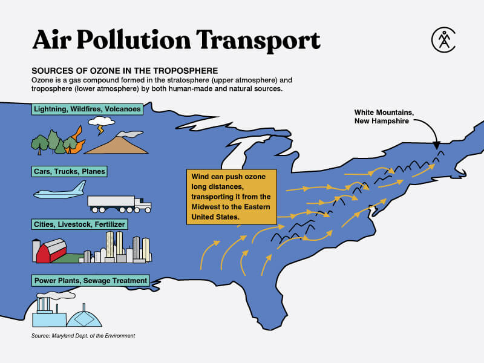

## MOVE + DIE: elevation escalator in Appalachia

* **Climate warming pushes cold-adapted endemic species upslope (MOVE)**
    + high elevation habitats are limited in habitat area

 

* **Competition increases at the summit, leading to local extinctions (DIE)**

 

* **Example: Balsam fir trees are glacial relics that survive on a handful of high elevation Appalachian mountaintops**
    + Move response to any stressor is non-existent
    + Balsam woolly adelgid (BWA) is a sap-feeding invasive insect that attacks fir species
    + Cold winter temperatures can affect BWA survival/reproduction at higher elevations
    + Warming winters allow larger populations of BWA to survive longer
    + Christmas tree farms (frasier fir) can also transport BWA

    

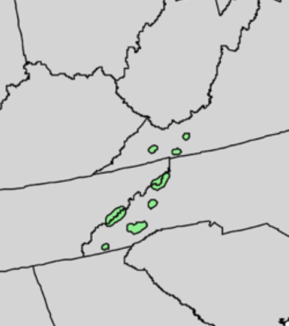

## MOVE limitations in Appalachia = DIE?

 

* **Adaptations of native/endemic species to unique microclimates can result in “No place to go” scenarios**

 

* **Appalachian salamanders depend on moist microhabits AND have low dispersal (move slowly)**
    + inability to cross dry/open ground in natural behavior/movement

 
 

* **Habitat fragmentation also creates more 'edges', exposing the species (MOVE) to predators/contaminants on outside the suitable habitat**
    + key issue for bird/amphibian species

  

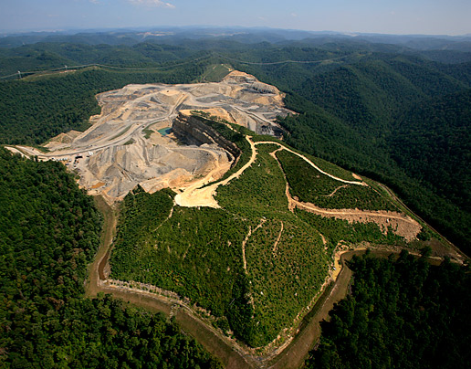

## MOVE limitations in Appalachia = DIE?

 

* **Another key constraint of the MOVE response is co-dependent species**
    + do symbionts, mutualists, pollinators, specific prey all move at the same rate?

 
 

* **Rhododendron is a showy Appalachian shrub that blooms in late spring at mid-to-high elevations**
    + research shows shifts from -4 days to +14 days in flowering times
    + relies heavily on bees for pollination

 

* **If climate change pushes azaleas upslope, they may bloom later (warm temperature cue)**
    + if bees do not also MOVE or ADJUST their emergence/foraging times, populations of both could suffer

  

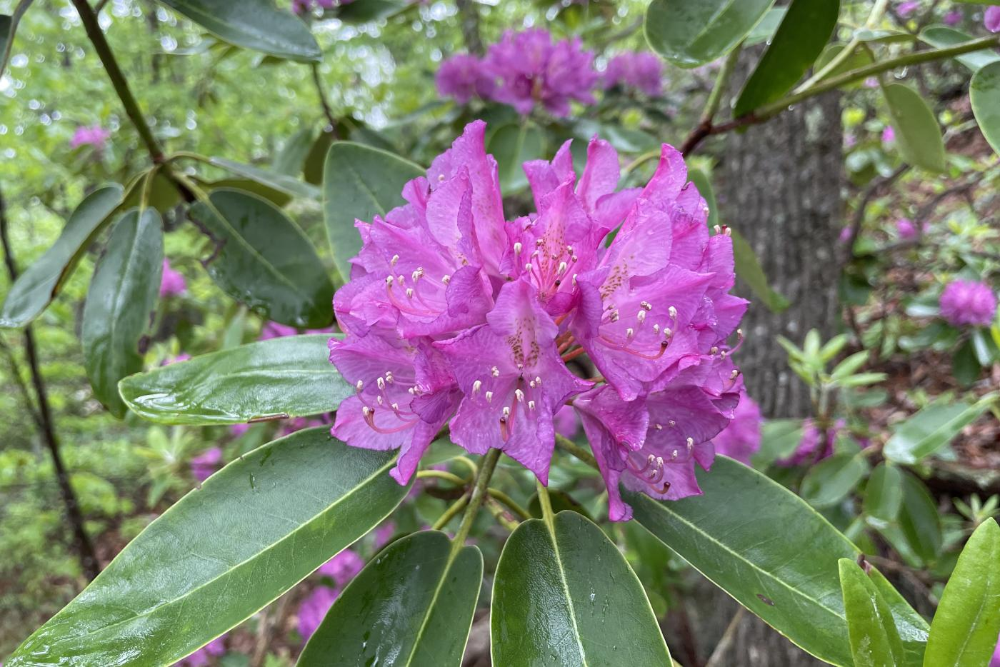

## MOVE limitations in Appalachia = DIE?

 

* **Another key constraint of the MOVE response is co-dependent species**
    + do symbionts, mutualists, pollinators, specific prey all move at the same rate?

 
 

* **Brook trout depend on cold, well-oxygenated Appalachian streams and feed heavily on aquatic insect larvae (mayflies, caddisflies, stoneflies)**
    + warming water may force brook trout into higher-elevation headwaters.
    + some aquatic insects may not be able to colonize these headwaters due to lack of suitable substrate or flow conditions
    + Even if trout find refuge, food availability could collapse, impacting survival

  

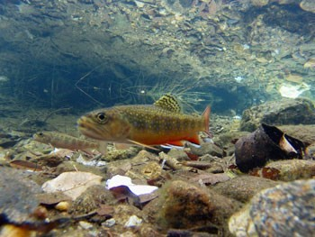

## MOVE response coupled to ADJUST/ADAPT to new conditions

* **Movement to new habitats ≠ identical conditions — temperature, oxygen, moisture, soil chemistry all differ**
    + elevation profiles of Appalachia exaggerate these differences
    + species moving upslope face colder nights, lower oxygen, shallower soil
    + species shifting northward encounter new photoperiods, competitors, and pathogens

 

* **Survival often depends on phenotypic plasticity (short-term adjustment) or rapid adaptation (genetic change)**

 

* **In Appalachia, narrow-range endemics are at high risk because they may have evolved in stable microclimates with less selection for tolerance**

 

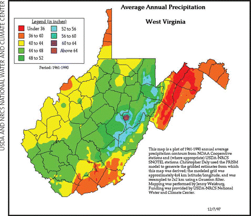

## Constraints on plasticity & adaptation in Appalachia

* **Low genetic diversity in isolated mountaintop or stream populations limits adaptive potential**
    + endangered and threatened species (e.g., Indiana bat) tend to exhibit low standing variation

 

* **Widespread species (e.g., white oak) maintain more genetic variation, increasing adaptive capacity**

 

* **Short-lived species may adapt faster due to more generations per time**
    + allow for beneficial mutations to occur
    + *may* keep pace with environmental change

 

* **Long-lived species (e.g., trees) adapt slowly — rely heavily on existing plasticity**

 

* **Endemic species may have key physiological genes 'fixed' for narrow ranges**
    + flexible gene expression more common in species with larger ranges/larger populations

## ADAPT or DIE: evolutionary rescue in Appalachia

 

* **Can adaptation through evolution by natural selection occur fast enough?**

 
 

* **Case Study: Hemlock woolly adelgid (HWA) resistance in Eastern hemlock (Tsuga canadensis)**
    + HWA is a sap sucking invasive insect from Asia
    + Eastern/Carolina Hemlock highly susceptible to HWA
    + ~50% of Hemlock populations have been affected
    + HWA has killed 95% of Hemlocks in Shenandoah National Park 
    

 

## ADAPT or DIE: evolutionary Rrescue in Appalachia

 

* **Some eastern hemlock trees in areas with HWA infestations show signs of resistance, despite surrounding trees dying**
    + resistance mechanisms unknown but could be higher amounts of terpenes created through genes/gene expression
    
 

* **Although resistance exists, can it keep up?**
    + HWA kills trees within 2-4 years
    + will beneficial mutations in non-resistant trees occur?
    + can scientists culture resistance trees fast enough?
        + consistent seed output after 15-20 years
        + peak seed production >75 years
    + can breeding programs (Eastern + Chinese hemlock) produce resistance hybrids fast enough?

 

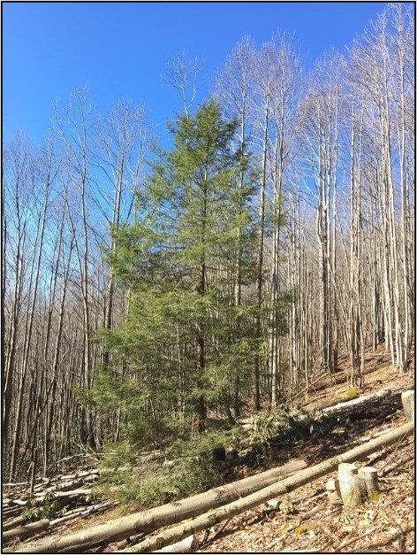

## ADAPT or DIE: evolutionary rescue in Appalachia

 

* **Although resistance breeding and natural selection are ongoing — climate change adds stress**
    + drought events and warming reduce plant fitness and ability to defend against pests
    + warmer winters makes it easier for HWA to spread farther north into new hemlock ranges

 

* **Do conservation breeding programs cause genetic drift?**
    + culturing programs select a small # of individuals with only key traits (HWA resistance)
    + artificial bottlenecks can be created when out-planting
    + genetic breeding programs must pay close attention to long-term genetic diversity

 

 

* **Remember: Natural selection is a moving target**
    + ↓ genetic diversity (bottlenecked survivors, breeding) can limit future stresses responses

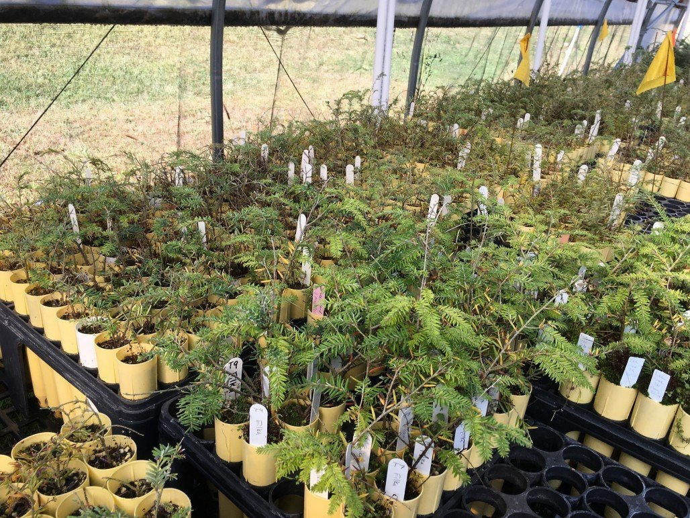

## Phenotypic plasticity as a filter to adaptation

 

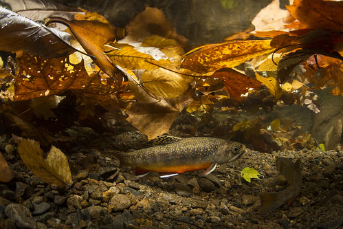

* **Plasticity allows persistence under new conditions**
    + remember: plasticity = existing flexibility in gene expression
    + creates flexible versions of traits (physiology, behavior, etc)

 
 

* **Case Study: Appalachian brook trout thermal tolerance**
    + Brook trout have an optimal temperature of around 58°F 
    + more sensitive to high temperature stress
    + experience stress and reduced feeding at water temperatures exceeding 60°F 
    + lethal effects > 69°F 

 

* **NOW: Brook trout typically inhabit waters ranging from 44-68°F**

## Phenotypic plasticity as a filter to adaptation

 

* **Brook trout activate genes related to heat-shock proteins (HSPs) which help protect cells during warmer conditions**
    + even at temperatures below their upper tolerance limit

 

* **Exposure to daily temperature oscillations also triggers increased expression of HSPs**

 

* **Brook trout show some capacity for acclimation to warmer temperatures**
    + individuals with more flexibility in HSP production, will survive more

  

* **Brook trout currently have reduced capacity to adapt to temperatures consistently exceeding 68°F**
    + gene expression differences are heredity, giving future generations more time to evolve tolerance to higher temperatures
    
## Human-mediated movement in Appalachia

* **Managed relocation involves intentionally moving species to new locations better suited to their survival under changing climatic conditions**
    + approach is still largely theoretical and debated among conservationists.

  

* **Reintroduction of extinct/locally extinct species (MOVE) occurs in Appalachia**
    + Elk, river otters, peregrine falcons
    + forest-assisted migration are underway to plant tree species from warmer areas further north

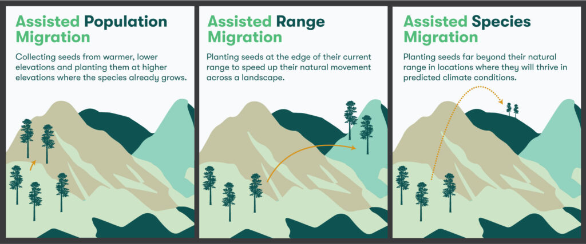

## Human-mediated movement in Appalachia

  

* **Success depends on more than just climate matching**
    + risks of mismatches with dependent species
    
  

* **Success depends on trees ADJUST to new environmental conditions & ADAPT over generations**

 

* **Forest-assisted migration requires short-term adjustment**
    + day length light cues for phenology, physiology

 

* **Forest-assisted migration long-term adaptation**
    + changes in nutrient regimes, new species interactions, etc. 

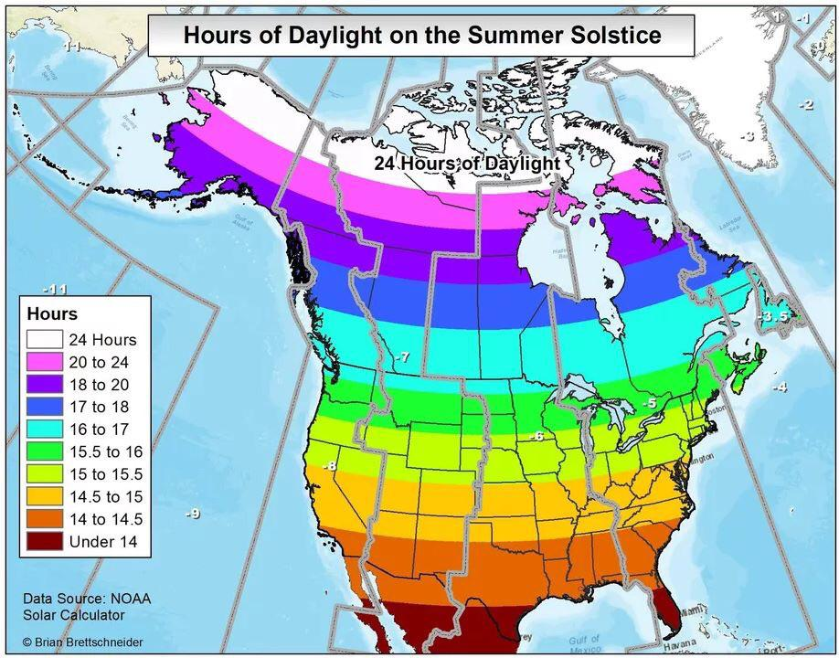

## Wrapping Up the adjacent possible

 

* **Appalachian species responses mirror global patterns but are intensified by endemism**

 
 

* **Move, Adjust, Adapt, Die responses often interact — creating complex outcomes**

 

* **Understanding these dynamics is essential for regional conservation**
    + many Appalachia endangered species face complicated recoveries
    + DIE response (extinction) is always waiting

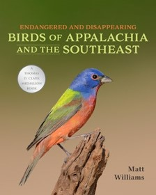
