## Global change impacts Earth's systems

 
 
 

**Earth's system's interact at the ecosystem level**

 

**Ecosystem = A community of living things interacting with each other and with the nonliving environment (like air, water, and soil).**

 

**A change in just one *biotic* or *abiotic* factor can alter complex relationships and have large scale consequences**

## In ecosystems, abiotic and biotic processes interact

**Ecosystems (and higher levels) are regulated by the flow of energy and the cycling of nutrients**

 

**Life is composed of energy and matter, which is always on the move**

 

- **Energy from the sun powers communities, ecosystems, biomes, etc**
    + energy in nature isn’t recycled — it flows one way
    
 

- **Matter, including the chemical building blocks of life, cycles around the biosphere**
    + matter can’t be created or destroyed — it just changes form

## Energy from the sun flows through Appalachian food webs

**The flow of energy through food webs is very inefficient**

## Global change can impact any level of energy flow

## Energy flow and efficiency is partially temperature dependent!

**Projected decrease in transfer efficiency is expected to lead to a ~20% decrease in abundance of predators in marine ecosystems (↓ energy available at top of food web)**

## Matter recycling: Water

* **Evaporation & Transpiration: Water moves from land and plants into the atmosphere**
 
* **Precipitation: Rain, snow, sleet, or hail falls to Earth**
 
* **Condensation: Water vapor forms clouds**

 
 
 
 
 
 
 
 
 
 
 
 
 

* **Infiltration & Runoff: Water soaks into soils, feeds groundwater, or flows into rivers and streams**
 
* **Storage: Water is stored in ice, snowpack, soils, wetlands, lakes, groundwater, and oceans until it re-enters the cycle**

    

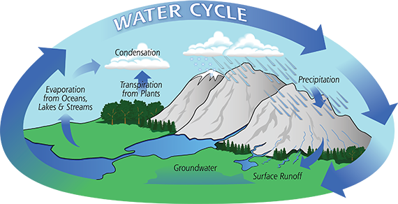

## Matter recycling: Water

 
 
 
 

* **Role of mountain ecosystems in water cycle:**
    + Mountains store water in snowpack, bogs, soils, and forests
    + Mountain vegetation releases water vapor into the atmosphere
    + Moist air cools as it rises over mountains, increasing condensation
    

## Global change will alter most parts of the water cycle

## Matter recycling: Nutrients

**Main Components of Nutrient Cycles (e.g., nitrogen, carbon, phosphorus, sulfur):**

 

**Inputs: Nutrients enter ecosystems from weathering rocks, atmospheric deposits or biological capture**

 

**Uptake: Plants and microbes absorb nutrients to build living tissue**

 

**Transfer: Nutrients move through food webs as organisms eat and are eaten**

 

**Decomposition & Recycling: Dead matter and waste are broken down, returning nutrients to soil and water**

 

**Storage: Nutrients can be held long-term in soils, sediments, biomass, or rock until re-mobilized**

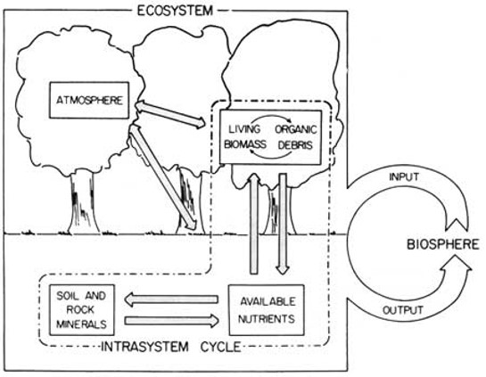

## Matter recycling: Nutrients

**Role of Mountain Ecosystems:**

 

**Sources: Bedrock and soils release nutrients through weathering, feeding streams and forests**

 

**Storage: Soils, wetlands, and living biomass serve as major nutrient storage pools.**

 

**Transfer: Aquatic systems are often "throughput systems" where nutrients pass through quickly rather than being significantly retained**

 

**Decomposition & Recycling: Generally slower than in warmer lowland or tropical systems, meaning nutrients cycle gradually and can become limiting for growth**

## Why care about Nitrogen?

 
 

**Nitrogen is one of the fundamental building blocks for life on Earth, especially plants**

 

- **Nitrogen is the limiting factor in how productive plant growth can be**
    + producers at bottom of food webs
    + human food security

 

- **Thus, Nitrogen is a primary ingredient in fertilizers**

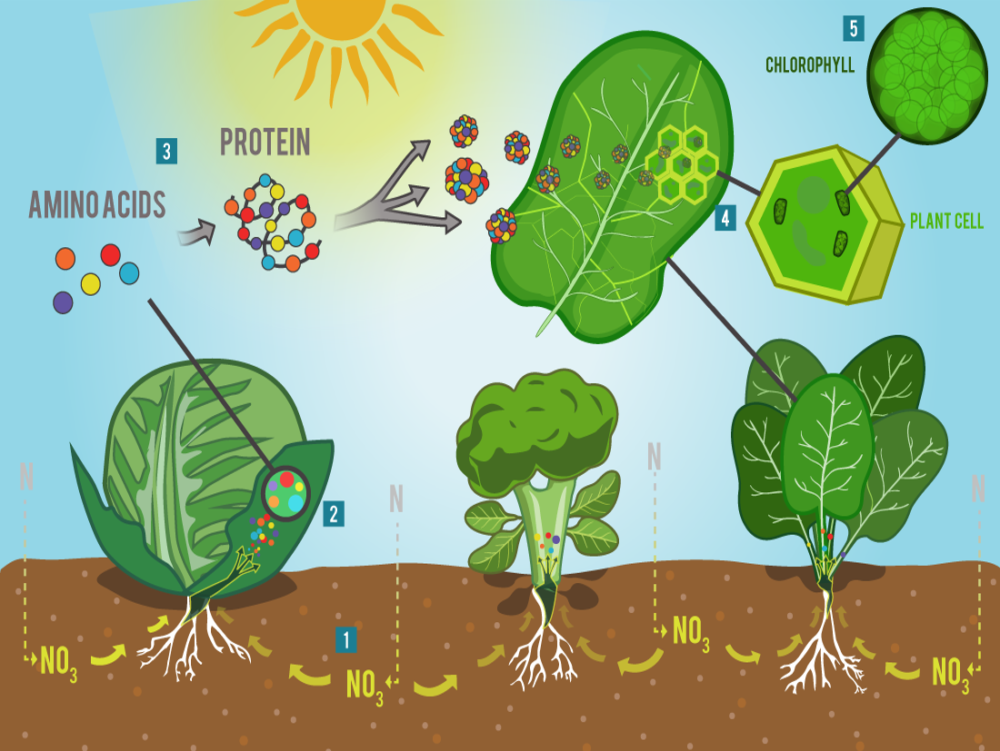

## Nitrogen cycle: the basics

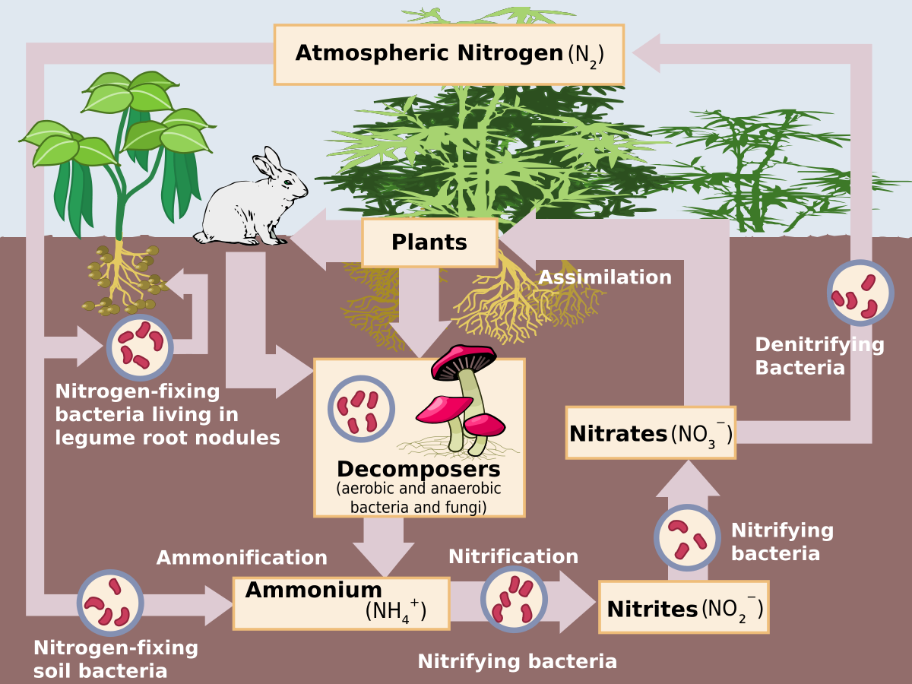

## Global change will alter most parts of the nitrogen cycle

**Not all the nutrients in fertilizers get absorbed by plants and the excess moves its way into rivers, lakes, oceans and groundwater as agricultural runoff**

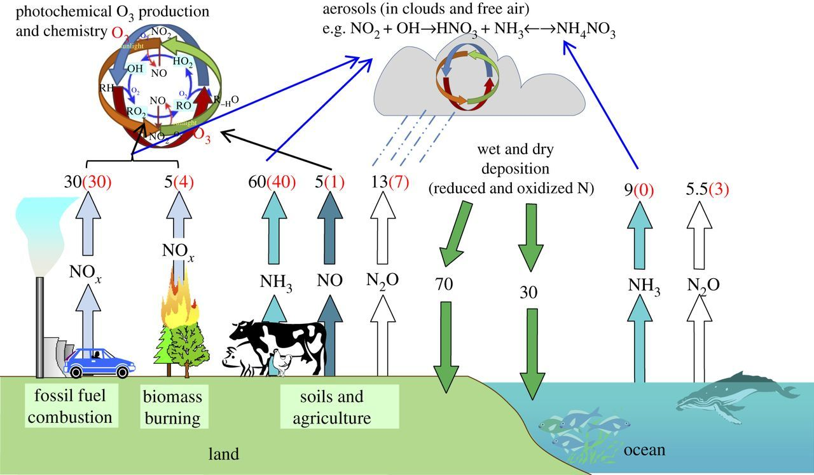

## The state of nitrogen cycling in Appalachian ecosystems

 
 
 
 

* **Appalachian ecosystems are no longer under peak nitrogen stress thanks to air quality improvements (Clean Air Act 1990)**

 

* **Legacies of past deposition, slow soil recovery, and climate-driven mobilization mean nitrogen cycling remains disrupted**
    + especially in high-elevation forests and sensitive headwater streams

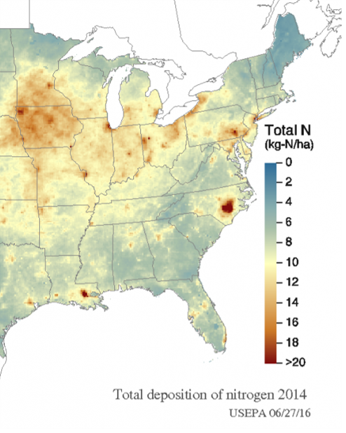

## The state of nitrogen cycling in Appalachian ecosystems

 
 
 
 
 

* **Appalachian agriculture creates a leaky nitrogen cycle (like most agriculture)**
    + farmland releases more nitrogen than natural mountain ecosystems
    + agriculture is a main driver of nitrogen pollution regionally and downstream

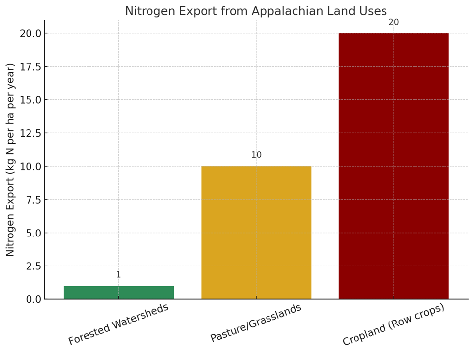

## Why care about carbon?

**Carbon is in carbon dioxide and methane, both greenhouse gases that trap heat close to Earth**

 

- **Carbon is stored deep earth, vegetation and oceans for potentially long time scales**
    + keeps carbon out of atmosphere
 
 
 
- **Human activities (burning fossil fuels, deforestation, agriculture) have added more carbon to the atmosphere than ecosystems can re-absorb**

 

**Carbon footprint is used as shorthand for the amount of carbon being emitted by an activity or organization**

## Carbon cycle: the basics

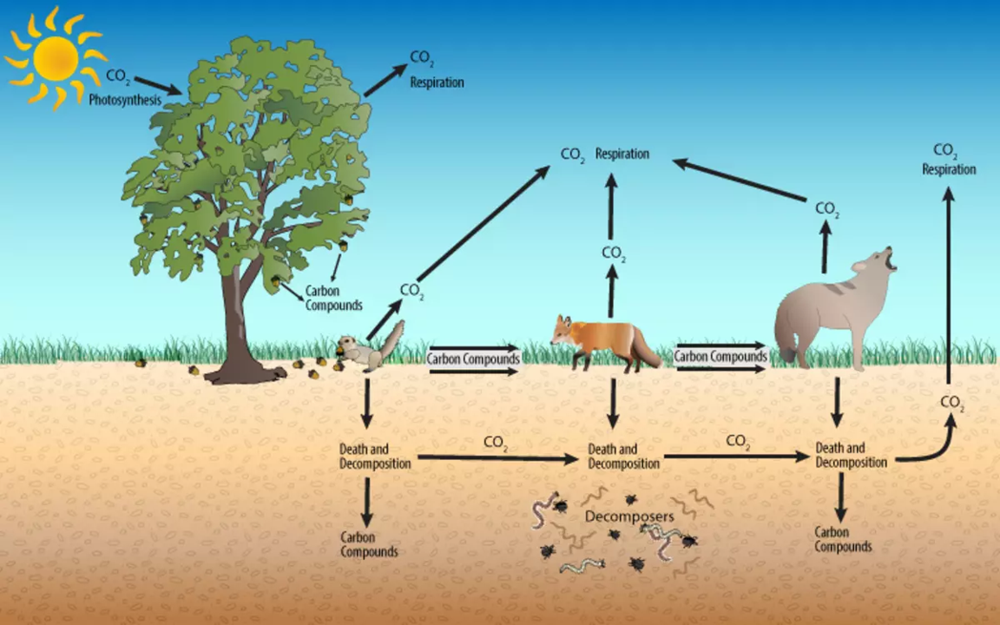

## Global change will alter most parts of the carbon cycle

## The state of carbon cycling in Appalachian ecosystems

**Forests as Carbon Sinks: Appalachian forests are key carbon 'sinks', pulling CO₂ from the air and storing it in wood**

 

**Soil Carbon: Cool, moist mountain soils store large pools of organic matter, but warming could accelerate decomposition and release carbon**

 

**Disturbance Impacts: Past logging, mining, and land use change have reduced carbon stocks in some areas, though reforestation has helped recovery**

 

**Agriculture & Development: Expanding agriculture and urban areas are net carbon 'sources', emitting more than they store**

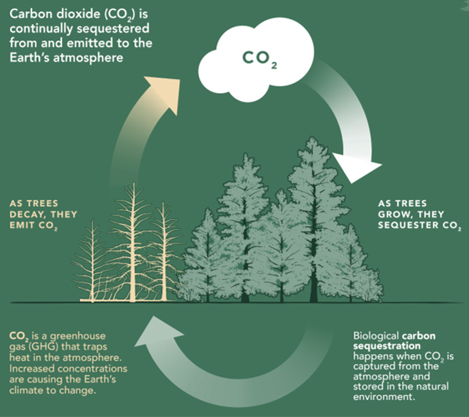

## Mountain ecosystems: Carbon storage

**Forests as Carbon Sinks: Appalachian forests are key carbon 'sinks', pulling CO₂ from the air and storing it in wood**

 

**Soil Carbon: Cool, moist mountain soils store large pools of organic matter, but warming could accelerate decomposition and release carbon**

 

**Disturbance Impacts: Past logging, mining, and land use change have reduced carbon stocks in some areas, though reforestation has helped recovery**

 

**Agriculture & Development: Expanding agriculture and urban areas are net carbon 'sources', emitting more than they store**

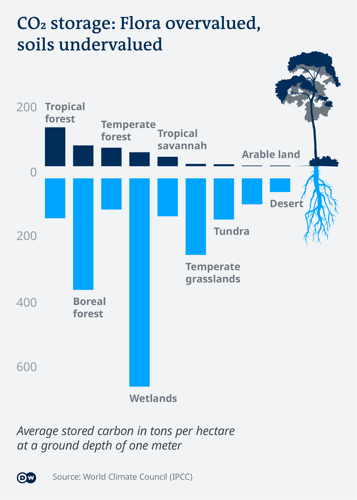

## Why does nutrient cycles matter, globally?

 
 
 

**Biochemical cycles interact to regulate the biosphere, including climate &#8594;**

 

**Biogeochemistry is a foundation of biomes: living things adapted to a specific regions  &#8594;**

 

**Ecosystems are the interactions with the biotic and abiotic within those regions**

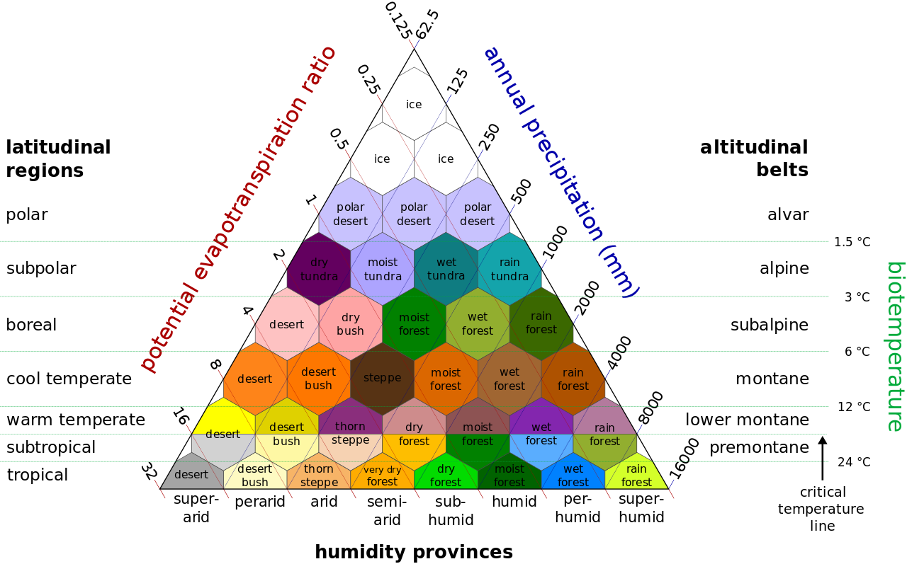

