## Conservation in an era of global change

 
 
 

**How do we define conservation priorities?**
 
**Forest restoration vs drinking water vs species loss in coal-mined lands**

 

**What are the challenges to conservation in the era of global change?**
 
**Balancing ecological protection and rural livelihoods**

 

**To Start: Conservation is a broad term**

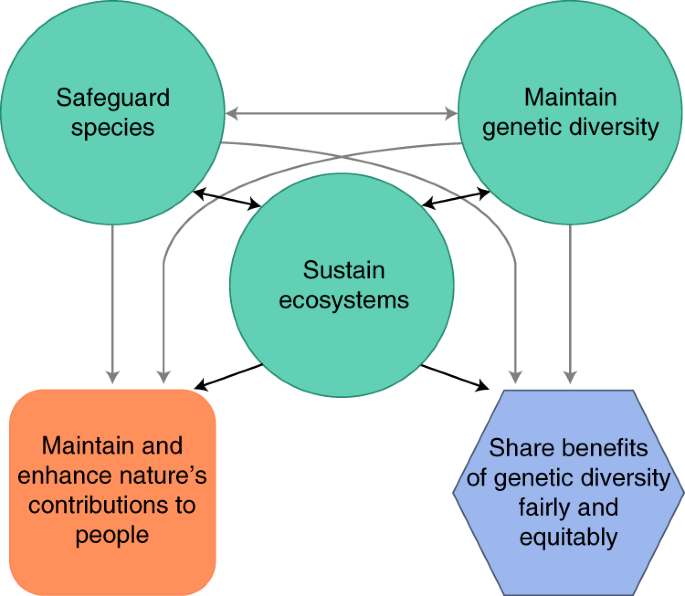

## What is the grand conservation challenge?

**https://conservationxlabs.com/**
 

- **Preserve biological diversity**
 
    + from genetic diversity to species diversity to functional diversity to ecosystem diversity
 
    + across spatial scales from local to global…
 
    + across time scales from now to the imaginable future…

## What is the grand conservation challenge?

**https://conservationxlabs.com/grand-challenges**
 

- **Preserve biological diversity**
 
    + from genetic diversity to species diversity to functional diversity to ecosystem diversity
 
    + across spatial scales from local to global…
 
    + across time scales from now to the imaginable future…
 
    + amidst uncertainty, in a world that will continue to change

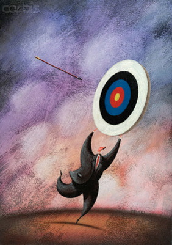

## What is the grand conservation challenge?

**https://conservationxlabs.com/grand-challenges**
 

- **Preserve biological diversity**
 
    + from genetic diversity to species diversity to functional diversity to ecosystem diversity
 
    + across spatial scales from local to global…
 
    + across time scales from now to the imaginable future…
 
    + amidst uncertainty, in a world that will continue to change
 
    + with finite resources

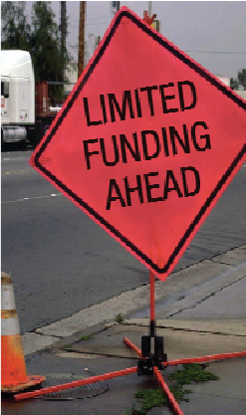

## Appalachian conservation case studies

 

**The American Chestnut Foundation (https://tacf.org/) has several key strategies for chestnut conservation...**

 

**1. To develop American chestnut trees with *sufficient resistance* to two deadly diseases so they may be restored to their native range.**

**2. To characterize, *preserve, and utilize the genetic diversity* of existing American chestnut trees for research and to ensure that the developed disease resistance is incorporated into environmentally-adaptable, diverse populations.**

**3. To promote forest plantings of genetically diverse and disease-resistant American chestnuts capable of sustained population growth and expansion *across the broad and ever-changing landscape* of our Eastern hardwood forests.**

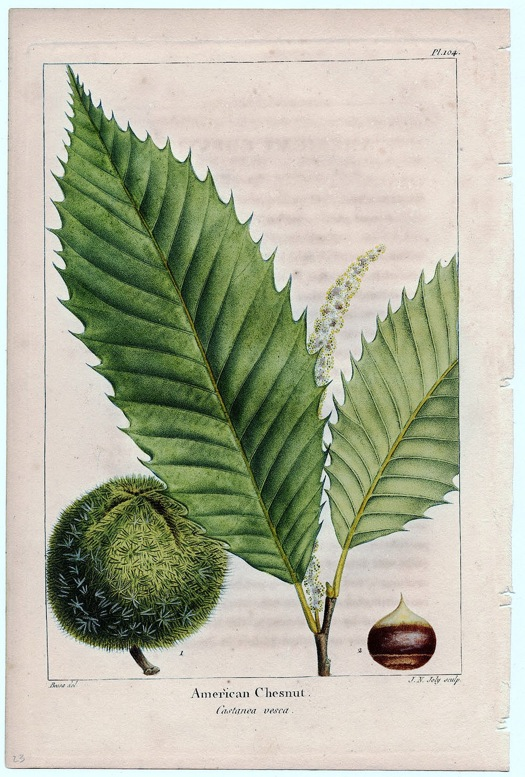

## Defining priorities for conservation (hard choices ahead)

 
 

**What types of species or ecosystems should be highest priority?**

 

**We have millions and millions of species on the planet interacting in complex ecological networks**

 

**How should we decide where to put our conservation dollar?**

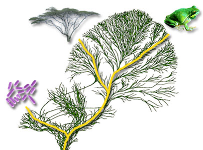

## Defining priorities for conservation (hard choices ahead)

**What types of species or ecosystems should be highest priority?**

* **Keystone species?**
 
* **Umbrella species?**	
 
* **Rare species?**	
 
* **Strong ecological interactors?**	
 
**Pros and Cons list might look like:**
 
* **Species under most stress?**
 
* **Species most likely to persist?**
 
* **Species with economic value to humans?**
 
* **Species with cultural significance?**
 
* **Species with stakeholder interest?**
 
* **Indicator species?**
 
* **Charismatic species?**
 
* **Old species?**
 
* **Young species?**

## Say we decide to prioritize a Appalachian amphibians..

**Of the ~6,500 known amphibians more than 1/3 are threatened with extinction (IUCN Red List)**

 
 
 

**Which should we prioritize?**
 
**There are over a 100 species of native Appalachian salamander and ~60% are threatened with extinction**

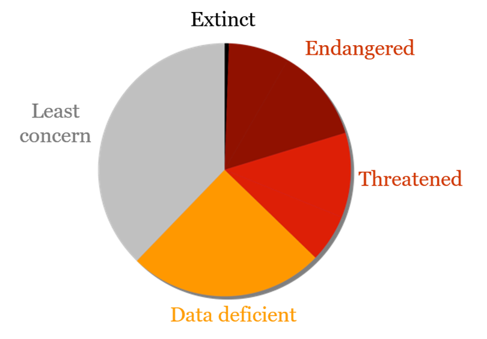

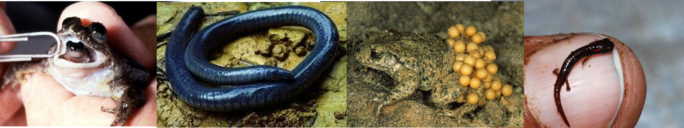

## Which Appalachian salamander(s) do we save?

 

**Appalachian Mountains are considered a high-risk areas for invasive chytrid fungi, (Bd and Bsal), that can be lethal to salamanders**

 

**Should we give more conservation attention to the more susceptible (they need our help) or the more resistant (they might actually survive) populations?**  **What would you vote for?**

 

**Appalachian criteria to consider: irreplaceability (endemism), vulnerability (trend), feasibility (tools exist?), and co-benefits (actions that help whole watersheds/communities).**

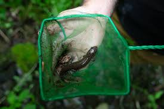

## Which Appalachian salamander(s) do we save?

 

* **Cheat Mountain Salamander — WV endemic. Tiny, isolated spruce-relic populations; sensitive to microclimate shifts and disturbance**
    + Threats: habitat fragmentation, climate warming, recreation pressure

 

* **Green Salamander — rock-outcrop specialist. Patchy cliff microhabitats; highly site-faithful**
    + Threats: quarrying, timber edge effects, drought, potential easy spread of  disease impacts

 

* **Eastern Hellbender — giant stream salamander. Needs cold, clean, well-oxygenated rivers with slab cover**
    + Threats: silt build up, dams/flow alteration, pollutants; disease via water-quality stress

 

 **Do you triage the imperiled micro-populations on the brink (high risk, low feasibility), OR the “resilient but stressed” sites where small investments could tip recovery (lower risk, higher feasibility)?**

<!-- 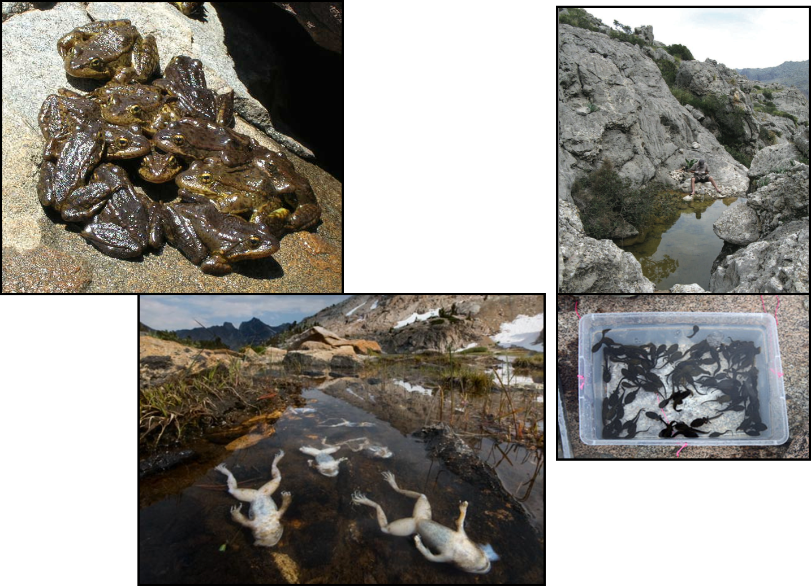 -->

## Strategy: which conservation levers do you pull?

* **Captive breeding: Buys a genetic/time “bank” for declining populations**
    + Costs & trade-offs: Facilities, biosecurity, reintroduction challenges; diverting from habitat fixes.

 

* **Conservation ambulances: Targeted antifungal or probiotics/microbiome pilot studies**
    + Costs & trade-offs: Ethics, feasability, permitting

 

* **Habitat restoration: Restoring freshwater streams, cliff faces, or other salamander habitats or targeting land protection to increase connectivity**
    + Costs & trade-offs: Expense/coordination heavy, benefits take years, landowner complexity.

 

* **Policy & prevention: Creating biosecurity norms and surveillance to prevent Bd/Bsal spread or create watershed specific policy for sediment caps, smart forestry and bridge/dam construction/removal**
    + Costs & trade-offs: Slow to enact; enforcement/compliance issues; political capital required

## Defining priorities for conservation

**So…first step in conservation planning is to explicitly define conservation priorities**

 

**There are some explicit and data-driven ways to do this, for example…**

## Defining priorities for conservation

**Example:   selection algorithms are computer algorithms that apply biodiversity optimization rules**

 
 

**Example optimization rules:**
 

* **Complementarity: add areas that contribute most new biodiversity**
 
* **Irreplaceability: add areas with unique species or attributes**
 
* **Bang for buck: add areas which maximize environmental benefit while minimizing economic costs**

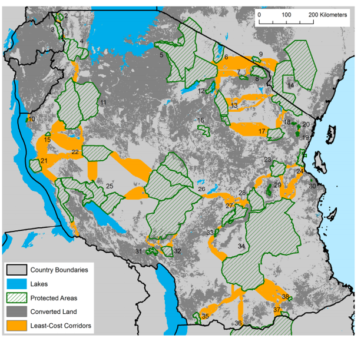

## Defining priorities for conservation

**Example: The Evolutionarily Distinct and Globally Endangered Initiative Zoological Society of London**

 

**Uses data from phylogenetic trees to give species a “phylogenetic uniqueness” ranking**

 

**Then adds a weight to this score based on IUCN red list risk of extinction.**

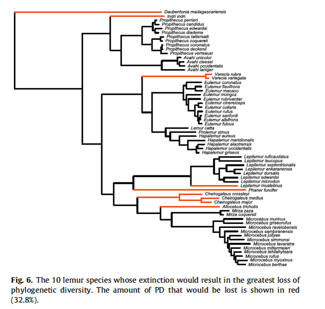

## Defining priorities for conservation

 

**Once conservation targets are selected, what are key management approaches?**

 

* **Fine filter: focus on protecting populations or species**
    + reducing overharvest
    + captive breeding
    + translocations

 

- **Coarse filter: focus on protecting ecosystems or landscapes**
    + creating reserves
    + re-establishing corridors
    + re-establishing natural disturbance regimes
    + enhancing habitat in high modified settings

## Flexibilities and complexities

 

**Flexible levels of access: Corridors and reserves can be static or flexible (e.g., dynamic rules to reduce detrimental synergies).**

 
 
 

**For example:**
 

**Closing dive tourism in coral reefs during heavy storm seasons**
 

**vs**
 

**Building wildlife corridors to cross highways**

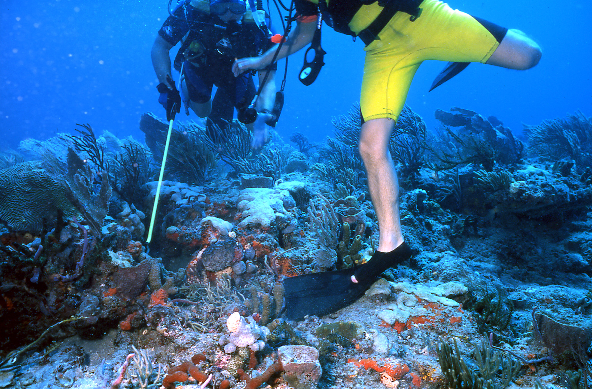

## Flexibilities and complexities

 

* **There have been *some* captive breeding “success stories”**

 

* **There are lots of issues that do lend toward failure:**
    + lower fertility, behavioral changes, genetic degradation
    + lack of reintroduction
    + lack of post-release support

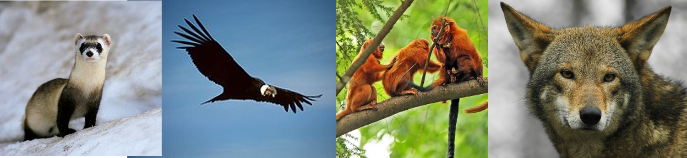

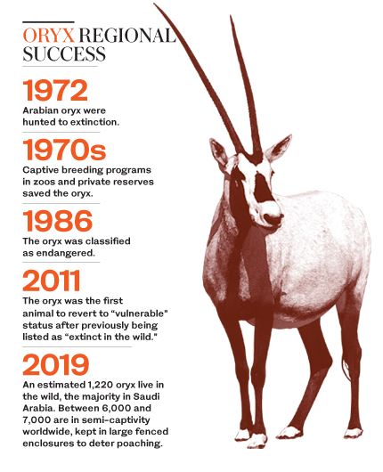

## Flexibilities and complexities

 
**There have been some captive breeding “success stories” and other high profile attempts**

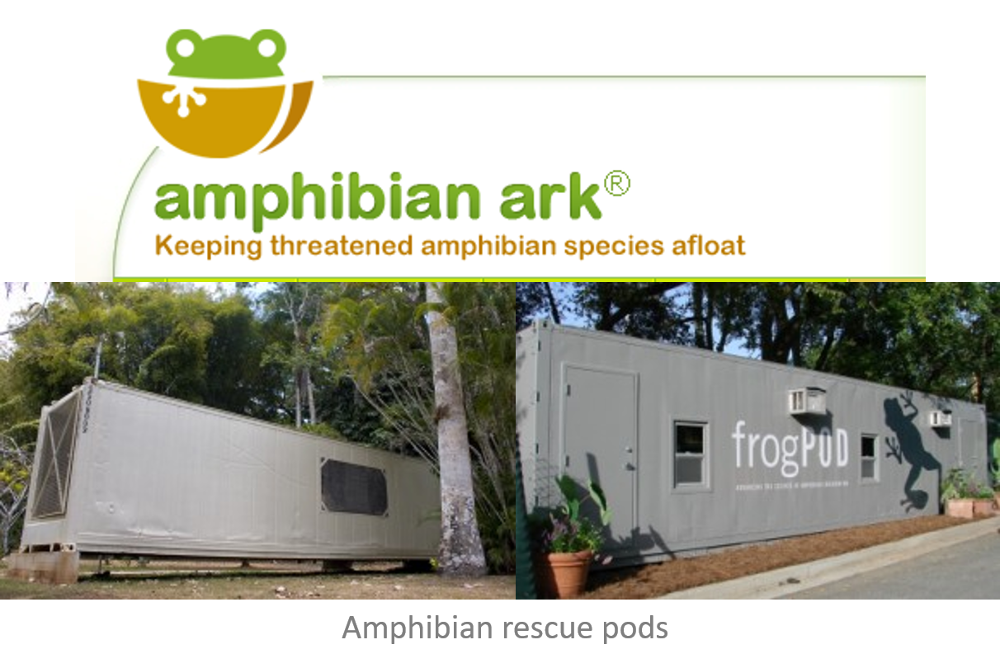

## Flexibilities and complexities

 
**There have been some captive breeding “success stories” and other high profile attempts**
 
**You are less likely though to hear about captive breeding failures, even though they constitute the majority of them**

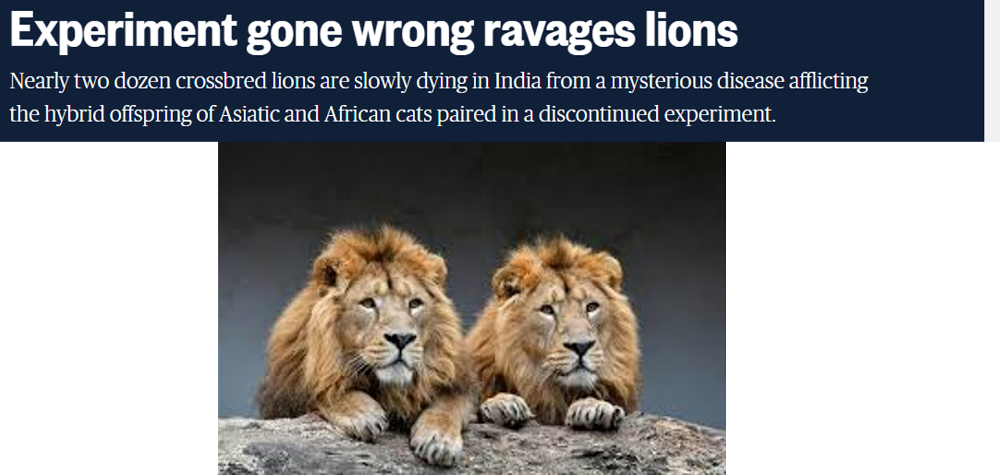

## Flexibilities and complexities

 
**There have been some captive breeding “success stories” and other high profile attempts… but only effective when coupled with efforts to reduce threats (fine + course filter)**

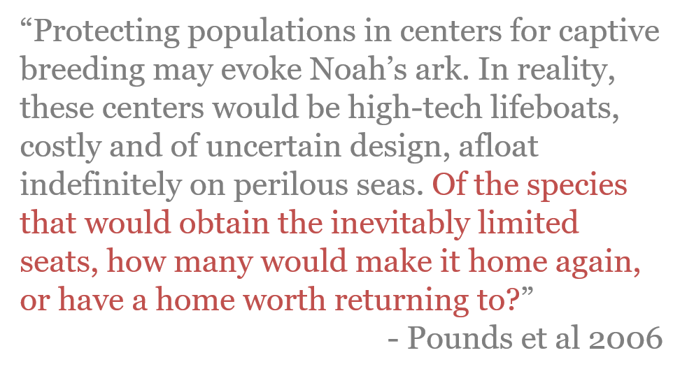

## Flexibilities and complexities

 

**Adaptive management: Learning-by-doing**

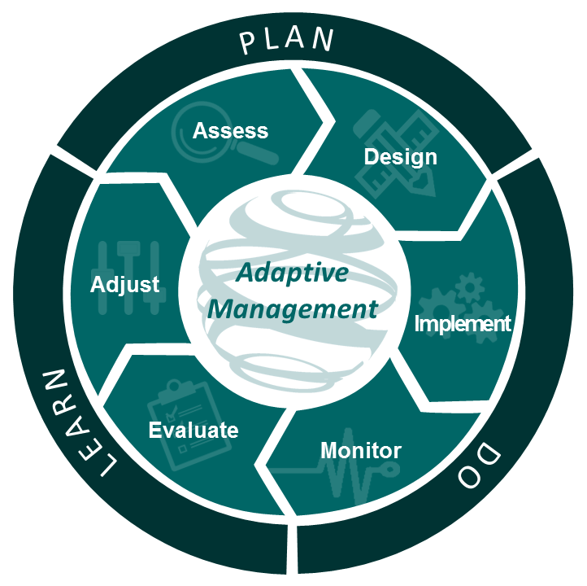

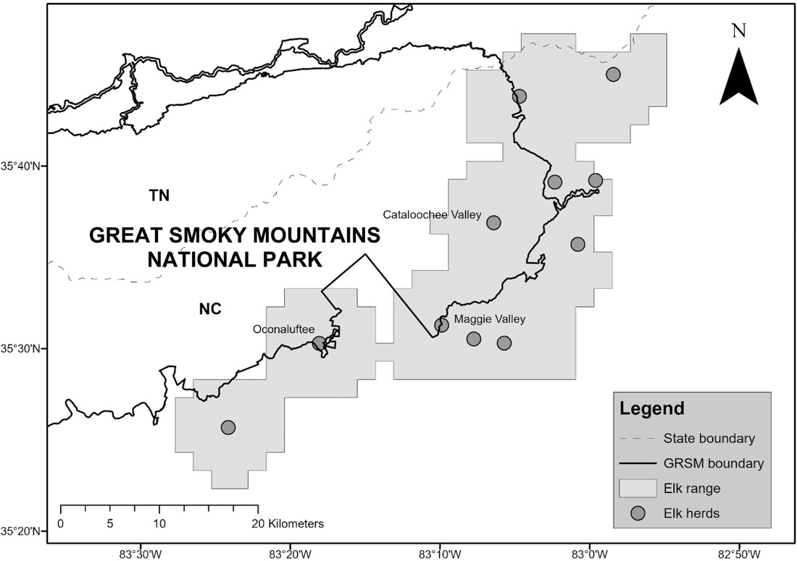

## Flexibilities and complexities

 
 
 
 

**After the 2001–2008 release of Elk, the Great Smokeys National Park adopted a Preferred “Adaptive Management” alternative: population is monitored (e.g., collars on adult females and calves), responses are adjusted over time (e.g., scale back collars, change responses to conflicts, coordinate outside the park, test removal of black bears), and actions are revised based on measured outcomes.**

## Flexibilities and complexities

 

**The law of unintended consequences : “intervention in a complex system tends to create unanticipated and often undesirable outcomes”**

 
 
 
 

**And complex systems include humans!**

## Should we micromanage nature?

**Many projects kill plant/animal species based on the mistaken assumption that another plant or animal will benefit**

 
 
 
 
 
 
 
 
 
 
 
 

**Nature Conservancy decimated the population of rare Arctic grayling fish in Montana by damming the streams to create ponds for the benefit of the equally rare trumpeter swan**
 

**Grayling spawned in those streams and the population plummeted when the streams were dammed**
 

**Scientists are trying to compensate for the damage to the grayling population by killing cutthroat trout that is considered a predator**

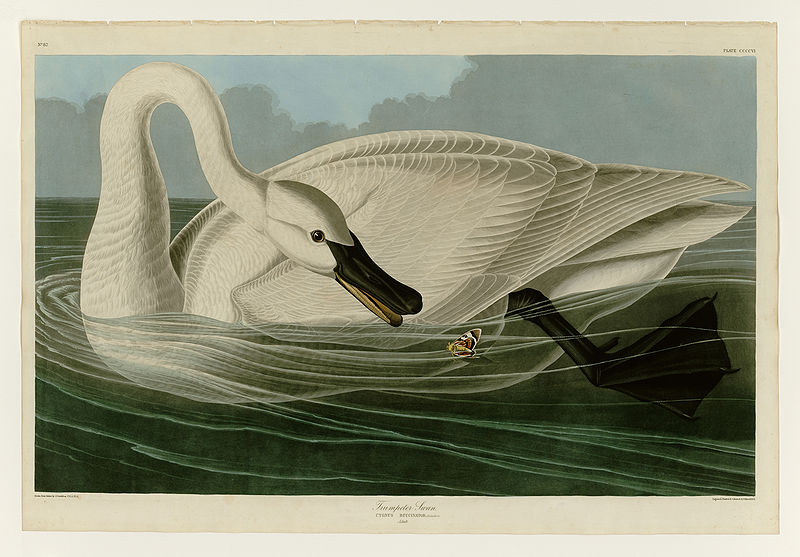

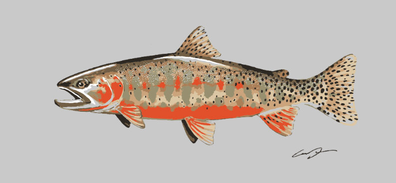