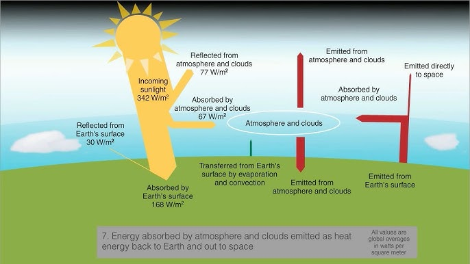
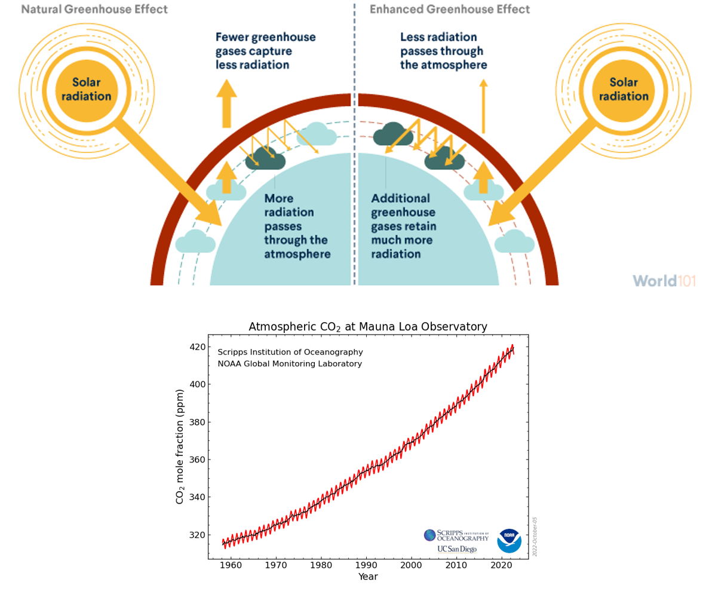

## What's in a name: Evolution of terminology

 
 

- **1970s: "Inadvertent Climate Modification" (NAS, 1971)**

 

- **1980s–1990s: "Global Warming"**

 

- **2000s: "Climate Change"**

 

- **Present: "Global Change" – includes climate change, land use, biodiversity, pollution, etc. **

## What's in a name: What is Global Change Biology?

 
 

- **Study of how global environmental changes affect biological systems**

 

- **Includes: climate change, land transformation, nutrient cycles, pollution, species introductions**

 

- **Focus on human-driven causes**
    + human impacts on the biosphere have ramped up at key times in our history

## What's in a name: Anthropocene

 

- **Current period where human activities are the dominant force shaping the Earth's geology and ecosystems**
     + appears in scientific and social discourse
     
 

- **Denotes current geological age - YET not an officially recognized geological epoch**
    + coincides with Atomic-Age (post 1950)
    + Crawford lake (Canada) selected as 'golden spike'

 

- **Proposal rejected in 2024 after 15 years of deliberation**
    + not enough data and not enough time has passes since start date
    
 

 

## Key drivers of global change and their consequences

 

- **Climate change**

 

- **Land transformation**

 

- **Disruption of biogeochemical cycles**

 

- **Pollution**

 

- **Introduction of species outside their native ranges**

## Key drivers: Climate Change – Causes

- **Greenhouse gas emissions (GHG's)**
    + Carbon dioxide (CO~2~) from industry/transportation/energy production
    + Methane (CH4) from agriculture/landfills/fossil fuels
    + Nitrous Oxide (N~2~0) from agriculture/industry
    + Water vapor (H~2~0) from evaporation

 

- **Deforestation - plants naturally take up (CO~2~)**

 

- **Shifts in albedo (color = reflective) from urbanization**

 

- **Non-human influences - Solar variability, volcanic activity, and ocean currents**
 

 

## Earth's Temperature is a Balancing Act

## The Greenhouse Gas Effect is a natural process

**GHG's play a critical role in maintaining Earth’s habitable temperature. Without GHG's, Earth would likely plunge into an ice age, as heat would escape back into space.**

## Human have Modified the Existing Greenhouse Gas Effect

## Climate Change – Effects on Natural Systems

 
 
 

- **Species distribution shifts**

 

- **Migration and breeding changes**

 

- **Coral bleaching, ocean acidification**

 

- **Extinctions**

## Climate Change – Effects on Our Species

## Land Transformation by Humans is a Global Phenonmenon

- **Agriculture: Conversion of forests, grasslands, and wetlands into croplands and pastures**

 

- **Urbanization: Expansion of cities, roads, and infrastructure fragments natural habitats**
    + Increases impervious surfaces, disrupting water flow, urban heat islands, and pollution

 

- **Deforestation: Logging for timber, agriculture, and fuel**
    + removes carbon sinks, causes soil erosion, and loss of biodiversity

 

- **Infrastructure Development: Construction of dams, highways, and mining operations**
    + modifies/removes habitats, interrupts animal migration routes and river flows.

 

- **Land Drainage: Conversion of wetlands, estuaries, and mangroves for development**
    + Loss of ecosystems that buffer storms and filter pollutants.

## Land Transformation: Habitat Loss

## Land Transformation: Biodiversity

## Land Transformation: Altered Water Flows

## Land Transformation: Expansion of Human-Wildland Interface

## Land Transformation: Removal of Historic Fire Regimes

## Land Transformation: Creation of Urban Heat Islands

## Altered Biogeochemical Cycles – Overview

* **Biogeochemical cycle: the movement and transformation of chemical elements/compounds between living organisms, the atmosphere, and the Earth's crust**

 

* **Carbon Cycle - C is main element for building organic molecules essential for life**
    + Fossil Fuel Combustion: Releases vast amounts of CO₂
    + Deforestation: Reduces the Earth's capacity to absorb atmospheric carbon

 

* **Nitrogen Cycle - N is used to build molecules like proteins, nucleic acids (DNA and RNA)**
    + Synthetic Fertilizer: Adds nitrogen to soils and waterways, which escapes into aquatic ecosystems
    + Fossil Fuel Combustion: Produces greenhouse gasses, contributes to smog, and acid rain, 
    + Livestock Waste: Releases greenhouse gasses

 

* **Phosphorus Cycle - building blocks like DNA and RNA, energy molecules, cell membranes**
    + Agricultural Runoff: Excess phosphorus from fertilizers enters rivers and lakes
    + Wastewater Discharge: Human sewage contributes to phosphorus overload in aquatic systems

## Eutrophication - Excessive N & P in Aquatic Systems

**Excessive nutrient levels lead to rapid algal growth. As these algal blooms decay, oxygen is depleted in the water, suffocating fish and other organisms**

## Ocean Acidification from CO~2~ emissions

**Oceans absorb CO~2~. When CO~2~ dissolves in seawater, it forms carbonic acid, releasing hydrogen ions and increases ocean acidity. More acidification makes it harder for organisms to build/maintain shells**

## Pollution from Humans is Vast

 

- **Industrial Activities (factories) emit air pollutants**
    + Chemical waste and heavy metals often contaminate soil and water.
    + Plastic manufacturing also contributes to microplastic pollution.

 

- **Vehicles release GHG's, volatile organic compounds (VOCs), and particulate matter**
    + land and air transportation

 

- **Agriculture fertilizer, pesticides and herbicides contaminate soil and water**
    + harming non-target organisms

 

- **Residential and Urban Waste includes household chemicals, plastic, and electronic waste** 
    + dssege and wastewater discharge pollutes aquatic ecosystems

 

- **Plastic waste, oil spills, and ballast water discharge pollute oceans and harm marine life**

## Biological Effects of Pollution

 
 
 

- **Reproductive decline**

 

- **Genetic mutations**

 

- **Ecosystem degradation**

 

- **Bioaccumulation**

 

 
 
 

## Species Introductions – Why?

- **An introduced species is a species that has been brough by human activity to an area where it does not naturally occur**

 

- **If specices becomes harmful to the environment = invasive**

 

- **Intentional: agriculture, pets**
    + many crop species = non-native
    + species are sometimes introduced to fight an invasice species = biocontrol
    
 

- **Unintentional: ballast water, trade**

 

- **Accelerated by globalization**
 

 
 
 
## Invasive Species – Impacts

**Invasive species often lack natural predators/diseases in new locations, allowing them to grow rapidly and outcome native species**

 

## Global Change Factors can be Interconnected

 

## Global Change Factors can be Interconnected – Coral Reefs

 
 
 
 

**When corals becomes stressed, the zooxanthellae (colorful algae) leave, causing coral 
bleaching and potentially death of the corals** 

 

**What causes corals to be stressed?**

 

 
 

