## The Value of Nature at Regional Scales

 

* **Understand the *unique* ecological, economic, and social benefits that a region's natural resources provide enables more effective conservation and sustainable development planning**

 

* **By focusing on regional scales, we can identify:**
    1. specific ecosystem services
    2. economic dependencies
    3. cultural values that are tied to local nature

     
    
* **Leads to more tailored and impactful strategies**

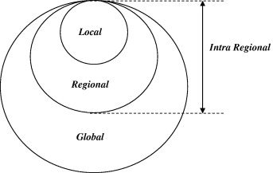

## Why is Nature so Valuble in Appalachia?

- **Rich in biodiversity with many *endemic* species**
    + endemic species = 
    
 

- **Long cultural history of land connection, especially Indigenous and settler traditions**

 

- **Economically tied to natural resources—forests, streams, wildlife**
    + are coal/timber industries a 'resource curse'?

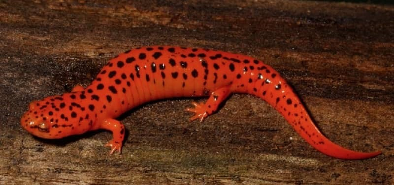

## The value of biological diversity: Categories

 
 

- **Scientific Value**: Factors that lead to gain or loss of species

 

- **Value to Human Health**: We rely on natural systems for our persistance

 

- **Economic Value**: Biodiversity has infinite commercial value

 

- **Cultural Value**: Natural world anchors human culture

 

- **Ethical Value**: Moral role in conservation and stewardship

 

- **Intrinsic Value**: Value of life

## Scientific Value in Appalachia

 

- **One of the most biodiverse temperate regions on Earth**
    + ~50% of salamander species are endemic!
    + high diversity areas are typically warm, close to the equator, and/or are *near mountain ranges*
    
 

- **Important research site for studying climate impacts and species resilience**
    + Appalachian mountains are a *climate refuges*
    
 

- **Hosts long-term ecological research sites**
    + https://www.neonscience.org/about

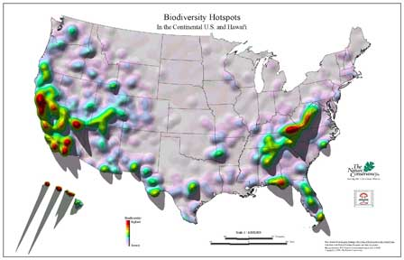

## NEON and other monitoring sites in funding peril???

**National Ecological Observatory Network (NSF NEON) provides high-quality, open and free data to enable research on the impacts of climate and land-use change, water availability and invasive species on the nation's living ecosystems**

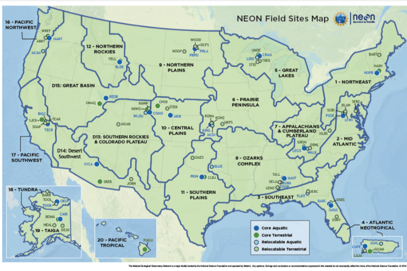

## Human Health Value in Appalachia

 

- **Medicinal plants (e.g., black cohosh, ginseng) have long been used for healing**
    + Dietary Supplement Health and Education Act (1994) creating a regulatory framework for  herbal medicines under the Food and Drug Administration
    + folk 'herbalism', however, is not being passed on effectively
    
 

- **Appalachian streams serve as drinking water sources for millions**
    + A recent meta analysis of >3,000 Appalachain studies over 20 years could not reach clear conclusions about the state of water quality, or its impacts on health, in any of Appalachia's subregions
    

 

- **Forests help filter air and mitigate respiratory issues in rural communities**
    + Clean Air Act (Federal, 1970), Smokestacks Act (State, 2002)

## Ginseng populations are a fraction of historical levels: WHY?

**Ginseng grows in Appalachia and a region of China called Manchuria. Ginseng in thought to aid in immunity, blood sugar regulation , stress, cardiovascular health...**

 

* **Is it overharvesting?**

 

* **OR is it...**
    + logging
    + surface mining
    + climate change
    + deer overpopultions
    + climate change
    + housing developement

## Air quality laws vs Deforestation

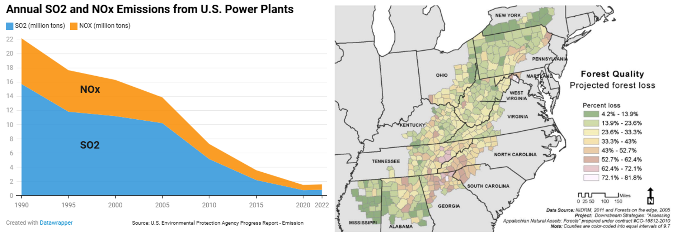

## Appalachia Economic Value – Timber & Tourism

 

- **Sustainable forestry and outdoor recreation are major contributors**

 

- **Ecotourism and national park visitation**
    + Great Smoky Mountains NP: 12 million visits (2024)
    + New River Gorge NP; 1.8 million visits (2024)
    + Shenandoah NP: 1.7 million visits (2024)

 

- **Loss of biodiversity risks undermining long-term economic sustainability**

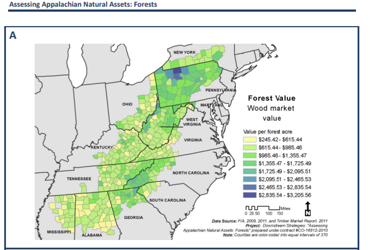

## Appalachia Economic Value – Foraging & Hunting

 
 
 

- **Cultural and economic reliance on hunting, fishing, and foraging**

 

- **Seasonal harvesting of ramps, mushrooms, and herbs**

 

- **Wildlife declines impact local food security and livelihoods**

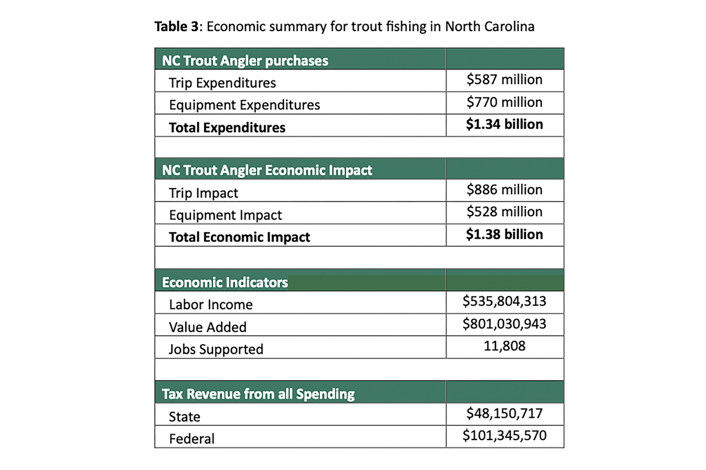

## Appalachia Economic Value – Foraging & Ginseng

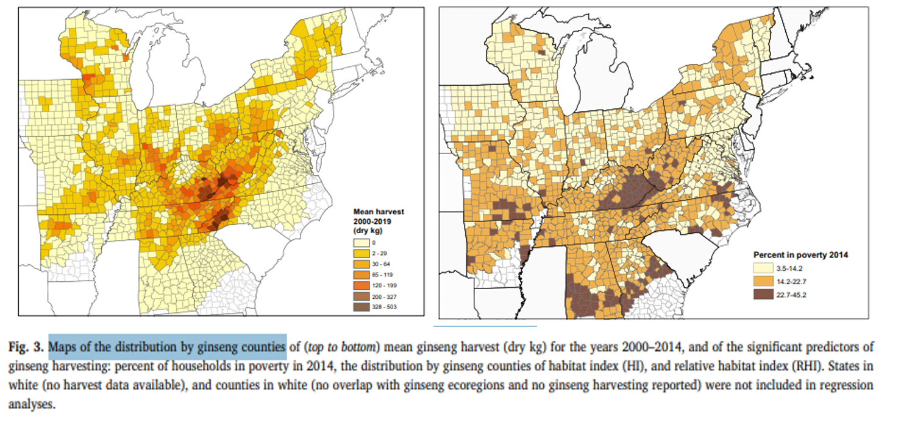

## Cultural Value of Appalachia

 
 
 

- **Deep place-based traditions tied to land: music, storytelling, herbalism**

 

- **Indigenous ecological knowledge systems still practiced**

 

- **Cultural identity rooted in mountains and nature**

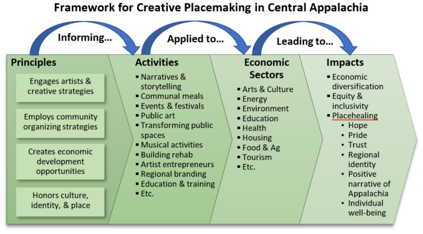

## Ethical Value of Appalachia

- **Stewardship rooted in faith and folklore (e.g., “God’s creation” ethics)**

 

- **Rise of community land trusts and conservation easements**

 

- **Balancing extraction history (e.g., coal) with ecological healing**

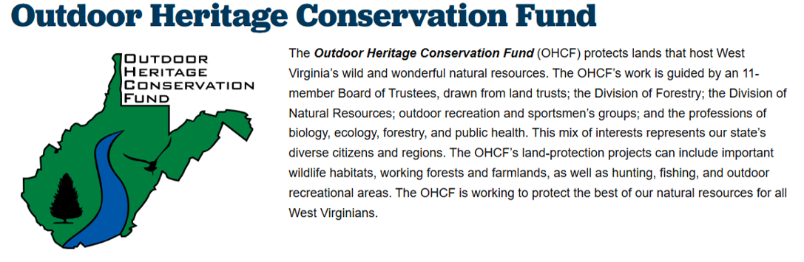

## Intrinsic Value of Appalachia

 
 

- **Nature has value beyond utility**
    + while providing clean air and water, it also holds intrinsic worth, meaning it has value regardless of its usefulness to humans

 

- **The Appalachian region sustains us economically but it's true value is much deeper to those that live here**
    + Presence of sacred places (e.g., waterfalls, burial mounds)
    + Storytelling that celebrates animals and forests as having spirit or “aliveness”
        + Appalachian cryptids...

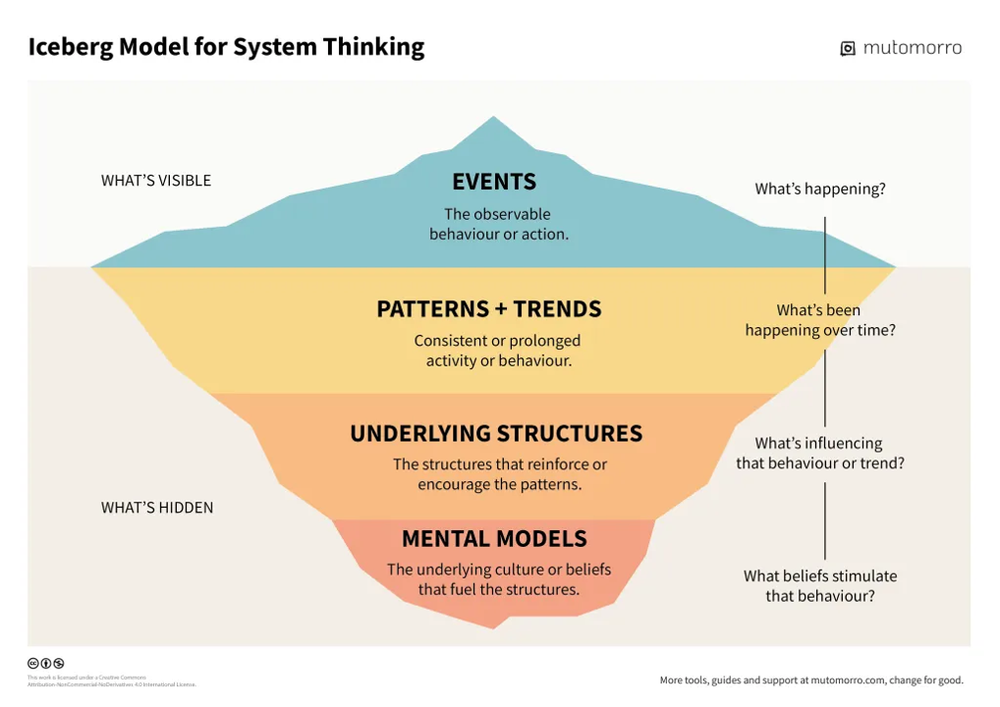

## Case Study Species – Salamanders

 

- **Appalachians: Salamander capital of the world**
    +  cool high-elevation environments represent ideal habitats

 

- **Keystone species in forest ecosystems**
    + both predator and prey
    + role in insect population control, soil health, and food webs

 

- **Sensitive to climate change and pollution**
    + breath partially through their skin, which makes them sensitive to change

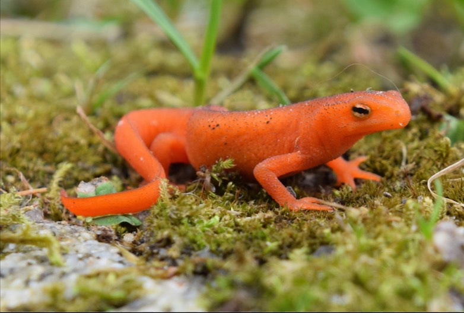

## Appalachian salamanders - Scientific Value

 

- **Biodiversity Indicators: The Appalachians host the highest diversity of salamanders in the world, particularly lungless salamanders**
    + Critical group for studying evolutionary biology

 

- **Ecological Research: Salamanders are used in studies on forest ecology, climate change sensitivity, and soil nutrient cycling**

 

- **Model Organisms: Some species, like the Eastern red-backed salamander, are model organisms for studying territoriality, behavior, and microhabitat use**

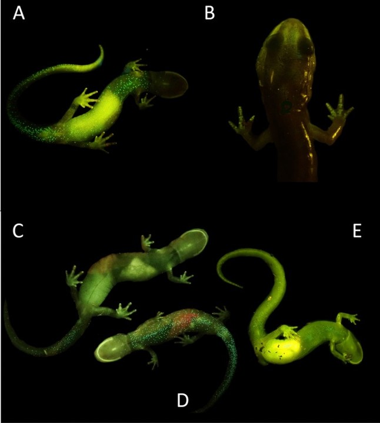

## Appalachian salamanders - Value to Human Health

 

- **Medical Research: Salamanders possess regenerative abilities (e.g., limb regeneration), which are being studied for advances in human medicine and tissue regeneration**
    + *bioprospecting*

 

- **Environmental Health Indicators: Salamanders are bioindicators of ecosystem health because of their sensitivity to pollution, pH changes, and toxins**
    + Monitoring them helps predict threats to water quality that affect human populations.
    + e.g., Atrazine found in water sources—impacts amphibians and possibly humans

## Appalachian salamanders - Economic Value

- **Ecosystem Services: By consuming vast numbers of insects, salamanders help regulate pest populations in forest ecosystems, reducing the need for chemical pest control**

 

- **Ecotourism and Education: The biodiversity of salamanders, attracts ecotourists, naturalists, and researchers, supporting local economies through nature-based tourism and education programs**

 

- **Scientific Funding: Research on Appalachian salamanders attracts grants and investment in regional universities and conservation organizations**

## Appalachian salamanders - Cultural Value

 

- **Regional Identity: In the Appalachians, salamanders are featured in school/team mascots, art, and regional folklore**

 

- **Storytelling and Education: Salamanders are used in environmental education as symbols of hidden biodiversity and conservation success**

 

- **Connection to Nature: Their elusive, forest-dwelling lifestyle and variety of colors and patterns evoke a sense of mystery and wonder in visitors and locals alike**

## Appalachian salamanders - Ethical and Intrinsic Value

 

- **Moral Obligation: Salamanders have a right to exist, independent of their utility to humans**
    + They play crucial roles in forest food webs, contributing to the natural balance of their habitats
    
 
 

- **Stewardship: Humans have a responsibility to protect species like salamanders, which are vulnerable due to habitat loss and climate change**

 

- **Existence Value: Their presence enhances the overall richness and integrity of Appalachian ecosystems**

## America the Beautiful initiative and Appalachia?

- **Conservation Goal: Conserve 30% of U.S. lands and waters by 2030 — includes Appalachia**

 

- **Habitat Protection: Targets hotspots such as Red River Gorge (KY) and Cherokee National Forest (TN), home to rare salamanders and bats**

 

- **Community Partnerships: Includes Coalfield Development (WV) and Highlands Biological Foundation (NC) for local stewardship and green jobs**

 

- **Climate Resilience: Promoted by Southern Appalachian Highlands Conservancy and U.S. Forest Service to protect forests and watersheds**

 

 **NOW: Executive order policy reversals by the new president have rescinded various environmental and climate-focused executive orders and issued new ones to focus on domestic energy production (e.g., coal) over conservation**

## False Dichotomy – Environment vs. Economy: Resource curse?

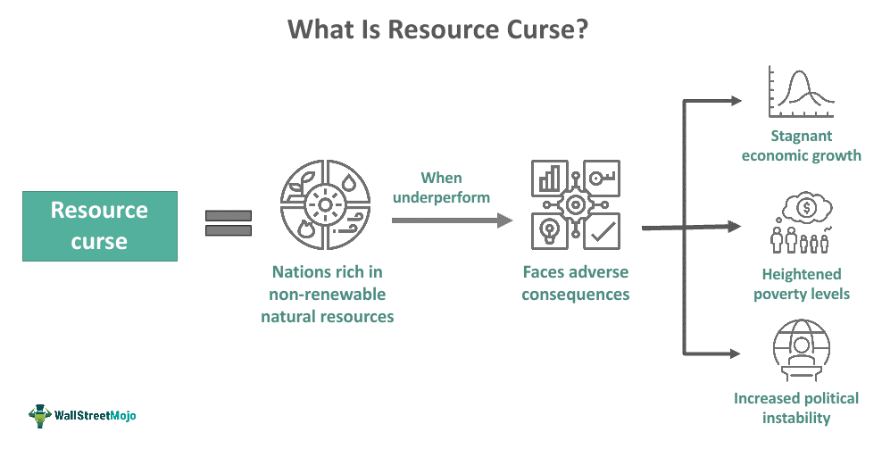

## False Dichotomy – Environment vs. Economy: Resource curse?

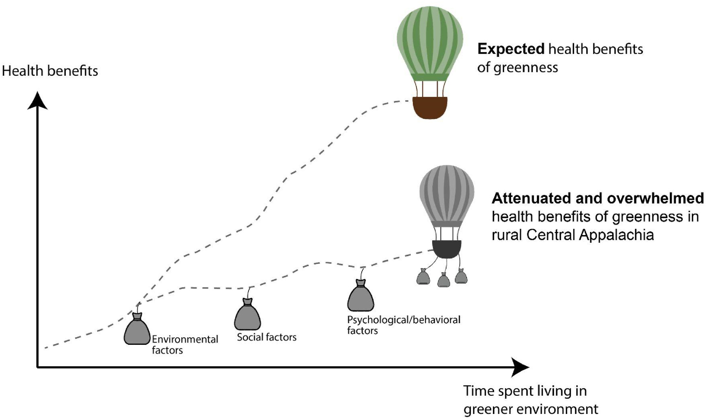

## Next up: Friday open-discussion on the 'value of nature'

 

- **Which value resonates most with you personally? **

 

- **Make a persuasive argument for which value aspect of biodiversity is the most important?**

 

- **Prepare a 'legal brief' to present to a small group**
    + summarize your argument into a few key points
    + provide real tangible evidence
    + submit your brief on Brightspace (can be rough)
    
 
 
- **Feel free to argue the path less traveled**

 

- **Your small group will need to come to a decision based on everyone's briefs**
