## The really BIG question

 

**How do biological systems respond to human impacts on planet Earth?**

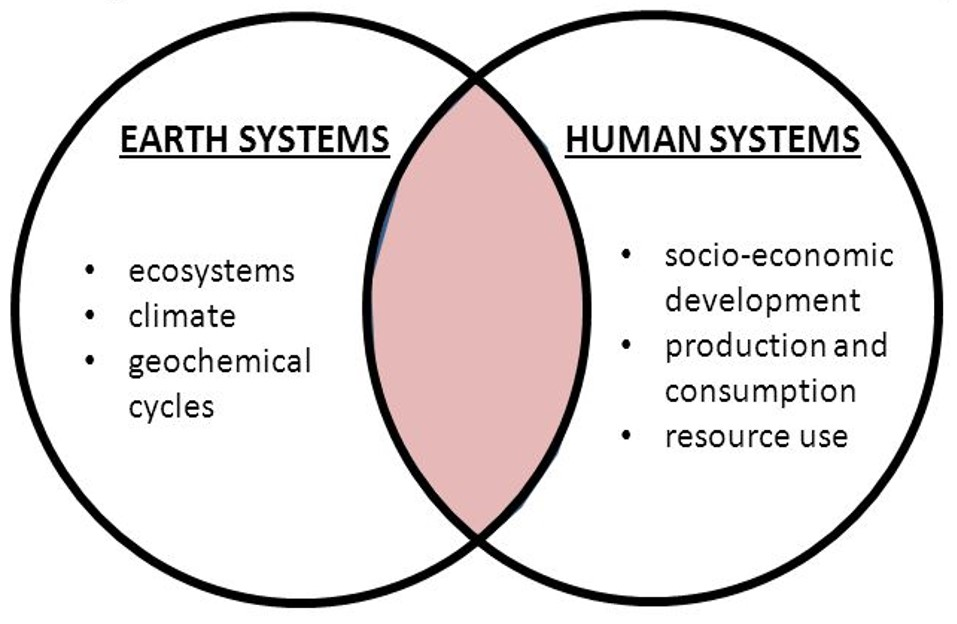

## Species *Range* changes

**Geographic range= total spatial area in which a species can exist**

 

**Range changes can be facilitated by individuals themselves moving**

 

**For example: individuals following food resources, altering migratory pathways, etc.**

 

**Can occur (1) naturally (competition) or (2) via move response or (3) changes in survival rate**

 

**Changes impact a species' distribution = where individuals are actually found at a given time**

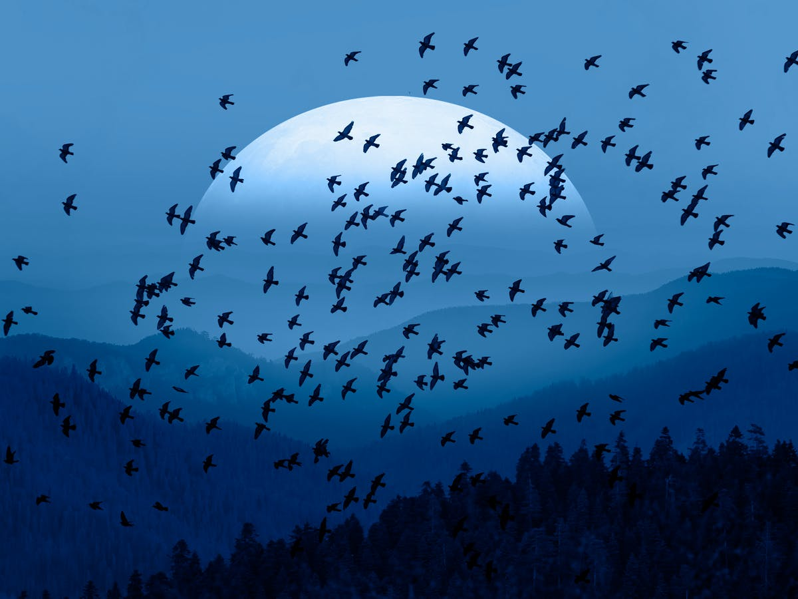

## Confronted with a changing world: organisms can *move*

 

**Move: movement of individuals (dispersal, migration), populations or species (range changes).**

 

**What are the reasons for an organism to move?**

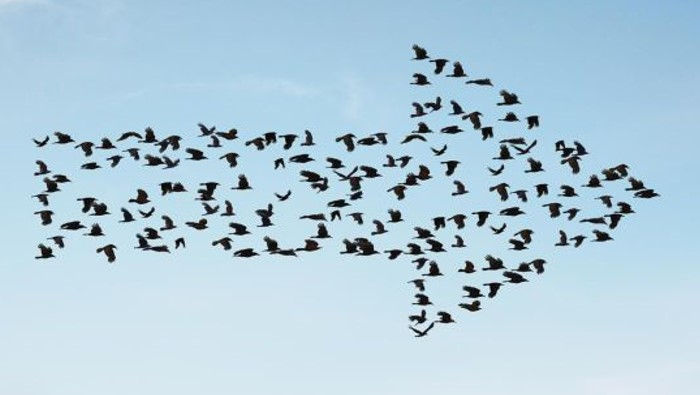

## Why Move? Organisms are adapted to environments

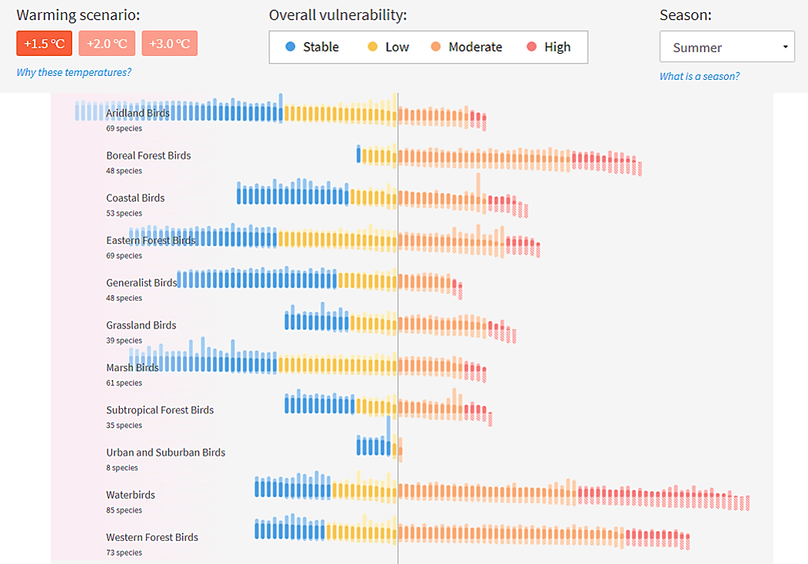

## Adaptations are very complex

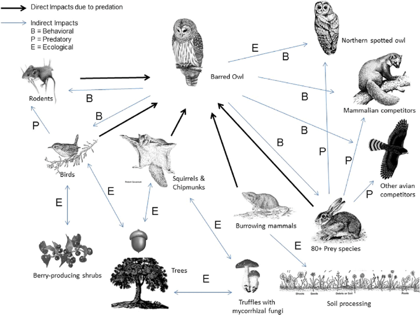

<!-- ## Adaptations are complex and took a long time time to develop -->
<!-- 
 -->

<!-- 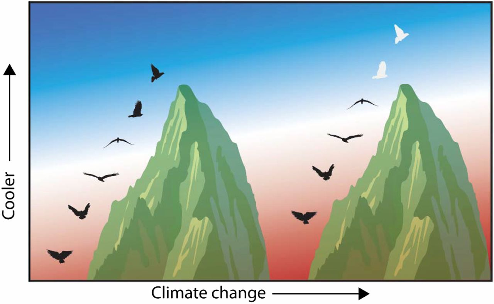 -->

<!-- ## -->

<!-- 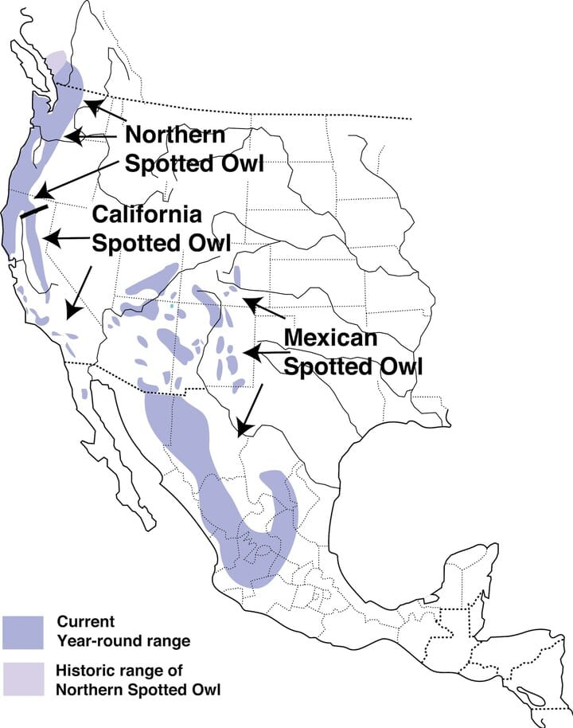 -->

<!--  -->

<!-- ## Koality not Quantity -->
<!-- 
 -->

<!-- 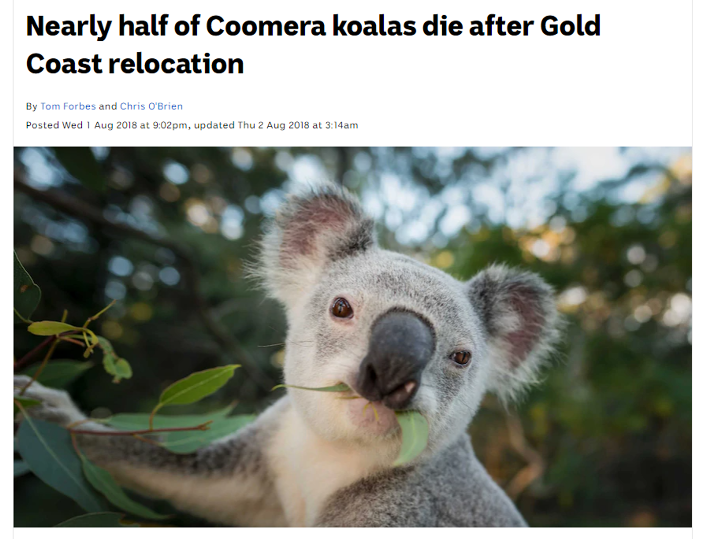 -->

## Broad move trends: Poleward, upslope, deeper

**With climate warming, species are moving to higher latitudes, higher elevation, and deeper (aquatic)**
 
*Not every species is on the move, showing the complexity and importance of other factors*

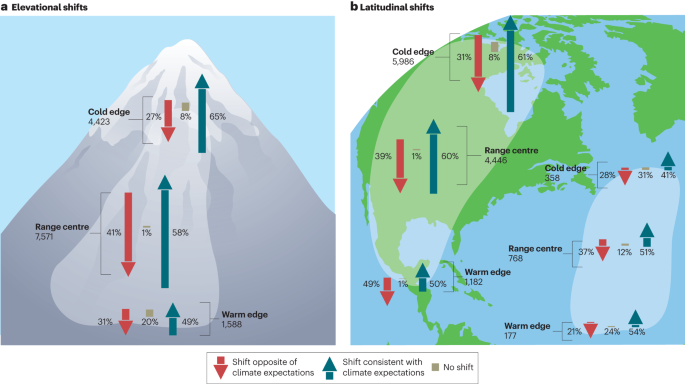

## Bird species in the Appalachian mtns (Deluca & King, 2017)

- **9 out of 16 low-elevation species in the White Mountains of New Hampshire moved upslope by an average of 99 meters over a study period from 1993 to 2009**

 

- **Only one high elevation species, Magnolia Warbler, exhibited evidence of an upslope shift**
    + WHY?
 
  
 
- **Several of the high elevation species shifted ranges downslope**
    + HUH?

 

- **What other species/community level factors could be at play??**

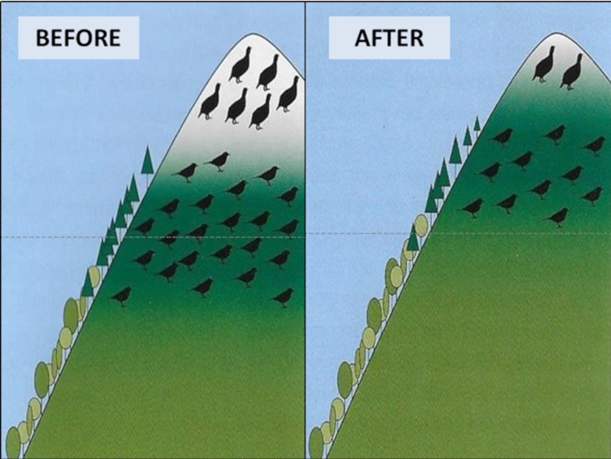

## Tree species in the Appalachian mtns (Deluca & King, 2017)

 

- **Northwestward Shift: Scarlet oak is appearing more frequently in areas northwest of the Appalachians.**

 

- **Decrease in Southeast: a decrease in its presence in the Southeast, a region experiencing drier conditions**

 

- **Studies indicate a substantial shift of over 100 miles to the northwest from the Appalachians over 30 years**

 

- **Natural colonization of these northern areas might be limited within a 100-year timeframe**
    + what limits tree movement?

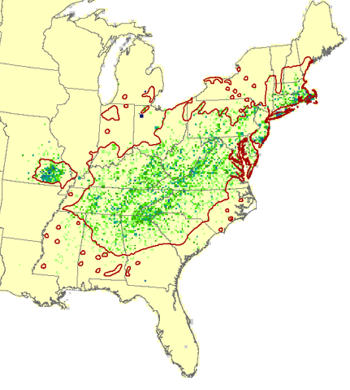

## Constraints to movement trends...

 

- **Brook trout are highly adapted to cold, oxygen-rich streams**
    + high sensitivity to small thermal changes

 

- **Warming temperatures reduce habitat suitability**
 
- **Drought lowers flows, which also makes water warmer**

 

- **High-elevation populations in the Southern Appalachians are particularly vulnerable**
    + *climate pinching* at southern edge and upward elevation limit
    + brook trout are unable to disperse long distances

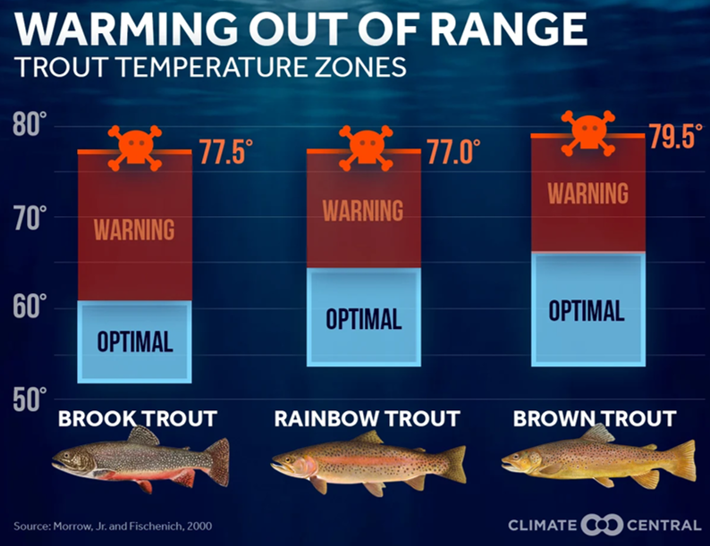

## Constraints to movement trends...

 

- **Range migration of hardwood trees (scarlet maple) is at the expense of conifer forests**

 

- **Northern flying squirrel depends on mature red spruce forests**
    + thus, climate and logging threaten reduce their habitat

 

- **Southern flying squirrel ranges are expanding**
    + survive in mix forests and eat nuts (hardwood)
    + carry a parasite that is lethal to Northern flying squirrel

 

- **Community interdependence matters!**

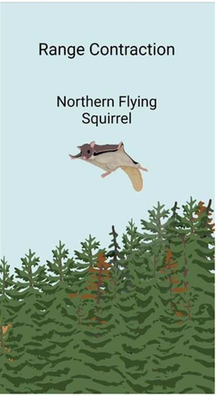

## Constraints to movement trends...

 

- **High elevation Appalachian mountain tops are 'sky islands**
    + glacial relic endemic species adapted to cold

 

- **Elevation limits reduce total available habitat and increase competition as other species move upslope**

 

- **Mountaintop endemics like the Appalachian grizzled skipper face extinction from competition** 

 

- **Fraser fir forests shrinking due to loss of cool temperatures and increased stress from invasive insects (balsam woolly adelgid)**

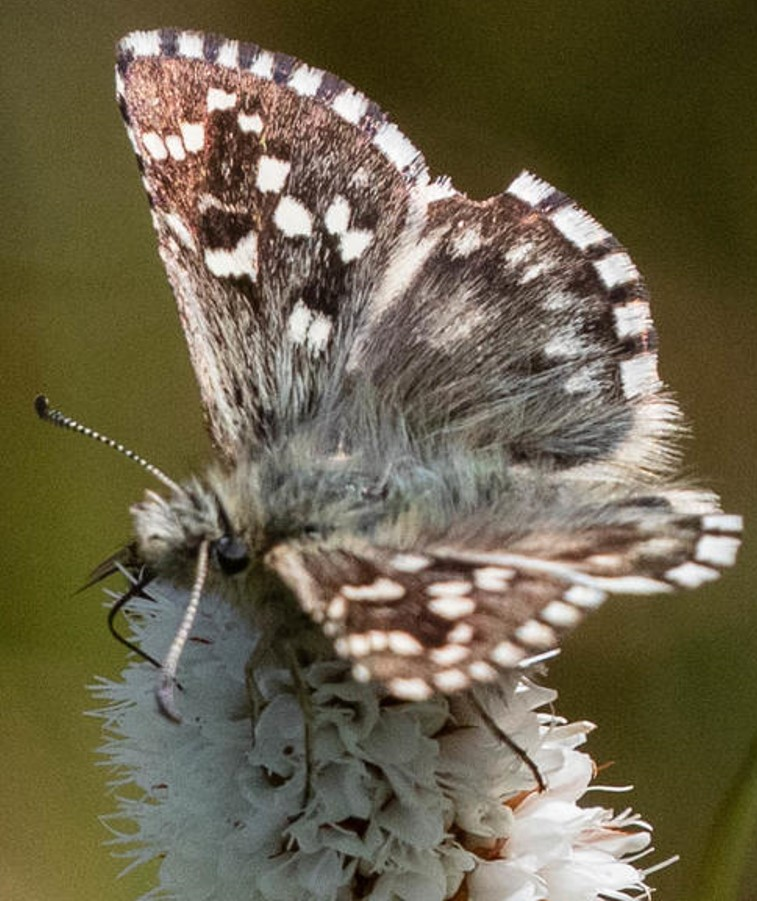

##

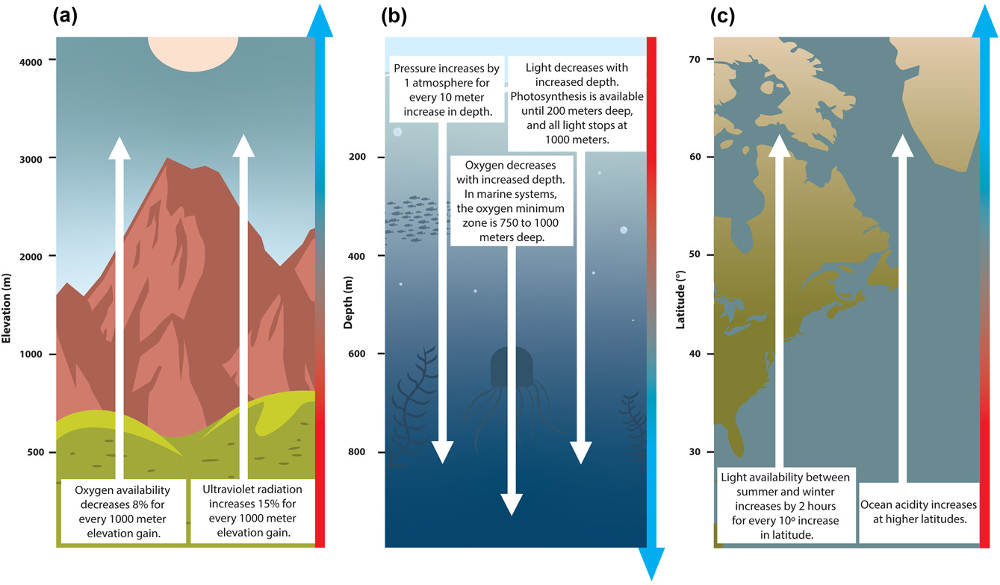

## Natural movement can also be disrupted: Monarch

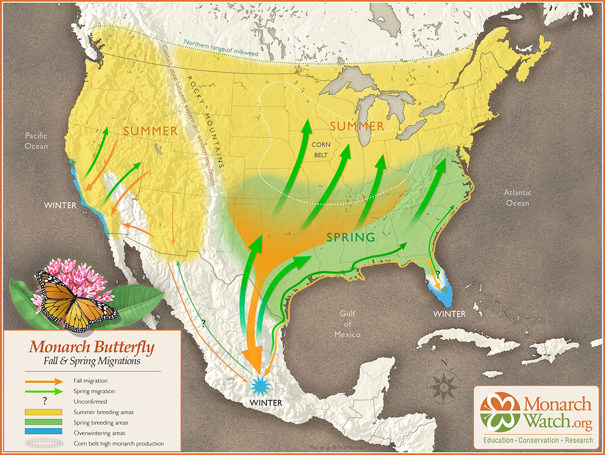

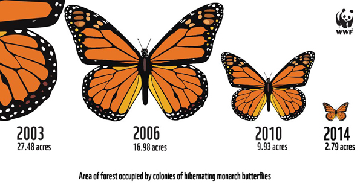

## Natural movement can also be disrupted: Monarch

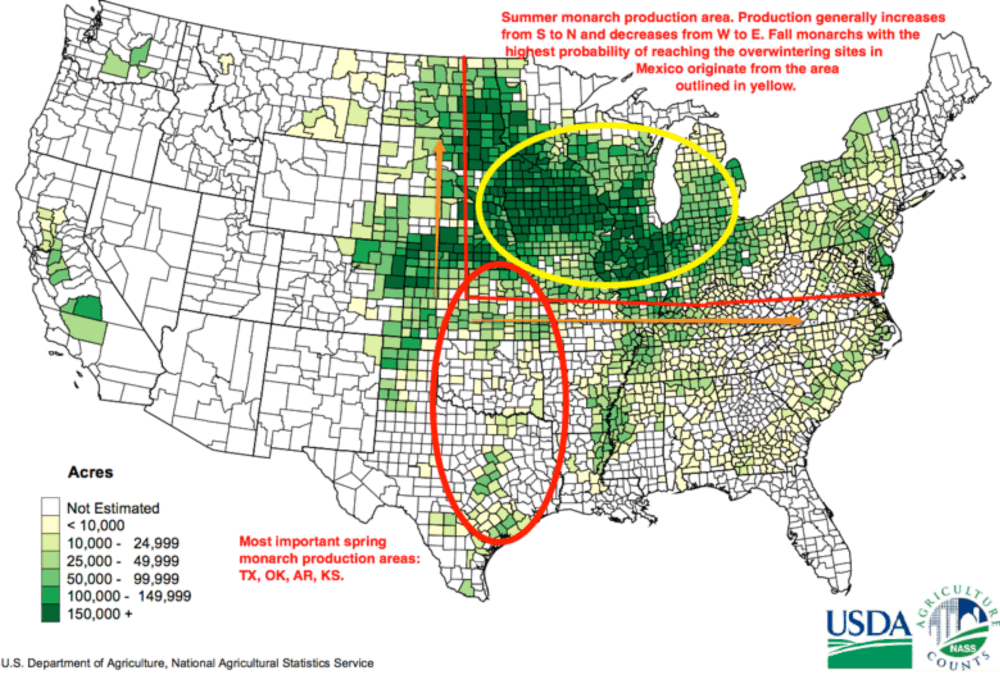

## Appalachian Mountains as a Migratory Corridor

- **Appalachian range provides a continuous forested pathway, rich in food and shelter**
    + 'green highway' for migration (N-S) for birds, insects and mammals
 
 
 
**Wood Thrush migrates from Central America to Appalachia to breed**
 
**Monarch Butterfly uses the Appalachians during its long-distance migration**
 
**Eastern Red Bat migrates along forested ridgelines**
 
**Black-throated Green Warbler  depends on high-elevation spruce-fir forests as stop-overs**    
  
 

- **Habitat fragmentation (e.g., roadways, development) disrupts continuous forest cover**

 

- **Climate-driven phenological mismatch – food resources (insects, berries) peak earlier, out of sync with arrival times**

 

- **Invasive species like garlic mustard reduce the quality of understory stopover habitat**

##

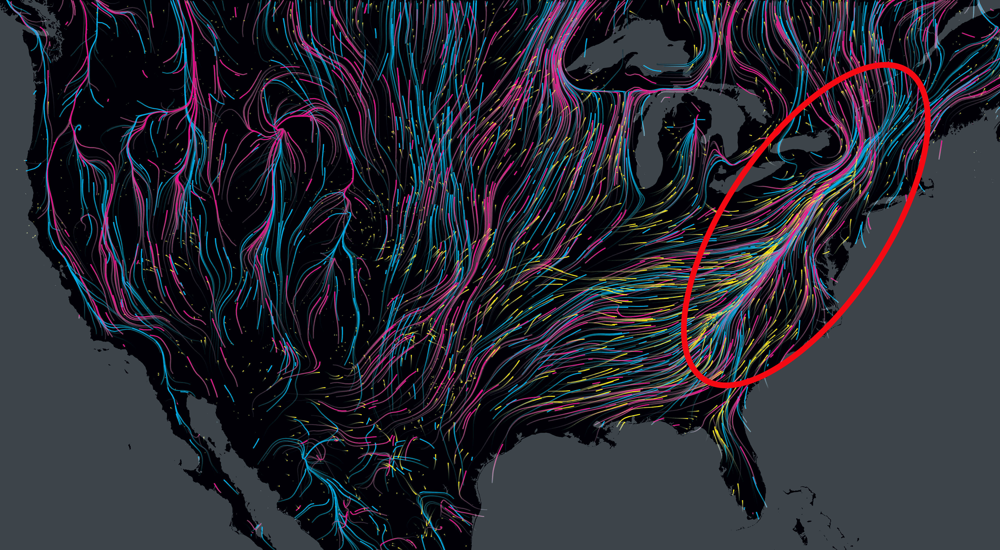

## In order to persist, species range changes are predictable

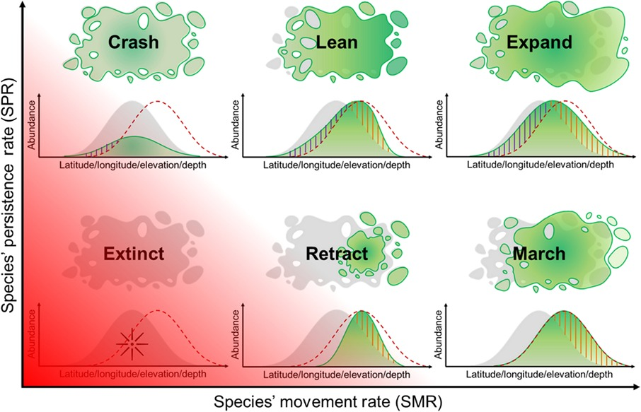

## The 'Move Response' is limited

 

**Move: movement of individuals (dispersal, migration), populations or species (range changes).**

 

**Dispersal: movement away from natal territory (typically before or during reproduction - can be gametes not individuals)**

 

**Dispersal is a key trait that influences move response. Can be short or long distance -  All species (even sessile ones) can disperse, but species differ in their dispersal ability.**

 

**Dispersal links/limits individual movement with range shifts**

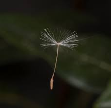

## Range changes are usually slow

* **Many species are limited in a move response by gamete dispersal**
    + Appalachian understory plants have limited seed dispersal
    
 

* **Trees are excellent disperses across many generations, however..TIME MATTERS**

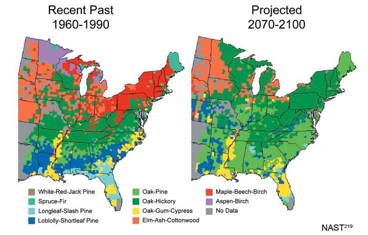

<!-- ## In order to persist, species range changes are predictable -->
<!-- 
 -->

<!-- 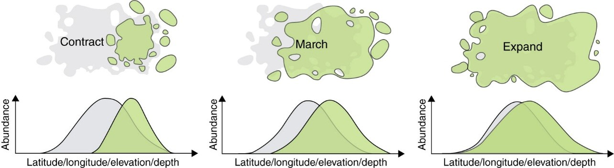 -->

## Factors that influence the move response

**Whether species can “move” as a response to global change stressors depends on many things…**

 

- **Organismal traits: Ability to move in response to changing conditions can be affected by many intrinsic traits like dispersal ability, generation time, etc.**
    + Appalachian salamanders are highly site-faithful
    
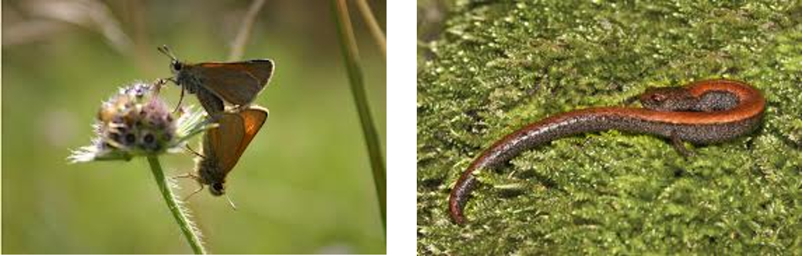

## Factors that influence the move response

**Whether species can “move” as a response to global change stressors depends on many things…**

 

**Landscape features: Ability to move in response to changing conditions can be affected by many *characteristics of the environment* like habitat matrix (connectedness)**

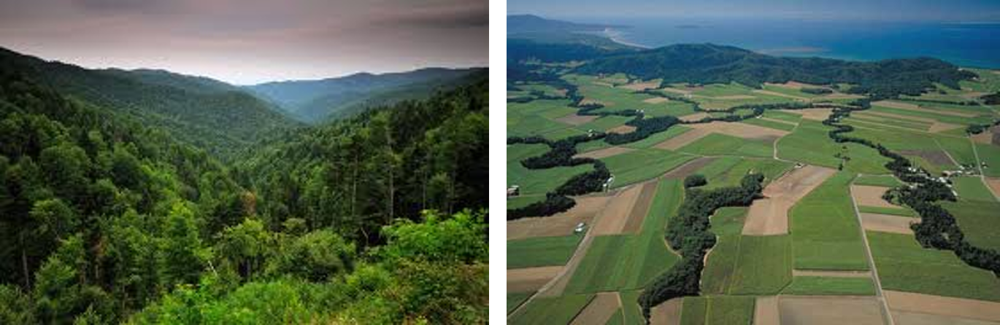

## Factors that influence the move response

**Whether species can “move” as a response to global change stressors depends on many things…**

 

- **Dynamics of change: Ability to move in response to changing conditions can be affected by many *global change stressors* like pace of change. Can they keep up?**
    + Appalachian mollusks have low vagility, can they ever move fast/far enough?
    
<!--  -->

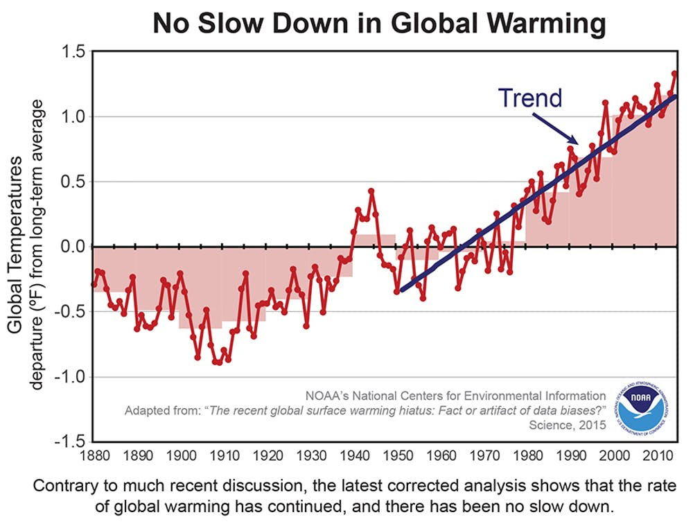

## Factors that influence the move response

**Whether species can “move” as a response to global change stressors depends on many things…**

 

**Globalization: Our transport systems change prior constraints on organismal movement for some species, which can lead to biotic homogenization**

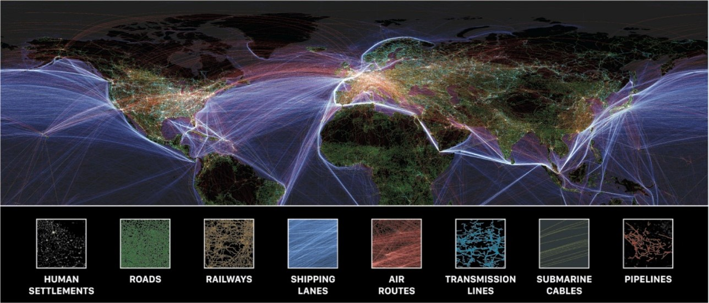

## Factors that influence the move response: Invasion

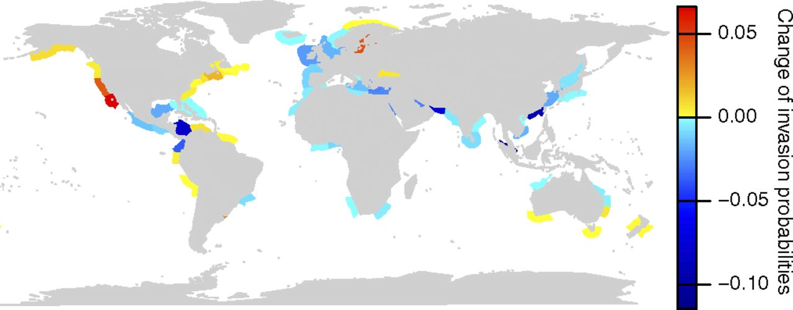

<!-- ## Projecting the move response into the future... -->
<!-- 
 -->
<!--   -->
<!--   -->
<!--   -->

<!-- 
 -->

<!-- **Ultimately ability to “move” will be determined by an interaction between the species and the environment** -->

<!--   -->

<!-- **100 years from now where could species survive and how could it get there?** -->

<!--   -->

<!-- **Can it disperse far enough fast enough over a fragmented landscape?** -->
<!-- 
 -->

<!-- 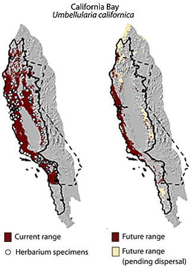 -->

<!-- ## Friday: Open discussion - Humans and the 'move response' -->
<!-- 
 -->

<!-- * **Investigate how/when/if humans may have to move due to global change factors** -->

<!-- 
 -->

<!--   -->

<!-- * **Utilize any form of communication you want** -->
<!--     + Be creative!  -->

<!--   -->

<!-- * **Submit an article on Brightspace** -->
<!--     + as proof of your work  -->

<!--   -->

<!-- * **Be prepared to discuss what you found as well as your opinion on if it is possible** -->

<!-- 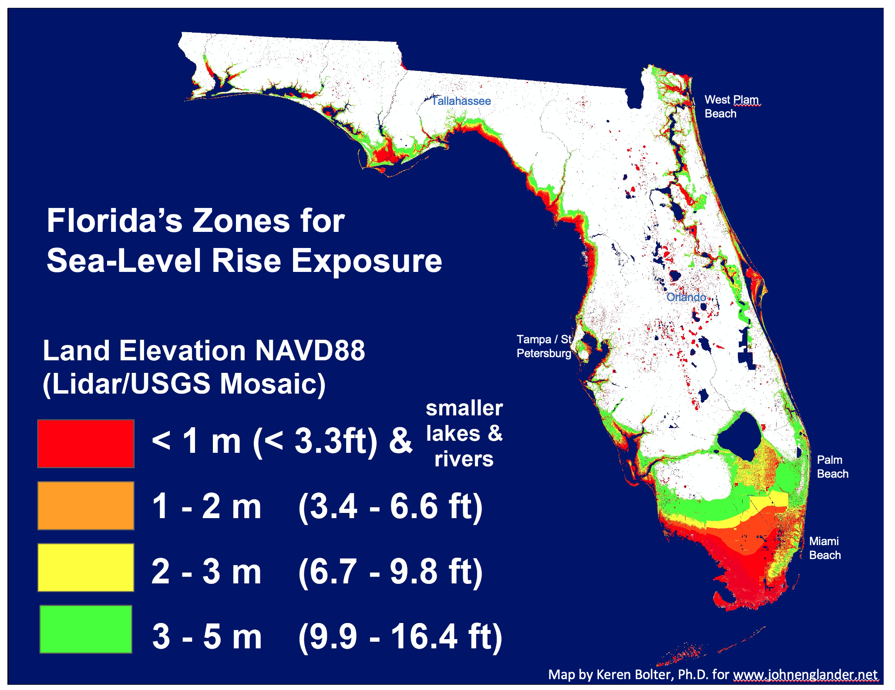 -->

<!-- ##  -->

<!-- 
 -->

<!-- **Pacific Islands threatened by sea level rise caused by climate change** -->

<!--   -->

<!-- **Water availability and overcrowding may become an issue in the next 50 years** -->

<!--   -->

<!-- **29% of US population lives on the coast** -->

<!--   -->

<!-- **40% of world populations live within 100km of coast** -->

<!--   -->

<!-- **1 in 10 people live in low-elevation coastal risk zone (<30 ft above sea level)** -->
<!-- 
 -->

<!--  -->

<!-- ## Are climate reguess in the near future? -->
<!-- 
 -->

<!-- **New Zealand is one of the first countries to propose program for climate refugees** -->

<!--   -->

<!-- **Pacific Islanders only want refugee visas as a last resort ** -->

<!--   -->

<!-- **Instead, island communities advocate for climate adaptation, emission reduction, and pathways for legal migration beforehand** -->

<!--  -->

<!-- ## Chapter reading -->

<!-- **Information on Invasive species** -->