<!-- ## Whats in a name: Revisting the Anthropocene -->
<!-- 
 -->

<!-- 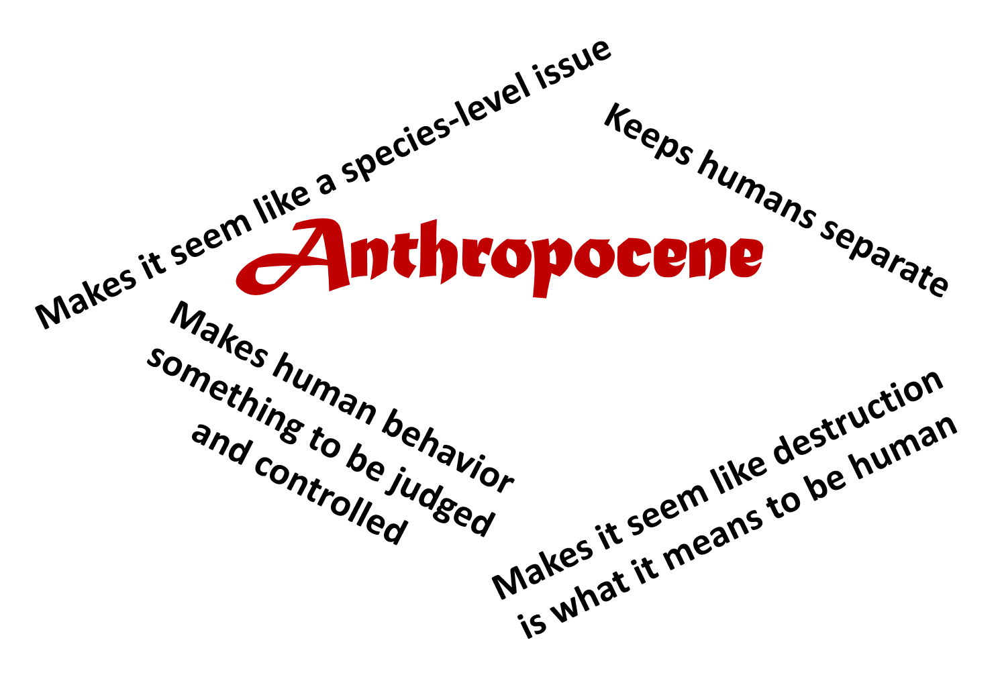 -->

<!-- ## Whats in a name: Revisting the Anthropocene -->
<!-- 
 -->

<!-- 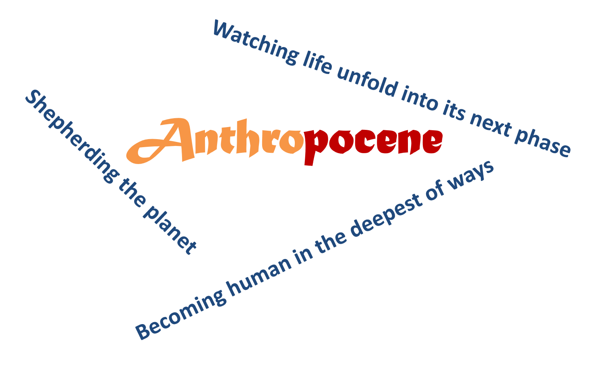 -->

## The effect of global change on organisms

 
 
 

**Are human impacts like a hammer and biological systems a nail? **

 
 

**What are the problems with this analogy?**

## The effect of global change on organisms

 

- **Hammer strikes have different characteristics**
    + Global change stressors can vary in magnitude, velocity
    + Stressors vary from local - regional - global
    + How many hammers are occurring

 

- **Nails have different characteristics**
    + Organisms vary in their vulnerability to global change stressors
    + Adaptation is not the only response

 

- **Also… the nail can influence the hammer**
    + Living things can respond to global change stressors and affect the entire system

## The effect of global change on organisms

 

**Organisms have different elements of “vulnerability”**

 
**The degree to which a system is susceptible to adverse effects of global change is a function of:**

 

- **Exposure: The character, magnitude and rate of a perturbation**
    + How hard & fast does the hammer hit?

 

- **Sensitivity: Degree the system changes from a given perturbation**
    + Is the nail fragile or robust?

 

- **Response: Ability of a system to respond from perturbation**
    + Can the nail bounce back?

<!-- Good to add specific examples for each of these: -->

<!-- Shallower or deeper in ocean – which is more exposed? -->

<!-- Generalist or specialist – which is more sensitive? -->

<!-- X or y, which is more resilient? -->

## The effect of global change on organisms

**So....organismal responses are critically important**
 
**Organisms affect their own fate and also the dynamics of biotic systems as a whole **

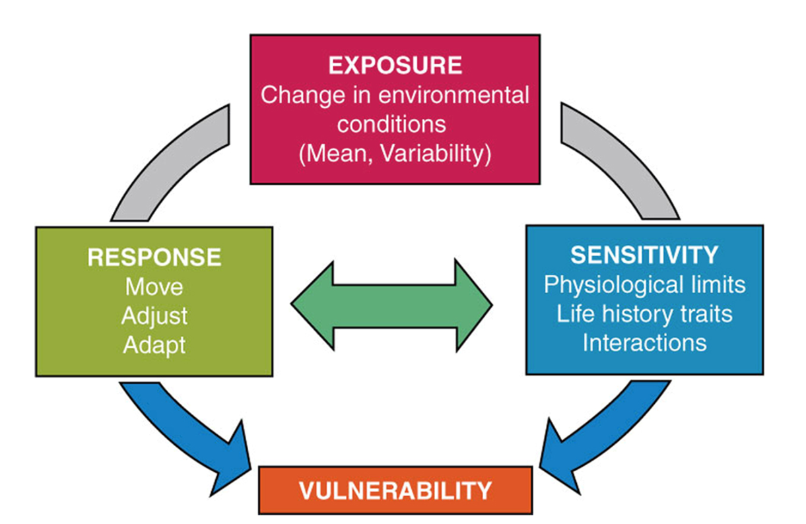

## Humans now dominate and modify the planetary system 

 
 

- **As human populations continue to rise, so do the pressures placed in natural systems**
    + no stop in sight
    
 

- **How do biological systems respond to human impacts on planet Earth?** 

 

- **Confronted with a changing world, what can organisms do?**

 

- **What we will consider is: WHAT IS POSSIBLE?**

## The "Adjacent Possible' Theory - Stuart Kauffman

 

- **Theory proposes that biological systems are able to morph into more complex systems by making incremental, relatively less energy consuming changes in their make up**
    + small steps rather than extreme jumps or more distant possibilities
    + concept of 'lowest hanging fruit'

 

- **Kauffman was particularly interested in the origins of order and the mechanisms that drive self-organization, via evolution**
    + how the *actual* expands into the *adjacent possible*
    + what possible responses are the most 'nearby' (most conceivable)

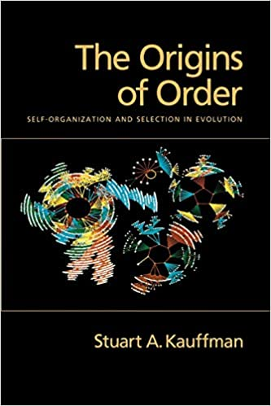

## The "Adjacent Possible' theory - Stuart Kauffman

 

How the *actual* expands into the *adjacent possible*

 
 
 

- **The *actual* describes the system in its current state, with all its components and interconnections**

 

- **The *adjacent possible* contains the set of possibilities available to individuals, communities, institutions, organisms, productive processes, etc., at a given point in time during their evolution**

 

- **For example, if a butterfly species is a generalist or a specialist feeder its 'adjacent possibles' will be more or less tied to its community**

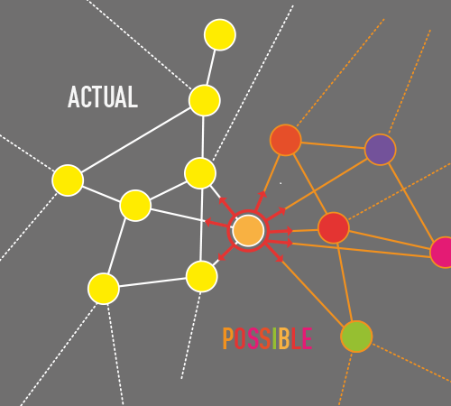

## The adjacent possible for other species

 

**If environmental conditions are changing…what are the adjacent possible options for survival?**

 

**In physical space -> move**

 

**In physiological / behavioral space -> adjust**

 

**In genetic / adaptive space -> adapt**

 

**If no adjacent possible -> die**

 

**Responses are not mutually exclusive**

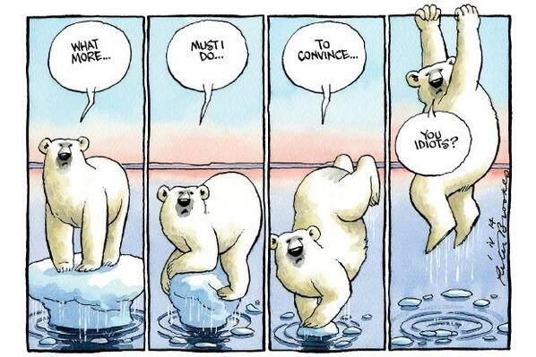

## The adjacent possible for other species

**If environmental conditions change...**
 
 
**What are the adjacent possible options for survival?**

- **What determines the adjacent possible?**
    + Organisms traits (mostly under genetic control)
        + developmental, physical, behavioral
    + Environmental features
    + Dynamics of change

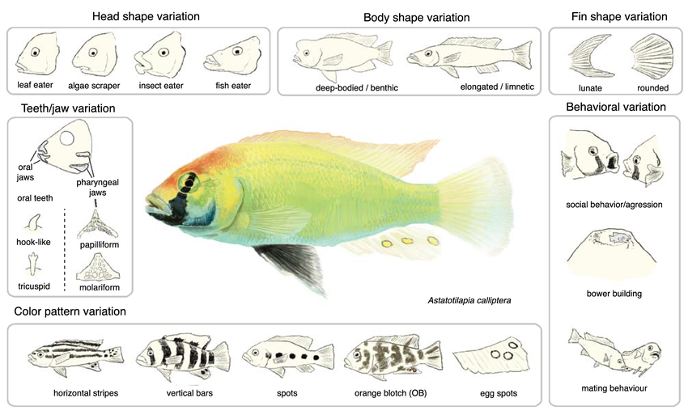

<!-- ## The adjacent possible for other species -->
<!-- 
 -->
<!--   -->
<!--   -->

<!-- 
 -->

<!-- **If environmental conditions are changing…** -->
<!--   -->
<!-- **what are the adjacent possible options for survival?** -->

<!--   -->
<!--   -->
<!--   -->

<!-- - **What determines the adjacent possible?** -->
<!--     + Organisms traits -->
<!--         + developmental, physical, behavioral -->
<!--     + Environmental features -->
<!--     + Dynamics of change -->

<!-- 
 -->

<!-- 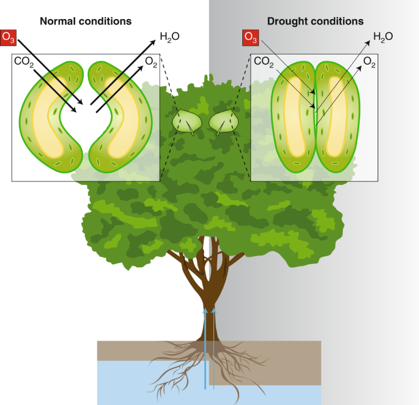 -->

<!-- ## The adjacent possible for other species -->
<!-- 
 -->
<!--   -->
<!--   -->

<!-- 
 -->

<!-- **If environmental conditions are changing…** -->
<!--   -->
<!-- **what are the adjacent possible options for survival?** -->

<!--   -->
<!--   -->
<!--   -->

<!-- - **What determines the adjacent possible?** -->
<!--     + Organisms traits -->
<!--         + developmental, physical, behavioral -->
<!--     + Environmental features -->
<!--     + Dynamics of change -->

<!-- 
 -->

<!-- 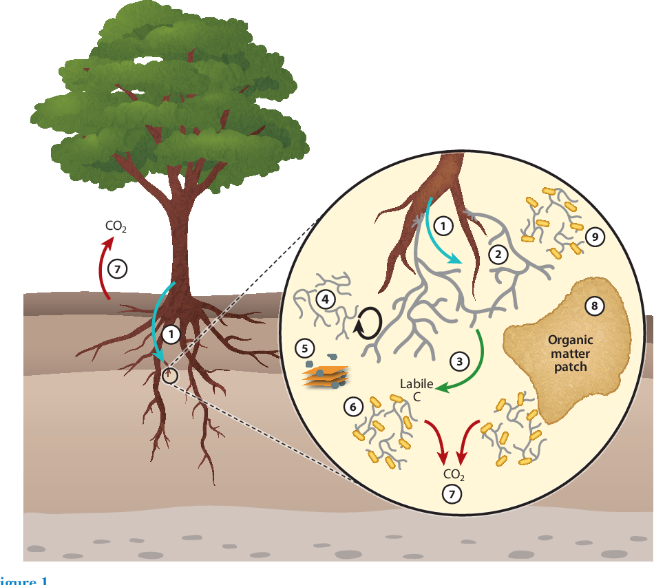 -->

<!-- ## The adjacent possible for other species -->
<!-- 
 -->
<!--   -->
<!--   -->

<!-- 
 -->

<!-- **If environmental conditions are changing…** -->
<!--   -->
<!-- **what are the adjacent possible options for survival?** -->

<!--   -->
<!--   -->
<!--   -->

<!-- - **What determines the adjacent possible?** -->
<!--     + Organisms traits -->
<!--         + developmental, physical, behavioral -->
<!--     + Environmental features -->
<!--     + Dynamics of change -->

<!-- 
 -->

<!-- 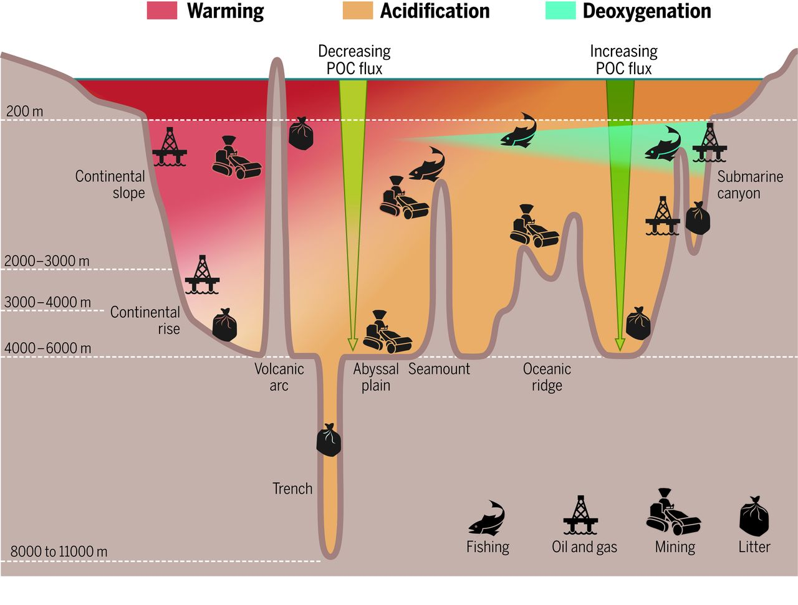 -->

## Organismal response to global change

 
 
 

- **Responses can occur at nested levels:**
    + individuals

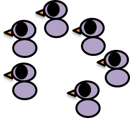

## Organismal response to global change

 
 
 

- **Responses can occur at nested levels:**
    + individuals
    + populations
    + metapopulations
    + species
    + communities
    + ecosystems
    + biomes

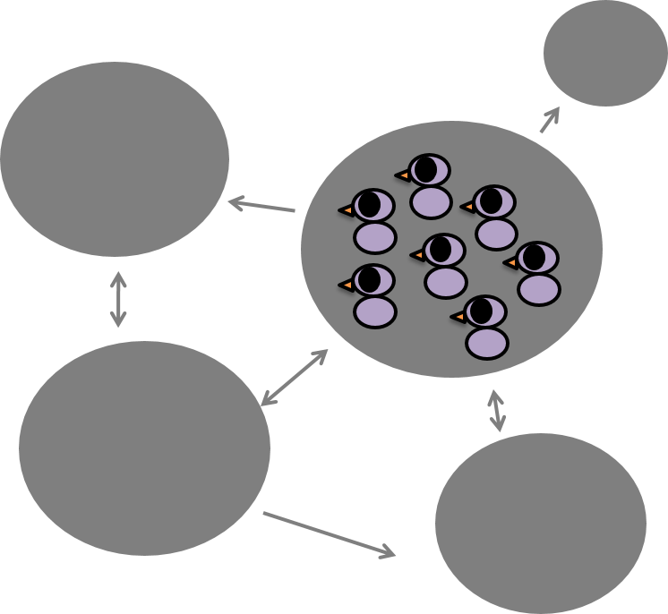

## Core Response: Move

**Move: movement of *individuals*, *populations* or *species* (range changes)**
 
**QUESTION: How would you categorize different types of movement?**
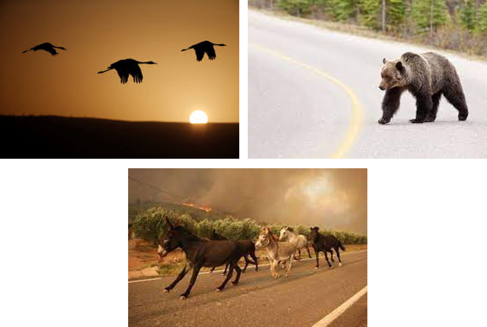

## The adjacent possible for the move response: Example

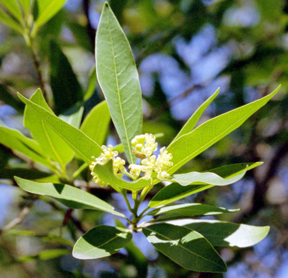

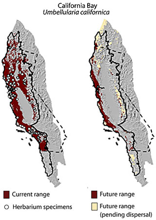

## Considerations for the move response...

 
 

**100 years from now where could a species survive and how could it get there?**

 

**Can it disperse far enough and fast enough over a fragmented landscape? **

 

**What is the role of interactions with species and the environment?**

 
 

**The move response is probably more complicated than you originally thought!**

## Move response: Immdediate

**Goal: Escape acute, short-lived stressors (e.g., heatwaves, fires, invasive predators)**

 

- **Microhabitat Shifts: Movement to a nearby, more tolerable area (e.g., shade, deeper water)**
    + Example: escaping a wildfire or flood 

 

- **Behavioral Avoidance: Short-term relocation based on sensory cues**
    + Example: Fish swimming away from a pollution plume

 

- **Diurnal/Nocturnal Shifts: Changing activity times to avoid unfavorable conditions**
    + Example: Insects shifting foraging times during heat waves
    

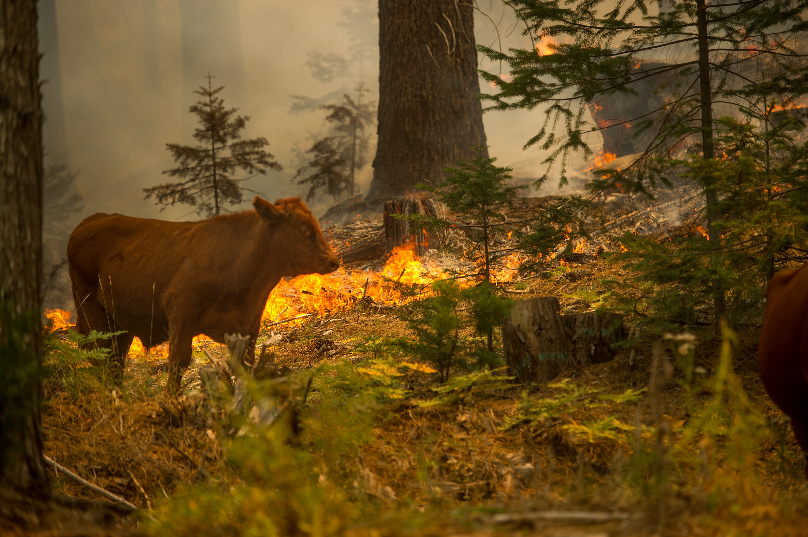

## Move response: Short-term (days-seasons)

**Goal: Track temporary favorable conditions or complete life cycle needs.**

 

- **Seasonal Migration: Regular, predictable movements to exploit seasonal resources**
    + Example: Monarch butterfly migration tied to seasonal temperature cues

 

- **Nomadic Movement: Less predictable, resource-driven relocations**
    + Example: Desert animals tracking rainfall and food pulses

 

- **Dispersal of Juveniles/Subadults: Movement away from natal sites**
    + Example: Young wolves leaving a pack to find a new territory

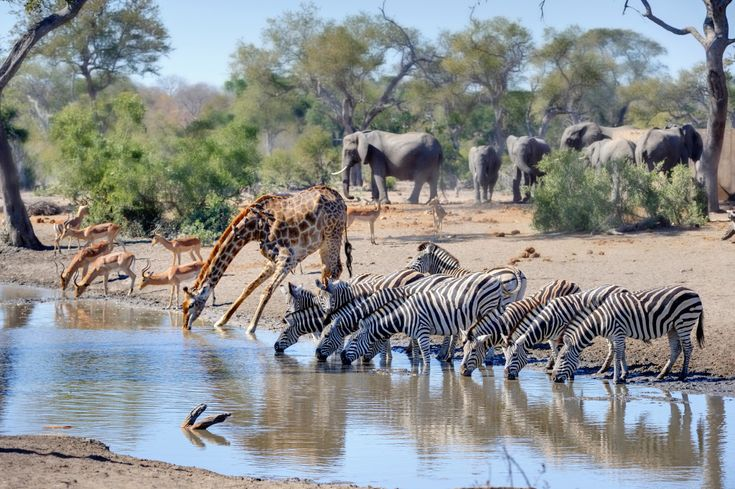

## Move response: Long-term (generations to centuries)

**Goal: Track shifting climate envelopes or suitable habitat due to persistent global change**

 

- **Latitudinal Shifts: Moving poleward in response to warming**
    + Example: tree species expanding ranges northward

 

- **Altitudinal Shifts: Moving upslope to maintain temperature niches**
    + Example: Alpine species shifting to higher elevations

 

- **Range Shifts: Species may lose parts of their range or colonize new areas**

 

- **Assisted Migration: Humans relocate species to more suitable habitats**

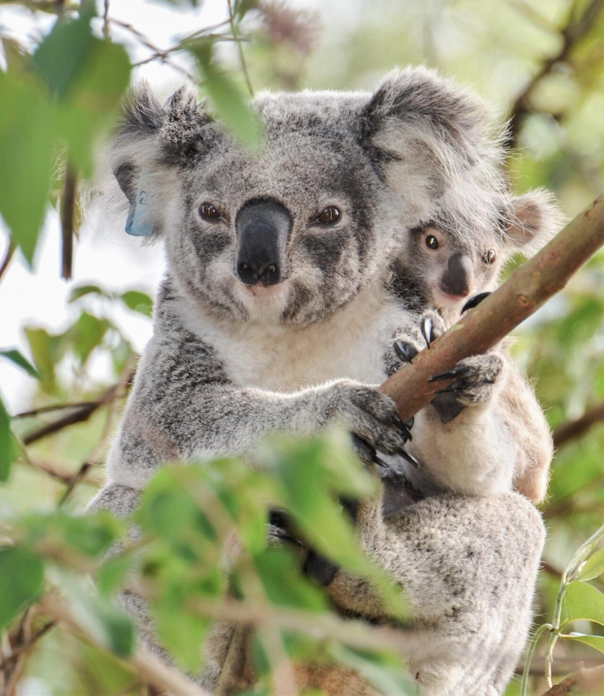

## To move or not to move.....

 

- **Dispersal Ability: Not all species can move equally well (plants vs. birds)**

 

- **Habitat Connectivity: Fragmented landscapes limit movement**

 

- **Barriers: Urban areas, oceans, or mountain ranges may block movement**

 

- **Biotic Interactions: New locations may lack mutualists or include novel predators/competitors**

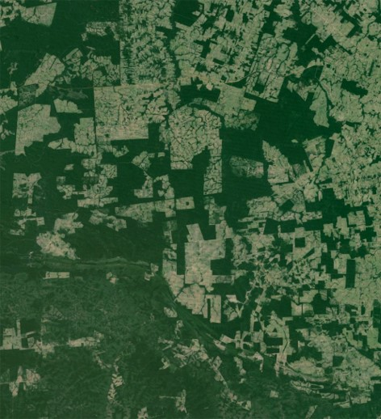

