## Quick Recap - What is Phenotypic Plasticity?

 

- **Definition: One genotype can produce multiple phenotypes depending on the environment**

 

**Example (Plant): Trees develops thicker leaves in full sun vs. shade**

 

**Example (Animal): Birds adjust migration timing based on temperature**

 

- **ADJUST response - responses withouth changing the genetic code**
    + existing genes contain the capacity to be expressed differently

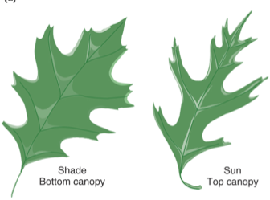

## Techincal details: How does phenotypic plasticity happen?

 

* **Instantaneous / instinctual responses**
    + behavior or physiology
    
 

* **Gene expression responses**
    + *process by which the information encoded in a gene is turned into a function*
    + gene activation/repression

 

* **Epigenetic responses**
    + *structural changes to DNA that change how your body reads a DNA sequence*
    + can occur from environmental cues
    + alters steps of gene expression

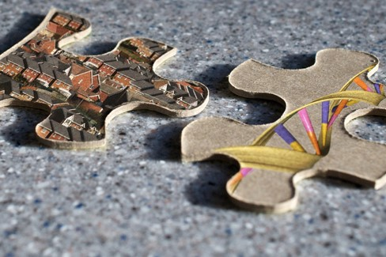

## Why Plasticity Matters for Global Change

- **Speed matters—waiting for genetic adaption may occur to slowly**

 

- **Plasticity helps organisms survive in unstable or fast-changing environments**

 

- **In Appalachia, temperature and precipitation already vary with elevation—plasticity helps species cope with this gradient**
    + species with broader ranges could have more flexibility to 'adjust'
    
 

- **Species that lack plasticity may face other 'adjacent possibles' under new conditions**
    + local extinction or range shifts

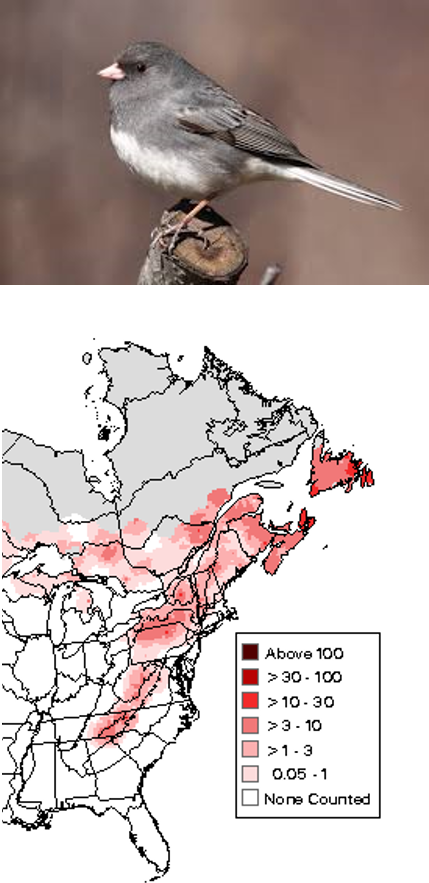
    
## Case Study: Plasticity (or not) in bird breeding behavior

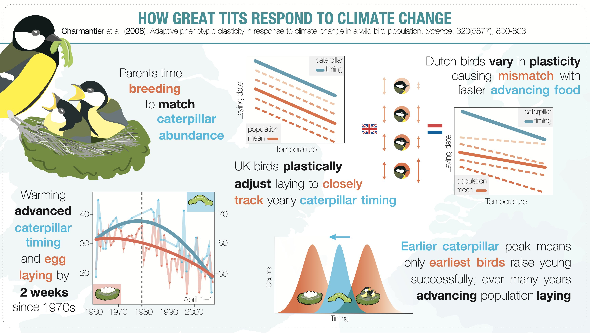

## Techincal details: How does phenotypic plasticity happen?

 

- **Genes contain the information to produce proteins**
    + proteins do just about everything in the body (build tissues, drive metabolism, support immunity, transport molecules, serve as messengers, etc., etc., etc., etc., )

 

- **Environment may alter the expression of those genes (on, off, more, less) altering the production of proteins that have some key function**
    + shifts in environmental cues (eg. temperature) detected by bodies/cells as a signal

 

- **Great tit (case study): production of specific proteins regulate the brain function and behavior that are specific to breeding**
    + more plasticity (↑ capacity to adjust) in UK populations compared to Dutch populations
 
 

 
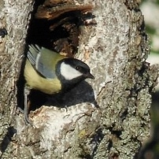

## Environmental sensing by organisms

 

**Monarch butterflies detect day length, temperature, sun angle and magnetic fields for migration**

 

**Amphibians like salamanders sense soil temperature and moisture for breeding.**

 

**Trees like red Oak respond to day length cues for bud break (flowering), leaf production, or removing nutrients from leaves before they fall off**

 

**Day length and temperature drive development and emergence of insects**

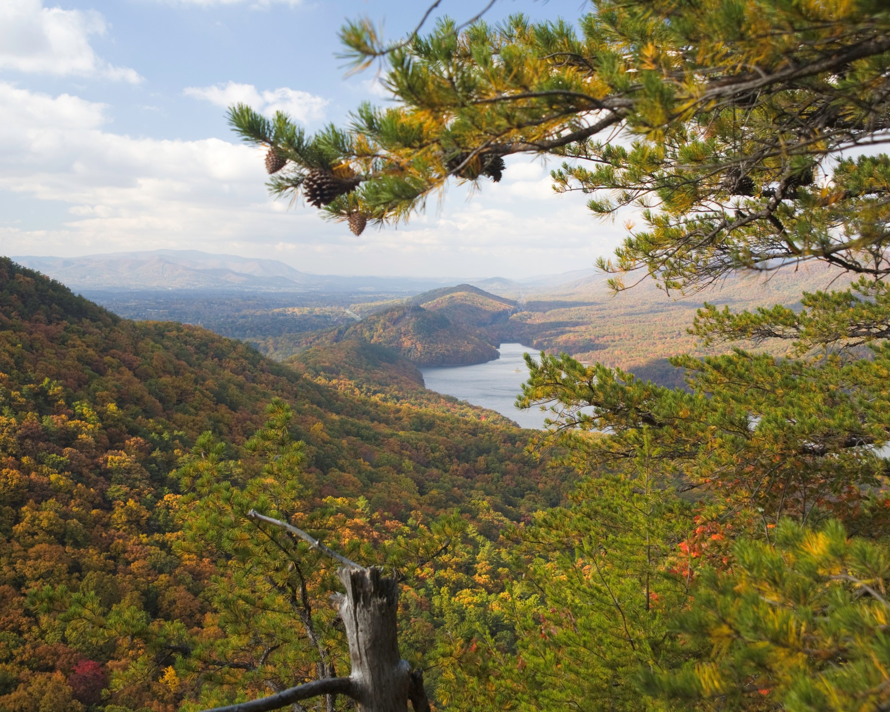

## Phenotypic plasticity: Instantaneous / instinctual response

 

- **Some responses occur within minutes to hours of an environmental cues**

 

- **Wood thrush adjust singing behavior during sudden weather shifts**

 

- **Eastern chipmunks retreat to burrows or shaded logs during sudden high-temperature events—a behavioral response to heat waves, which are more frequent due to climate change**

 

- **Appalachian fireflies reduce or cease courtship flashes in response to artificial light at night**

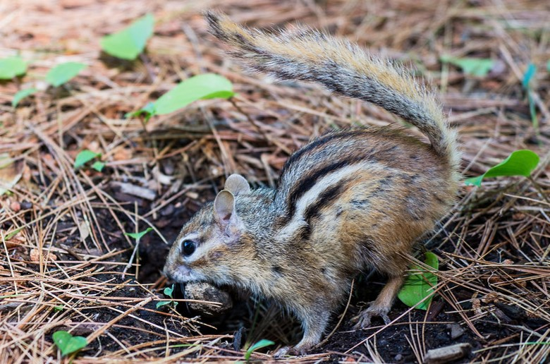

## Phenotypic plasticity in development

**Temperature-induced advancement in development is common and relates to a broader pattern…**

 

**Phenological changes: changes in periodic biological phenomena (like flowering, breeding, migration)**

 

**What is happening? Organisms are ADJUSTING their phenology to match the temperature cues they are adapted for**

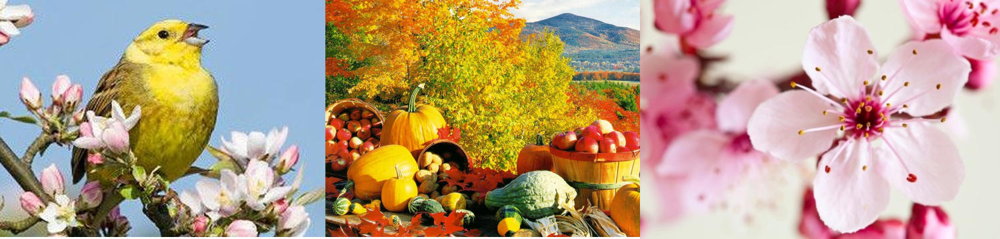

## Phenotypic plasticity in development

 

**2003 meta-analyses found a broad developmental advancement of ~2.3 days per decade**
 

**Remarkably consistent across groups (and that was >20 years ago!!!)**

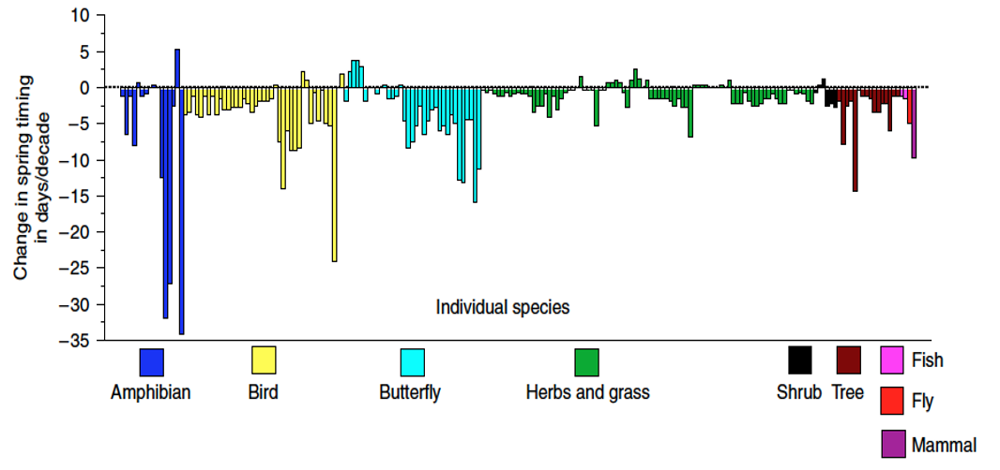

## Phenotypic plasticity in development: Examples from insects

 

**As ecotherms, temperature matters a lot for insect survival, development, dispersal, etc.**

 

* **Major effect of global warming on insects is to speed up developmental rates**
    + can lead to more generations per year

 
 

**Increase of temperatures by 2°C is predicted to allow some aphid species to produce an additional 4–5 generations per year.**

 

**Aphids are among the most destructive insect pests on cultivated plants**

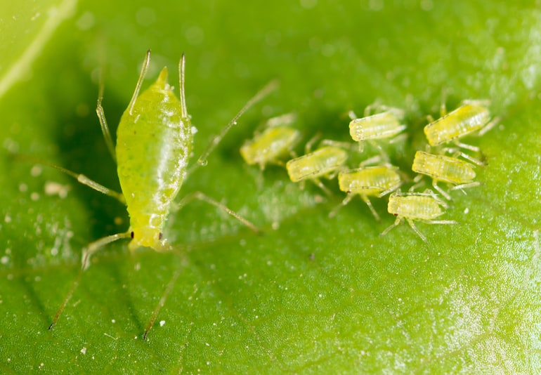

## Phenotypic plasticity: Timing (phenology)

 

- **With global warming we expect many temperature dependent processes to occur earlier in the year**
    + Even a few days matters!!

 

**Many species life cycles are synced to each other (insect emergence + flowering)**
 

**Phenological mismatch: When interacting species are no longer temporally or spatially aligned**

 

* **Biodiversity loss is linked with Phenological mismatches**
    + mismatches impact many species in food webs

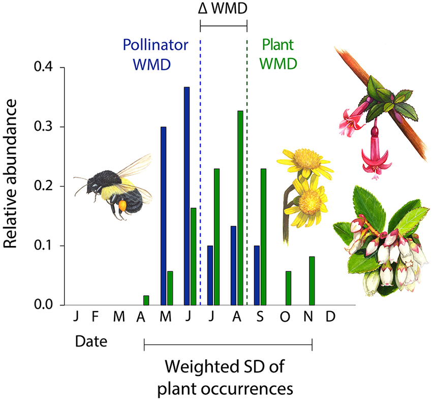

## Phenotypic plasticity: Timing (phenology)

 

- **Appalachian species are shifting their phenology due to warming springs**
    + understory plant species with shorter life cycles are more affected

 

- **Example: *Claytonia virginica* (understory plant) blooms 1-2 weeks earlier now than 40 years ago**
    + *Claytonia virginica* has a specific pollinator: the Spring Beauty Bee

 

- **Both species are shifting their phenology in response to warmer springs, but not necessarily in perfect synchrony**
    + plant flowering seems to be more plastic to warmer temperatures than bee activity

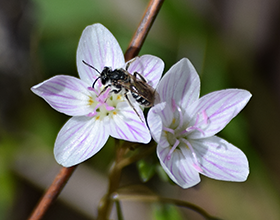

## Phenotypic plasticity: Gene expression responses

**Larval bees have identical DNA sequences. Changes in gene expression, from a protein in royal jelly, alter the development of the larva into a new queen**

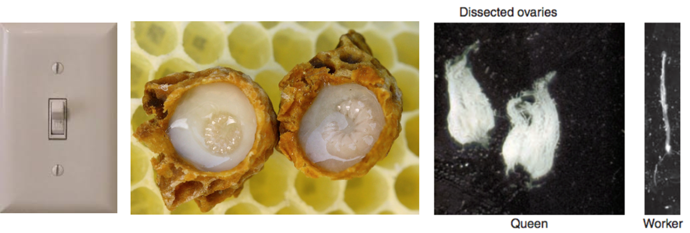

## Gene expression and leaf traits in Appalachian trees

 

- **In plants, environmental cues regulate the expression of genes that influence leaf traits**
    + thickness, size, and density of stomata

 

**Gene expression responds to light, temperature, and soil moisture cues**

 

**Alters protein production, influencing development of tougher leaves or fewer stomata in dry or high-altitude conditions**

 

**Plasticity in gene expression helps trees balance water conservation with carbon gain**

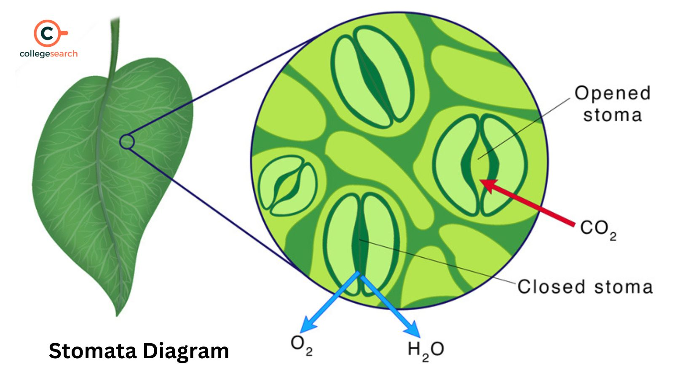

## Climate change and leaf traits in Appalachian trees

 

- **Warming trends + droughts in Appalachian regions have altered seasonal water availability**
    + plasticity in gene-regulated leaf traits help hardwoods adjust to water stress
    
 

**In Sugar Maples, gene expression linked to ABA synthesis (hormone=protein) increases under drought, leading to smaller, thicker leaves and stomata that stay open less**

 

**In Red Oaks wax production genes upregulate during drought, thickening the water proof outer leaf layer, reducing water loss**

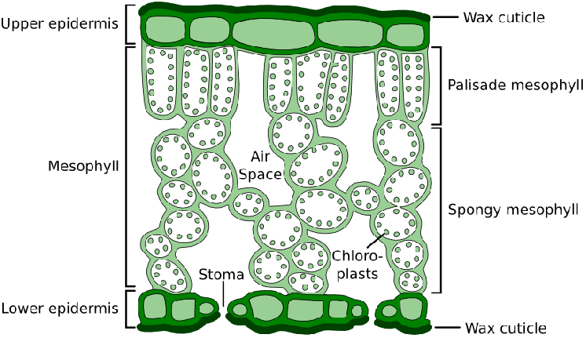

## Phenotypic plasticity: Epigenetic response

**Many 'ADJUST' responses to global change are going to be negative**

 

**Vinclozolin is a fungicide used by farmers to stop rot, mold and blight**

 

**Vinclozolin linked to great granddaughter's stress via epigenetic changes in mice**

 
 

**DDT, the first modern pesticide, has been banned in USA since 1972**

 

**When pregnant female mice were fed DDT, their female offspring were more obese**

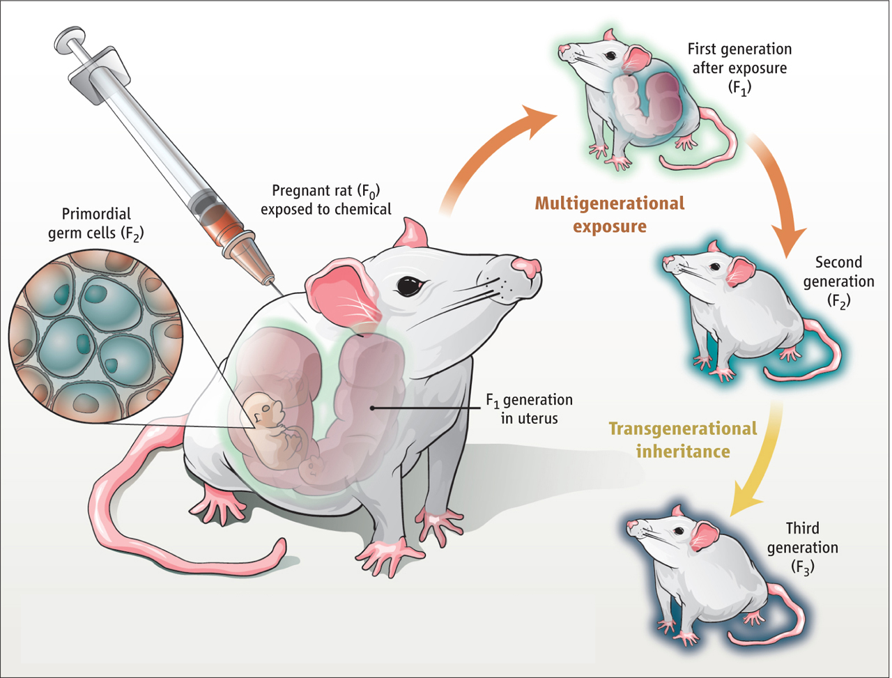

## Phenotypic plasticity: Epigenetic response

- **Agrochemicals, commonly used in Appalachian Christmas tree farms, orchards, and row crops, can act as environmental stressors—not just toxins**

 

- **In frogs, bees, and small mammals pesticides can alter DNA without changing the genetic code—hallmarks of epigenetic regulation**

 

- **Could exposure in amphibians like the Eastern newt or pollinators like bumble bees trigger similar epigenetic changes affecting**
    + Development?
    + Immunity?
    + Reproductive timing or behavior?

 

**Raises concern about invisible effects of modern agriculture on Appalachian biodiversity.**

## Limits to the ADJUST adjacent possible

- **Plasticity is not always going to work; sometimes it's too slow, too small, or mismatched**
    + **Example: Salamanders that delay breeding too long in drought years may miss their only window**

 

- **Energetic costs of being flexible may outweigh benefits**

 

- **Genetic variation limits how much change is possible**
    + no organism is infinitely plastic

 

- **Rapid or extreme change disrupts predictable environmental cues, inhibiting any ADJUST response**

 

- **If plasticity is too strong, does it restrict the ability of a population to adapt to long-term environmental changes????**

## The adjust response

**Adjust: non-genetic shifts in organismal traits in different environments (phenotypic plasticity)**

 

**The adjust response happens at the level of the individual and happens within a single generation (MOSTLY)**

 

**The adapt response (next week) happens at the level of the population and happens across generations**

 

* **Can plasticity and adaption be connected?**
    + can plasticity buy time: YES
    + can plasticity promote adaptive genetic change:?
        + phenotype produced with enhanced survival...
        + loss of plasticity after environmental change...
        + **selection of more or less plasticity would be adaptation**

