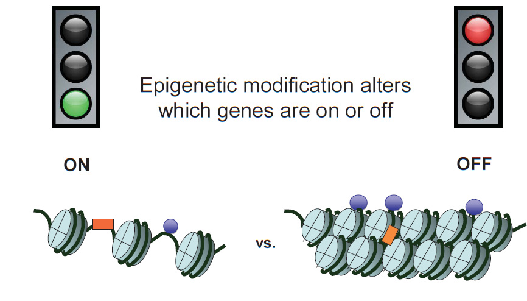
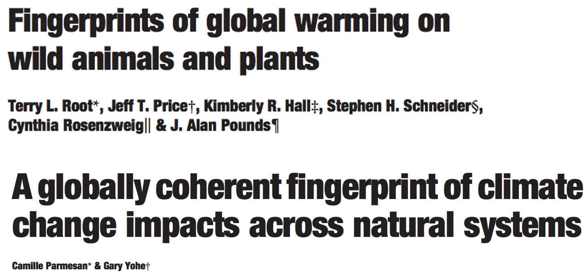
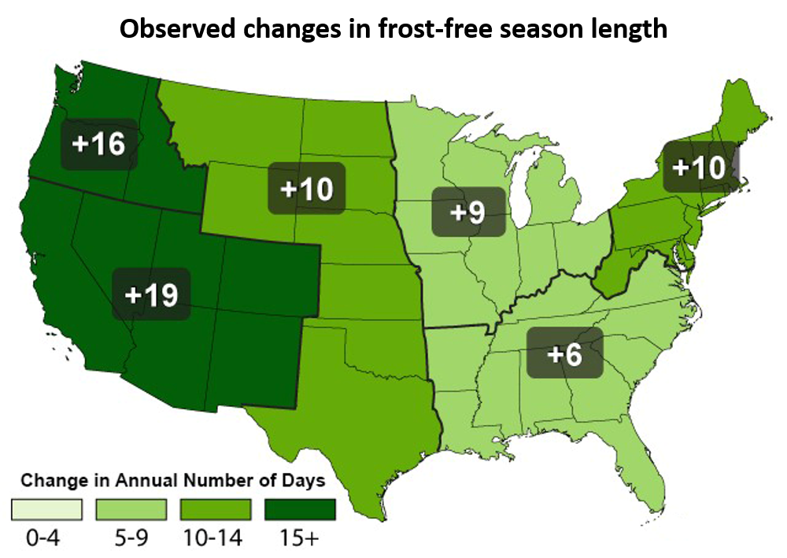
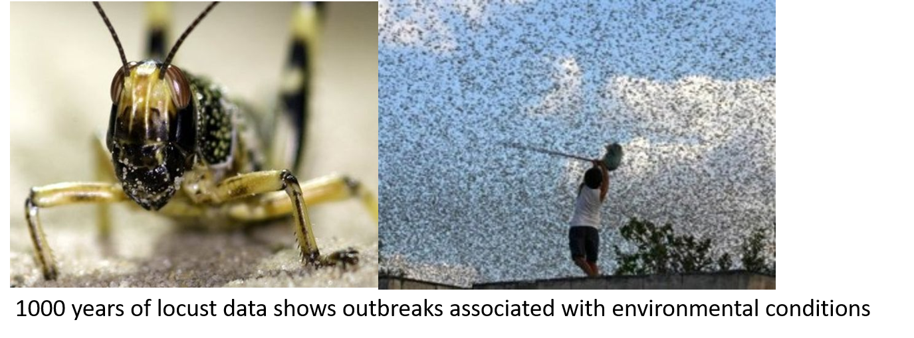
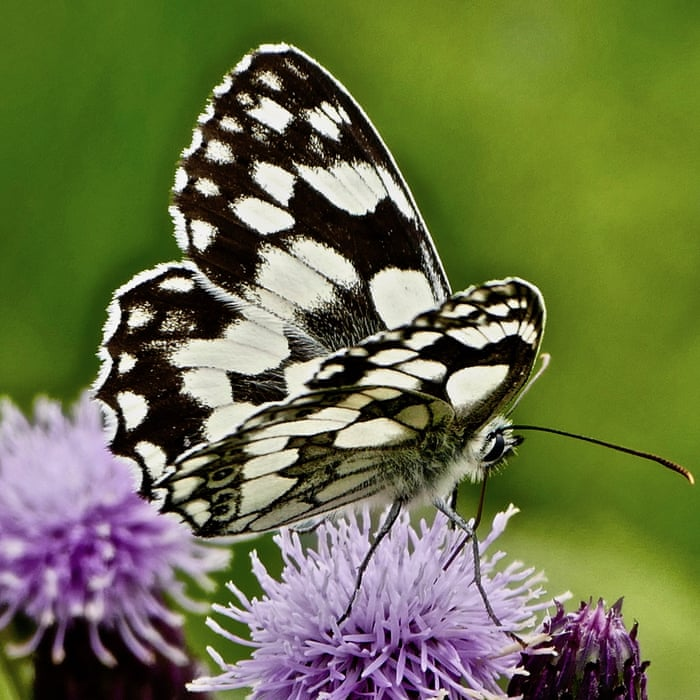
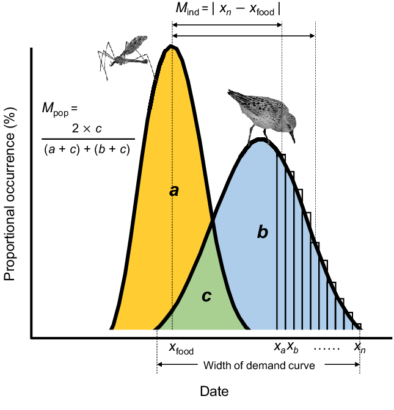
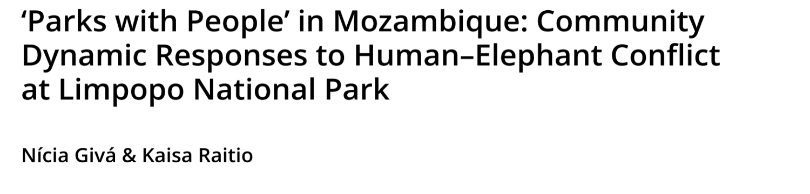
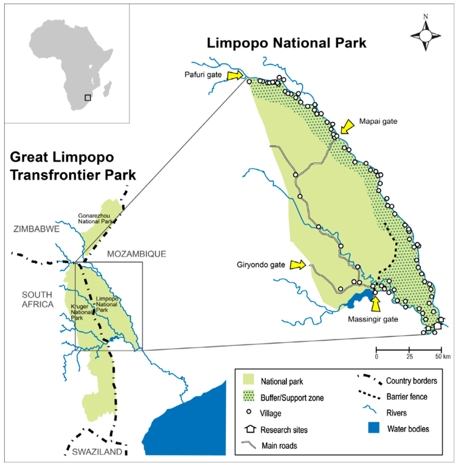
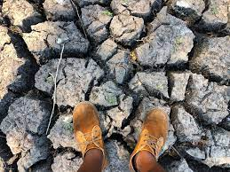
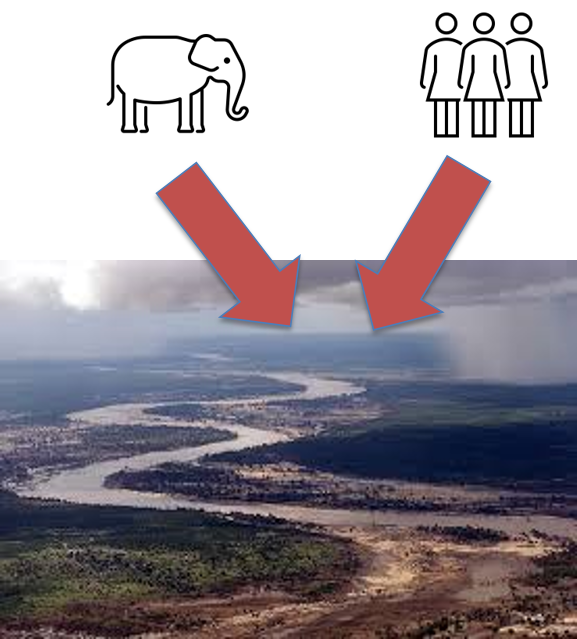

## Quick Recap - What is Phenotypic Plasticity?

 

- **Definition: One genotype can produce multiple phenotypes depending on the environment**

 

**Example (Plant): Trees develops thicker leaves in full sun vs. shade**

 

**Example (Animal): Birds adjust migration timing based on temperature**

 

- **It’s not evolution per se—the genetic code stays the same**
    + existing genes contain the capacity to be expressed differently

## Techincal details: How does phenotypic plasticity happen?

* **Instantaneous / instinctual responses**
    + behavior or physiology
    
 

* **Gene expression responses**
    + *process by which the information encoded in a gene is turned into a function*
    + gene activation/repression

 

* **Epigenetic responses**
    + *structural changes to DNA that change how your body reads a DNA sequence*
    + can occur from environmental cues
    + alters steps of gene expression

## Why Plasticity Matters for Global Change

- **Speed matters—waiting for genetic adaption may occur to slowly**

 

- **Plasticity helps organisms survive in unstable or fast-changing environments**

 

- **In Appalachia, temperature and precipitation already vary with elevation—plasticity helps species cope with this gradient**
    + species with broader ranges could have more flexibility to 'adjust'
    
 

- **Species that lack plasticity may face other 'adjacent possibles'**
    + local extinction or range shifts

    
## Case Study: Plasticity (or not) in bird breeding behavior

## Techincal details: How does phenotypic plasticity happen?

 

- **Genes contain the information to produce proteins**
    + proteins do just about everything in the body (build tissues, drive metabolism, support immunity, transport molecules, serve as messengers, etc., etc., etc., etc., )

 

- **Environment may alter the expression of those genes (on, off, more, less) altering the production of proteins that have some key function**
    + shifts in environmental cues (eg. temperature) detected by bodies/cells as a signal

 

- **Great tit (case study): production of specific proteins regulate the brain function and behavior that are specific to breeding**
    + more plasticity (↑ capacity to adjust) in UK populations compared to Dutch populations
 
 

 

## Environmental sensing by organisms

 

**Monarch butterflies detect day length, temperature, sun angle and magnetic fields for migration**

 

**Amphibians like salamanders sense soil temperature and moisture for breeding.**

 

**Trees like red Oak respond to day length cues for bud break (flowering), leaf production, or removing nutrients from leaves before they fall off**

 

**Day length and temperature drive development and emergence of insects**

## Phenotypic plasticity: Instantaneous / instinctual response

 

- **Some responses occur within minutes to hours of an environmental cues**

 

- **Wood thrush adjust singing behavior during sudden weather shifts**

 

- **Eastern chipmunks retreat to burrows or shaded logs during sudden high-temperature events—a behavioral response to heat waves, which are more frequent due to climate change**

 

- **Appalachian fireflies reduce or cease courtship flashes in response to artificial light at night**

## Phenotypic plasticity: Timing (phenology)

 
 
 
 

**Phenology is the study of seasonal life cycle events (blooming, migration, emergence)**

 

**Many species life cycles are synced to each other (insect emergence + flowering)**

 

**Climate change can cause phenological mismatches of organisms do not ADJUST in the same way**

## Phenotypic plasticity: Timing (phenology)

 

- **Appalachian species are shifting their phenology due to warming springs**
    + understory plant species with shorter life cycles are more affected

 

- **Example: *Claytonia virginica* (understory plant) blooms 1-2 weeks earlier now than 40 years ago**
    + *Claytonia virginica* has a specific pollinator: the Spring Beauty Bee

 

- **Both species are shifting their phenology in response to warmer springs, but not necessarily in perfect synchrony**
    + plant flowering seems to be more plastic to warmer temperatures than bee activity

## Phenotypic plasticity: Gene expression responses

**Larval bees have identical DNA sequences. Changes in gene expression, likely from an enzyme (a protein in royal jelly, alter the development of the larva.**

## Gene expression and leaf traits in Appalachian trees

In trees environmental cues regulate the expression of genes that influence leaf thickness, size, and density of stomatal

 

Gene expression is triggered by signals such as light, temperature, and soil moisture.

 

These changes alter protein production, influencing development of tougher leaves or fewer stomata in dry or high-altitude conditions.

 

Plastic gene expression helps trees balance water conservation with carbon gain.

## Climate change and leaf traits in Appalachian trees

Warming trends and droughts in Appalachian regions have altered seasonal moisture availability.

 

In sugar maples, gene expression linked to ABA synthesis (hormone=protein) increases under drought, leading to smaller, thicker leaves and conservative stomata (stay open less)

 

Red Oaks upregulate wax production genes during drought, thickening the water proof outher leaf layer, which reduces water loss

 

In both cases, plasticity in gene-regulated leaf traits help hardwoods adjust to water stress 

## Phenotypic plasticity: Epigenetic response

 

**Vinclozolin is a fungicide used by farmers to stop rot, mold and blight**

 

**Vinclozolin linked to great granddaughter's stress via DNA methylation (inherited)**

 
 

**DDT, the first modern pesticide, has been banned in USA since 1972**

 

**Pregnant female mice fed DDT and their female offspring had a lower tolerance for cold temperature and were more obese**

## Changes to gene expression underlie plasticity

**Traditionally, it was thought that changes to the sequence of DNA were heritable while changes to the expression patterns of DNA were not**

 

**That made it easy to define adaptation as “heritable genetic change” and plasticity as “non-genetic”**
 

**Epigenetics blurs those lines**

## The adjust response

**Adjust: non-genetic shifts in organismal traits in different environments (phenotypic plasticity)**

 

**The adjust response happens at the level of the individual and happens within a single generation (MOSTLY)**

 

**The adapt response (Chapter 7) happens at the level of the population and happens across generations**

 

* **Can plasticity and adaption be connected?**
    + can plasticity buy time: YES
    + can plasticity promote adaptive genetic change:?
        + phenotype produced with enhanced survival...
        + loss of plasticity after environmental change...
        + **selection of more or less plasticity would be adaptation**

<!-- ## Meet the Data: Shifts with global warming -->
<!-- 
 -->

<!--  -->

## Meet the Data: Shifts with global warming

 

**What shifts (in space and time) do we see most commonly for organisms with global warming?**

 
 

* **Geographic shifts toward the poles**

 

* **Geographic shifts up in elevation**

 

* **Geographic shifts deeper in oceans**

 

* **Seasonal shifts earlier in the year**
    + earlier springs AND longer falls

## Phenotypic plasticity in development: Examples from insects

**As ecotherms, temperature matters a lot for insect survival, development, dispersal, etc.**

 
**Insect life histories are tied to environmental factors **

## Phenotypic plasticity in development: Examples from insects

 

* **Major effect of global warming on insects is to speed up developmental rates**
    + can lead to faster maturity

 
 

**In the UK >70% of butterfly species studies have earlier “first flight”**

 

**First flight is predicted to occur 2-10 days earlier for every 1°C**

## Phenotypic plasticity in development: Examples from insects

 

* **Major effect of global warming on insects is to speed up developmental rates**
    + can lead to more generations per year

 
 

**Increase of temperatures by 2°C is predicted to allow some aphid species to produce an additional 4–5 generations per year.**

 

**Aphids are among the most destructive insect pests on cultivated plants**

## Phenotypic plasticity in development

 

**Temperature-induced advancement in development is common and relates to a broader pattern…**

 

**Phenological changes: changes in periodic biological phenomena (like flowering, breeding, migration)**

## Phenotypic plasticity in development

 

**2003 meta-analyses found an advancement of an average of 2.3 days per decade**
 

**Remarkably consistent across groups (and that was 20 years ago!!!)**

## Phenotypic plasticity in development

 

* **With global warming we expect many temperature dependent processes to occur earlier in the year**
    + Even a few days matters

 

**Phenological mismatch: When interacting species are no longer temporally or spatially aligned (Chapter 9)**

 

* **Biodiversity loss is linked with Phenological mismatches**
    + no organism is infinitely plastic
    + mismatches impact many species in food webs

## Friday Discussion: Can Humans *Adjust* to Global Change?

 

* **How do humans adjust (short-term changes) to environmental change**

 

* **What evidence exists? Past, present and/or future**
    + can we acclimate to .....
    + what traits are plastic (or not)?
    + human behavioral shifts...
    + are specific genes involved (for bio people)?
    + do any phenological mismatches exists with other species?

 

* **Be prepared to discuss what you found as well as your opinion on if it is possible**

 

* **Submit an article/finding on Brightspace for participation**

<!-- ## Case Study: Limpopo National Park -->
<!-- 
 -->
<!--   -->
<!--   -->
<!--   -->
<!--   -->
<!--   -->
<!--   -->
<!--   -->
<!--   -->
<!--   -->

<!-- 
 -->

<!-- **Village communities used the region before the establishment of Limpopo National Park ** -->

<!--   -->

<!-- **After the park’s establishment, village communities live within the park buffer zone** -->

<!--   -->

<!-- **The buffer zone is an important area for wildlife ** -->
<!-- 
 -->

<!--  -->

<!--  -->

<!-- ## People, Parks, and Climate Change -->
<!-- 
 -->
<!--   -->

<!-- **Strategies Dealing with Drought before the National Park** -->

<!--   -->
<!--   -->

<!-- * **Small plots in multiple areas** -->
<!--   -->
<!-- * **Sharing plots** -->
<!--   -->
<!-- * **Seeding at every rainfall** -->
<!--   -->
<!-- * **Temporary migration** -->
<!--   -->
<!-- * **Crop mixing** -->

<!--  -->

<!-- ## People, Parks, and Climate Change -->
<!-- 
 -->
<!--   -->

<!-- **Strategies Dealing with Drought before the National Park** -->

<!--   -->
<!--   -->

<!-- 
 -->

<!-- **WILDLIFE: As drought intensifies, elephants compensate by increasing usage of areas nearest the river, including crop fields** -->

<!--   -->

<!-- **HUMAN: Village communities respond by using fencing and altering cropping practices ** -->

<!-- 
 -->

<!--  -->

<!-- ## People, Parks, and Climate Change -->
<!-- 
 -->

<!--  -->

