## Are organisms 'shape-shifting' to climate change?

- **Animals are altering their morphology—especially body size and extremity proportions—as a response to climate change.**
  + This phenomenon is consistent with two complementary ecogeographical rules:

 

**Bergmann’s Rule: body sizes adapt differently to climate**
 
**Allen’s Rule: body part sizes adapt differently to climate**

 
 
 
 
 
 
 
 
 
 
 

**These changes may represent phenotypic plasticity, evolutionary adaptation, or both**

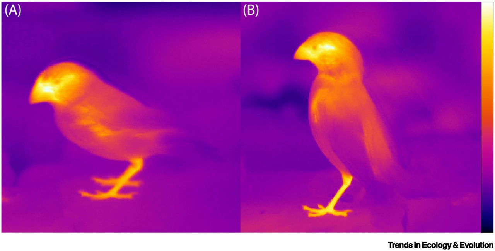

## Bergmann’s Rule and body size

- **Bergmann’s rule = individuals of a species tend to be larger in colder environments and smaller in warmer environments**

 

- **An organism's surface area-to-volume ratio (size) affects how body heat**
    + ↓ surface area helps retain body heat
        + larger animals in cold climates
    + ↑ surface area helps remove body heat
        + smaller animals in warm climates

 

- **Works for animals that regulate their body temperature (endotherm) and even for those that do not (ectotherm)**
    + Polar bears are larger than American black bears to better conserve heat in their Arctic habitat
    + Some species of turtles in colder regions are larger compared to those in warmer climates

 
 
 
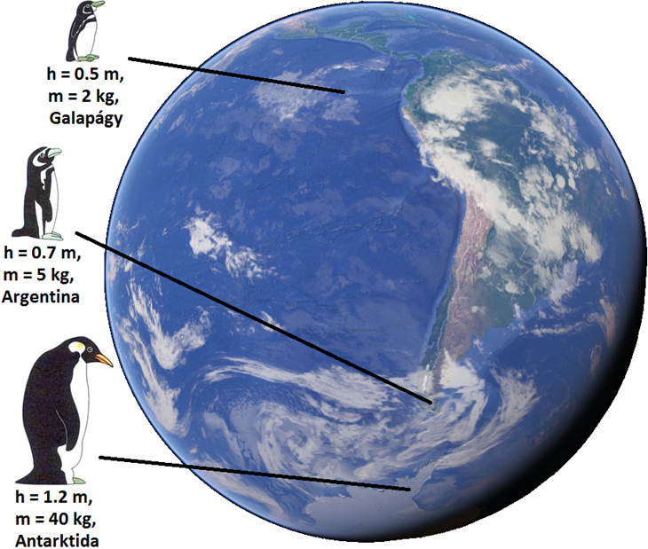

## Allens’s Rule and body size

 

- **Within endothermic animals, species in colder climates tend to have shorter extremities compared to their counterparts in warmer climates**
    
 

- **Shorter length reduces surface area, minimizing heat loss, which is important in cold environments**    
    + shorter ears, tails, and limbs are common

 

- **Arctic foxes have shorter ears and legs compared to desert foxes**

 

- **Birds in hot, tropical northern Australia have longer bills than birds in temperate, southern Australia**

 
 
 
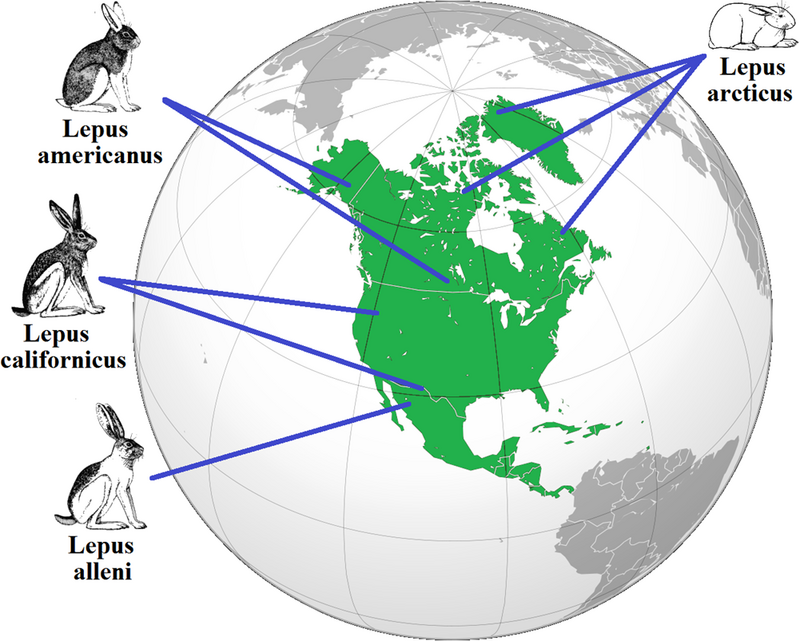

## Non-animal species shift morphology too, just differently

 

* **Some plants have shifted leaf size, shape, or thickness for water conservation**
    + shifts in leaf traits has long evolutionary history
    
 

* **Some plants have altered root distributions and branching in response to drought/flooding**

 

* **Cell size for bacteria/protists (single-celled organisms) reduced with climate warming**

 

* **These changes may represent phenotypic plasticity, evolutionary adaptation, or both**

 
 
 
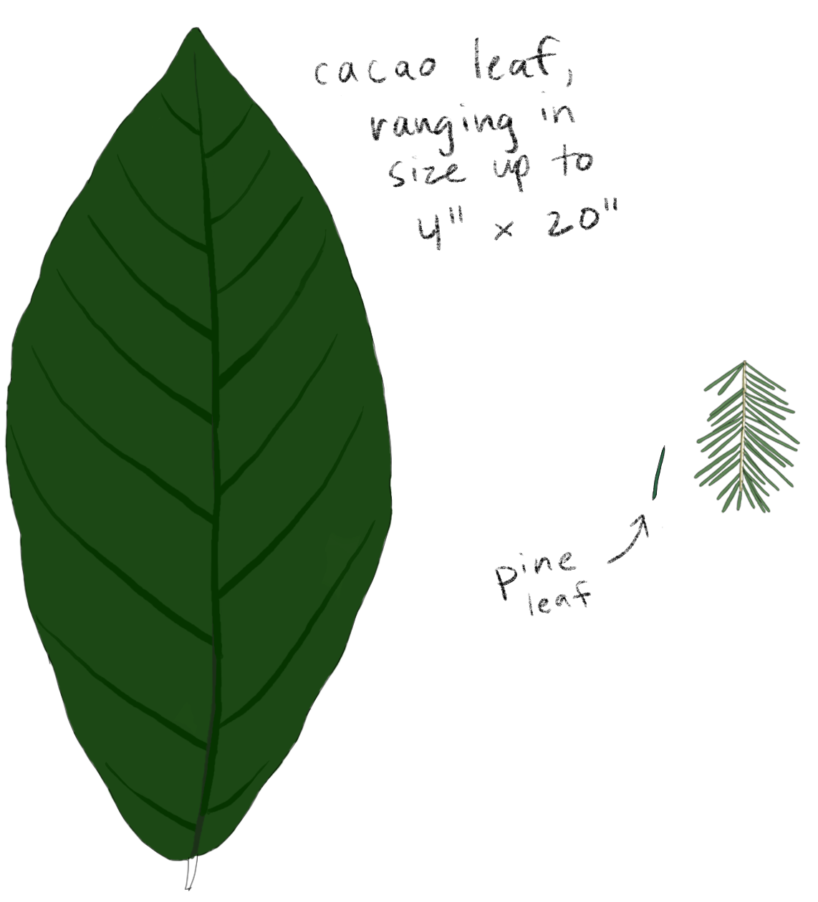

## Evolution can be fast (but not usually)

 
 

- **The rate of adaptation is influenced by a combination of biological and ecological factors:**
    + *Generation Time*: Short generations (e.g., insects, bacteria) allow more opportunities for selection
    + *Genetic Variation*: Evolution requires existing variation
    + *Mutation Rate*: High mutation rates can introduce new traits
    + *Population Size*: Larger populations have more variation
    
 

- **Another thing to consider: How powerful is the environmental selection?**

 
 
 
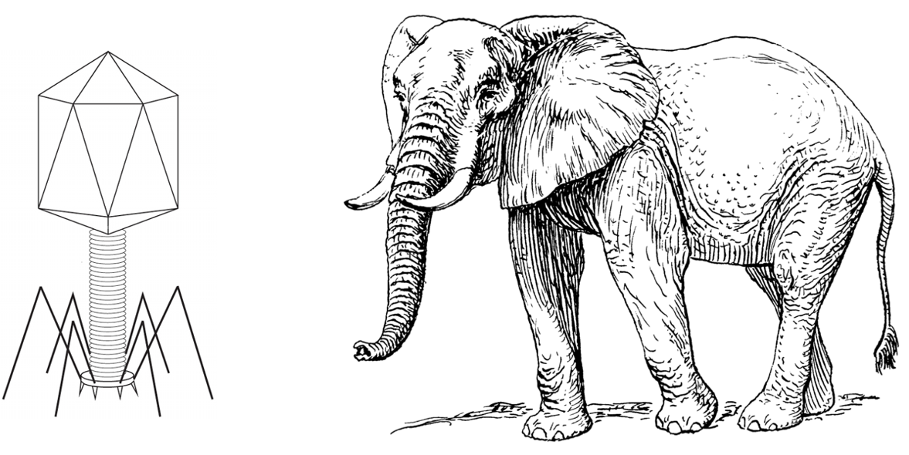

## Evolution can be fast (but not usually)

 

- **Case Study (Eastern Red-backed Salamander)**
    + Color morphs (red-backed vs. lead-backed) show variation across elevation, forest cover, and temperature gradients
    + Lead-backed morph more frequent in warmer, fragmented forests
    + Could be natural selection favoring heat-tolerant morphs as forests warm
    + shifts have occurred over the past several decades (fast)

 

- **Not all populations show the same shift**
    + suggests local adaptation or constraints

 
 

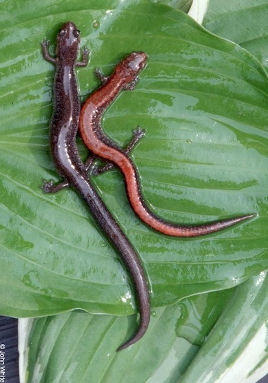

## Is rapid-evolution occurring in Elephants due to poaching?

 
 
 

- **Intense ivory poaching pressure (human-driven selection) of Savannah elephants has reduced populations**
    + poachers prefer elephants with large tusks
    
  
 
- **Some females are born without tusks, due to mutations on several genes**
    + similar genes to teeth traits in humans

 

- **Ivory poaching disproportionately removes tusked individuals from the breeding population**
    + Removing tusks without killing the animal is nearly impossible 
    
 
 
 
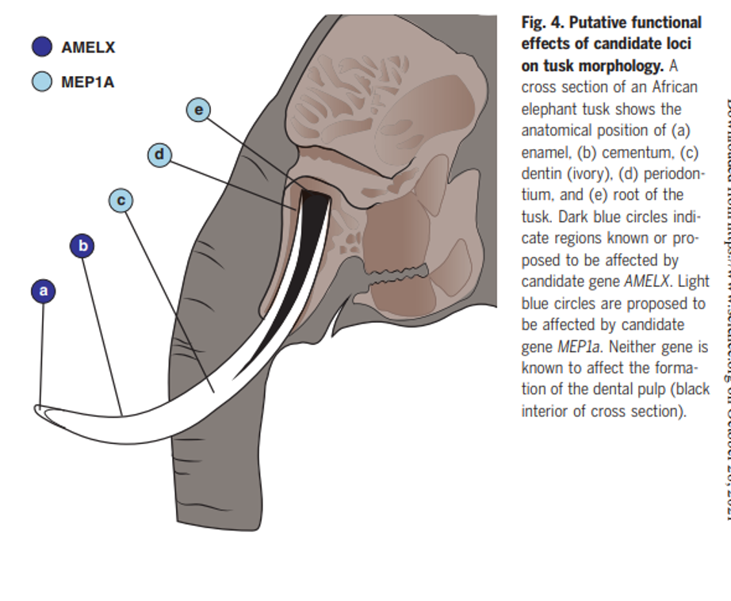

## Microevolution: Rapid selection of tuskless female elephants

 **The survival of tuskless females across this 28-year period was estimated to five times that of tusked individuals in Gorongosa National Park (Campbell-Station et al. 2021)**

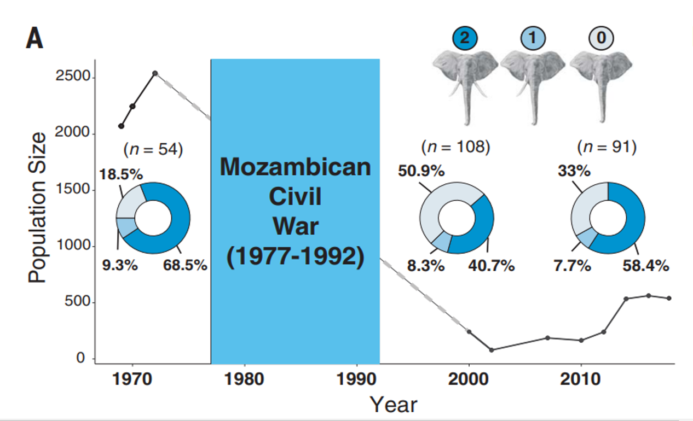

## Measuring rapid evolution in water fleas

 
 
 
 
 
 
 
 
 

**Question: Can *Daphnia* evolve to cope with global warming?**

 

**Approach 1: Experimental evolution**
 
  

**Approach 2: Resurrection ecology**

  
 
**CTmax - upper threshold of temperature that an organism can function normally**

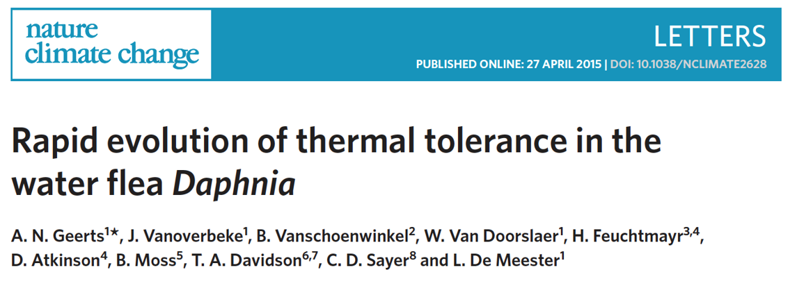

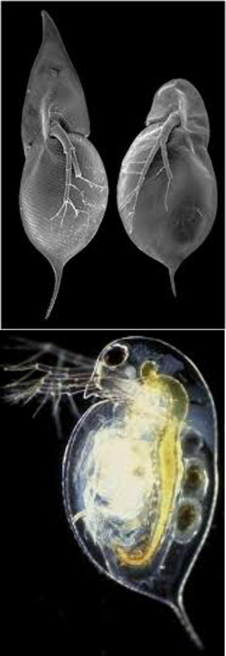

## Measuring rapid evolution in water fleas

 
 

**Approach 1: Experimental evolution - Evolved *Daphnia* under control and warmed conditions for 2 years**

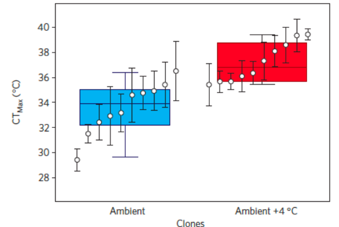

## Measuring rapid evolution in water fleas

 

**Approach 2: Resurrection ecology - Hatched *Daphnia* from historic and contemporary sediment layers**

 
 
 
 
 
 
 
 
 
 
 
 
 
 
 
 

**Conclusion: Thermal tolerance in *Daphnia* can evolve over short time scales in response to warming**

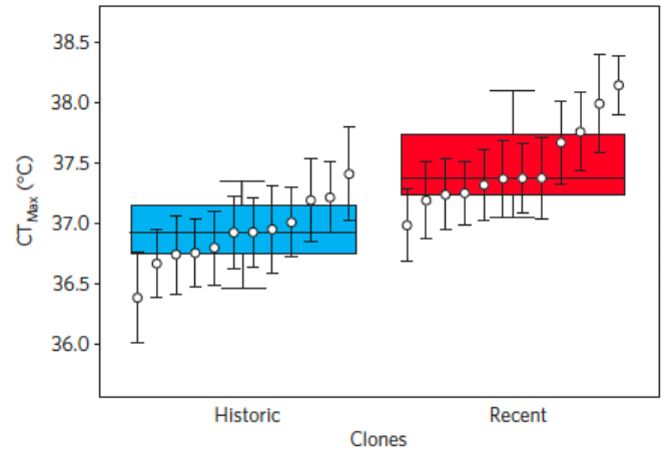

## Urban evolution in real time?

 
 

- **White-footed mouse thrive in both Appalachian forests and urban areas in the eastern US**

 

- **In urban areas, populations have evolved genetic changes to detoxify pollutants and enable metabolism of high-fat human foods**

 

- **Studies show evolutionary divergence in less than 100 generations**

 

- **Test yourself: Which adjacent possible has occurred in urban populations?**

 
 
 
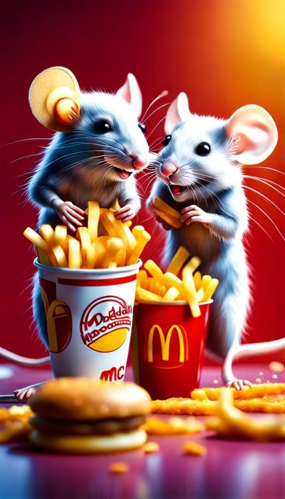

## Measure it: Urban eolution in real time?

 
 

**Is the urban mouse population genetically adapted or just exhibiting phenotypic plasticity?**

 

**Could a common garden experiment (raising forest and urban mice in the same conditions) help isolate genetic effects?**

 

**What outcomes would suggest plasticity?**
 

**What outcomes would suggest evolution by natural selection?**

 
 
 
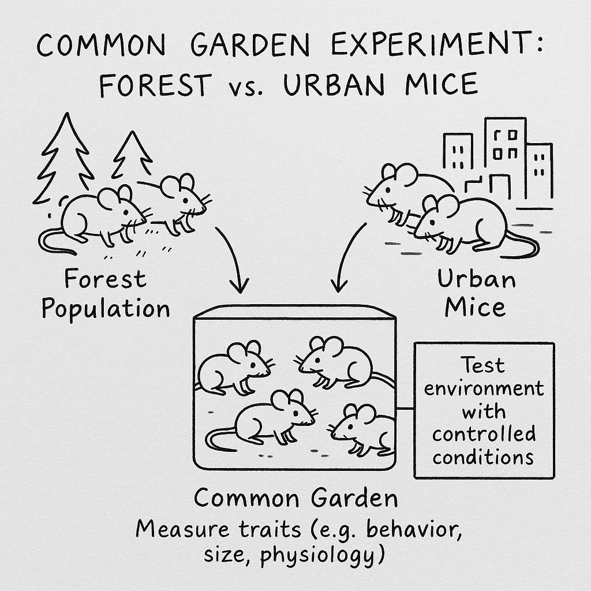

## BIG QUESTION: Can adaptation prevent extinction?

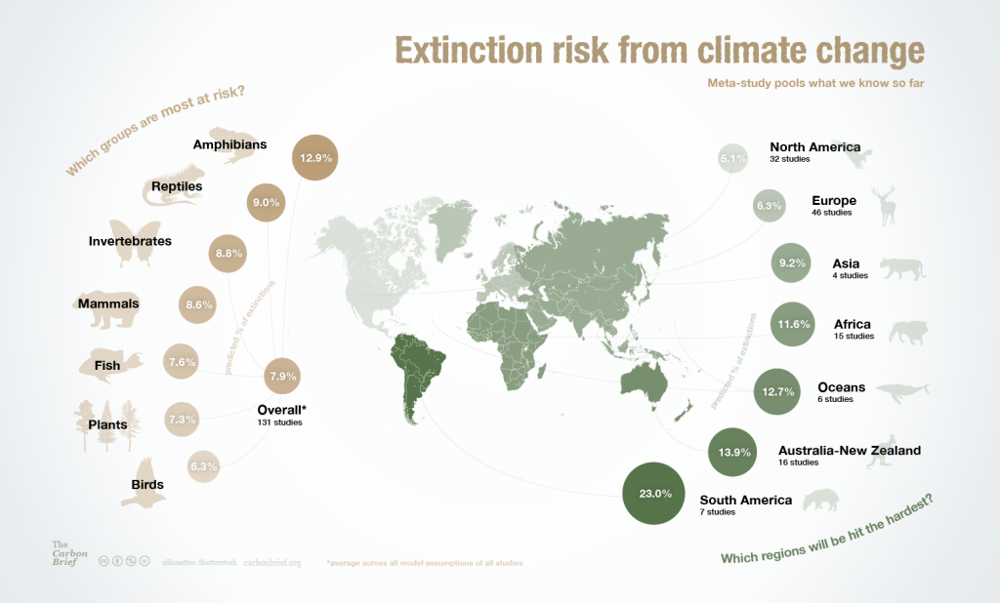

## BIG QUESTION: Can adaptation prevent extinction?

 

* **Evolutionary rescue = process by which a population—that would have gone extinct in the absence of evolution—persist due to natural selection**

 

* **So far, not been shown to be common in nature**
    + cricket versus invasive fly parasitoid
    
 

* **Experimentally - more common**
    + yeast evolving to tolerate previously lethal salt concentrations

 

* **Can species adapt to multiple global change stressors?**

 
   
 
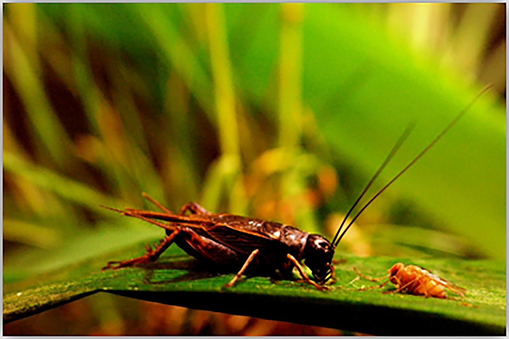

## Assisted evolutionary rescue...

 

- **Spreading Avens is an Appalachian endangered plant, found only on high-elevation peaks**
    + found in western NC and eastern Tennessee
 
  
 
- **Vulnerable to extinction due to climate change, land development and outdoor recreation (climbing)**

 

- **Researchers have breed the small isolated populations of Spreading Avens with more diverse populations to create hybrids**
    + hybrids may gain traits (↑ adaptive potential) to allow them to survive 

 

- **To speed up evolutionary rescue, what should our role be?**
 
   
 
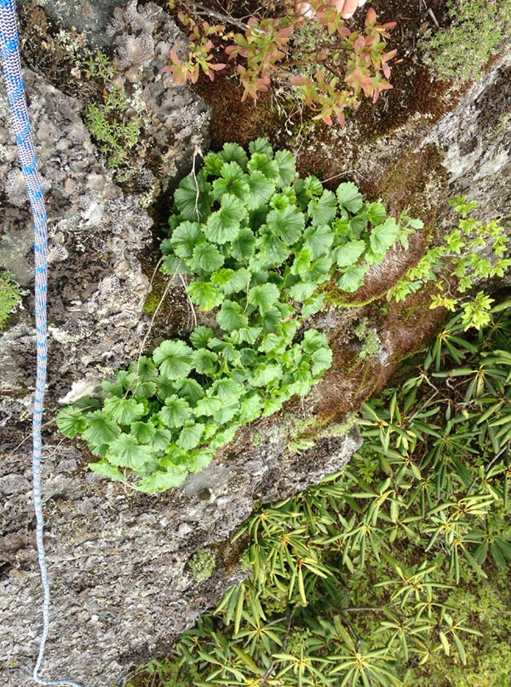

## What are there limits to adaptation?

- **Standing genetic variation is the existing pool of traits in a population**
    + Natural selection can only act on traits that already exist
    + Species with high standing variation are more likely to adapt quickly to global change

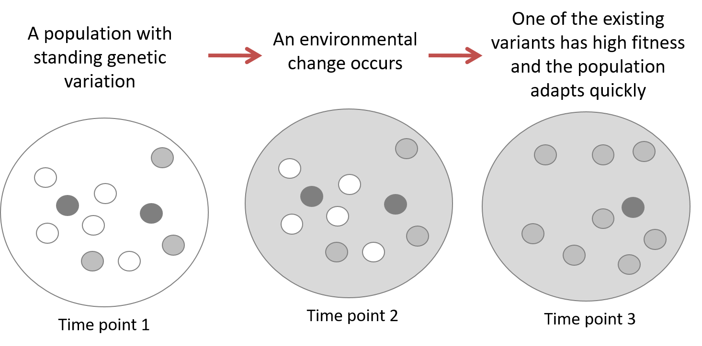

## What are there limits to adaptation?

- **Species with low variation may have no evolutionary "tools" available to respond**
    + Long-lived species or reduced populations often have reduced variation
    + environmental change may occur to quickly before a beneficial mutation arises
    
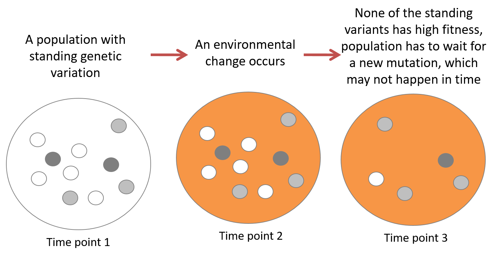

## Evolution Case study: American chestnut

**Chestnut blight (fungus) was introduced to North America from Asia in the early 1900s.**

 

- **American chestnuts were once widespread and dominant in eastern forests—including Appalachia**
    + had no prior exposure to this pathogen
    + lacked genetic resistance to the fungus

 

- **Despite being genetically diverse overall, they had no existing resistance alleles**
    + standing variation for the trait under selection = 0

 

- **The entire population was uniformly vulnerable, and blight wiped out ~4 billion trees within decades**
    + trees reproduce to slowly for mutations to create an adaptive solution

 
  
 
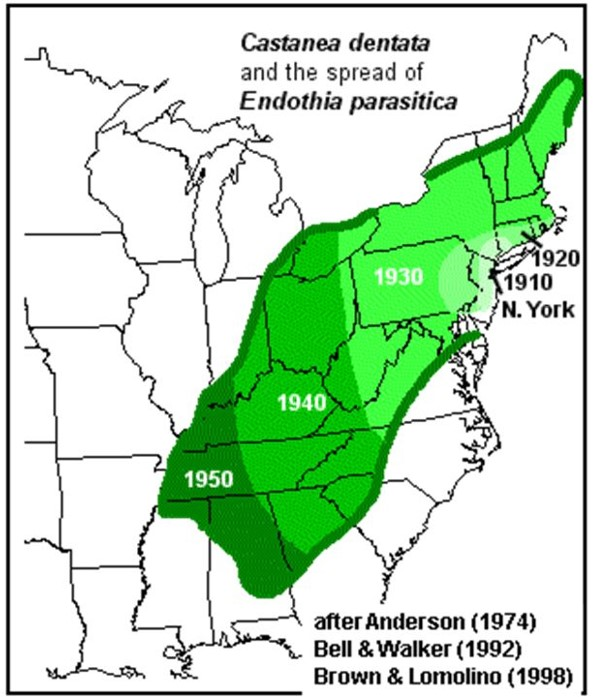

## Can Species Adapt to More Than One Challenge?

- **Adapting to multiple stressors often requires multiple traits**
    + Species rarely face just one threat—global change is multi-factorial:
      + Climate warming, habitat loss, invasive species, pollution, harvesting

 

- **Many species have limited standing variation—not enough to evolve all needed traits at once**

 

- **Appalachian Brook Trout may need to adapt thermal tolerance, disease resistance, altered spawning timing**
    + Even if variation exists for one trait, adaptation can fail if other traits can’t respond
    + isolated headwater populations tend to have low genetic variation

 
  

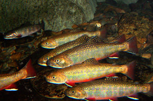

## Gene Flow: A Lifeline for Adaptation...

 

- **Gene flow is the movement of genes between *connected* populations through migration and reproduction**
    + introduces new alleles into a population
    + alternative to local mutations or standing variation

 

- **But only works if populations are connected**

 

- **Appalachian Brook Trout populations are fragmented from roads, habitat loss, warming, drought**
    + gene flow could be restored through through conservation

 
 
 
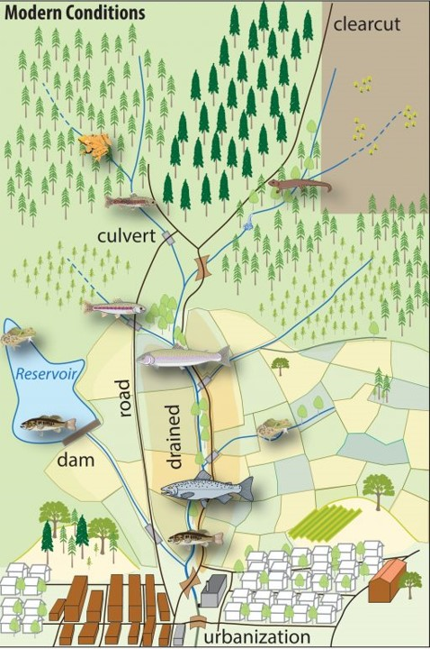

## Not All Evolutionary Change is Adaptive

- **Genetic drift is random change in allele frequencies over time, unrelated to fitness or selection**
    + reminder: alleles = alternate versions of a gene
    + usually results in alleles being lost

 

- **Powerful evolutionary in small populations, where chance events can quickly shift genetic makeup**
    + habitat loss and fragmentation can severely reduce population sizes
    + reduces adaptive potential, makes populations more vulnerable to change

 

- **Brook trout in fragmented isolated Appalachian streams may lose rare alleles just by chance**
    + any deaths may mean a helpful trait disappears
    
 
 
 
 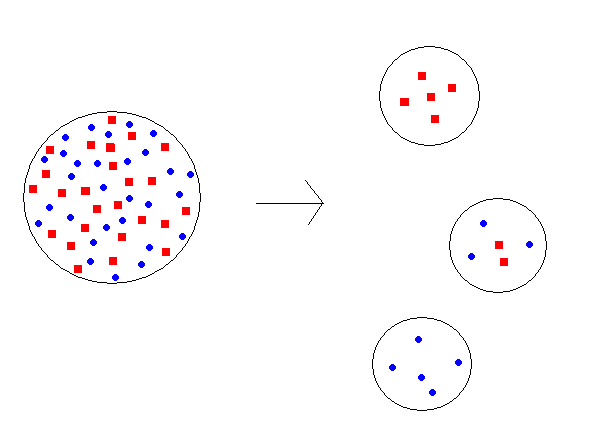
 
## Genetic drift can interfere with natural selection

**Global change can reshape the gene pool randomly, without improving fitness**

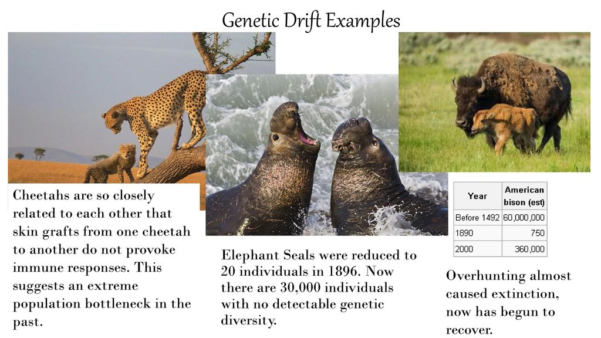

